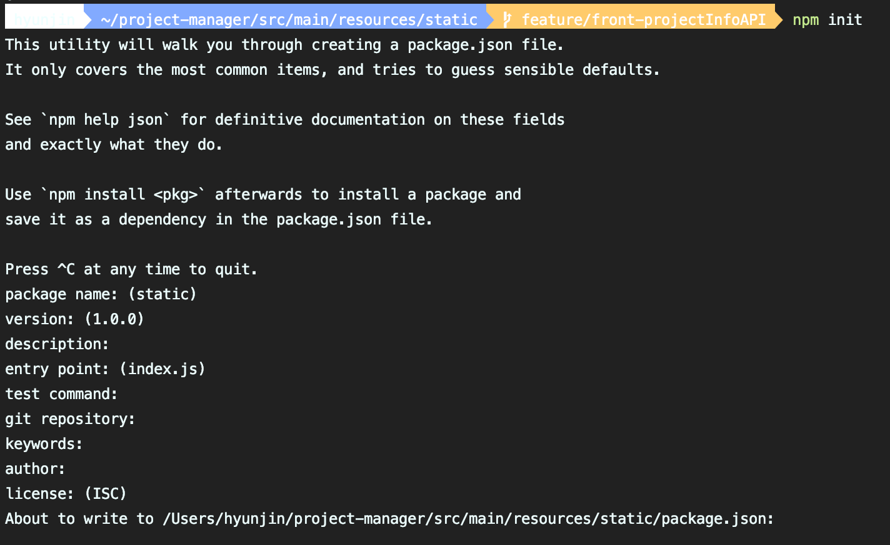
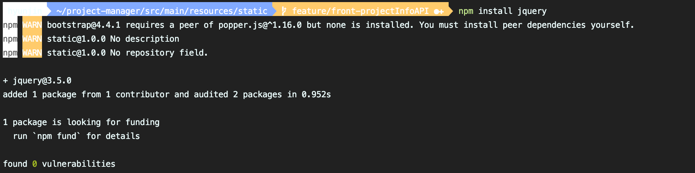
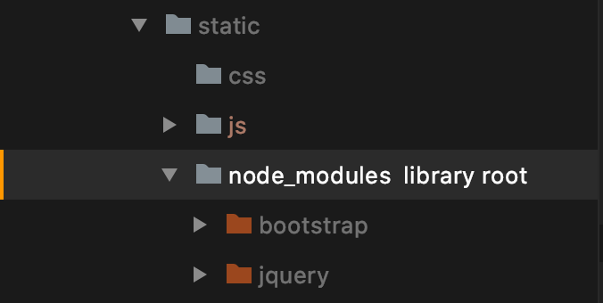

## npm(Node Package Manager)이란
### 개념 
node.js 패키지 관리자 
-> node.js에서 사용하는 모듈들을 패키지로 만들어 npm을 통해 관리, 배포
(node.js 설치 시 자동으로 설치된다)
>다른 언어에서 비슷한 개념
python의 pip
ruby의 Gem
java의 jpm 등 

### 기능 
- node.js에서 사용할 수 있는 모듈들을 패키지화하여 모아둔 저장소 역할
- 패키지 설치 및 관리를 위한 CLI(Command line interface) 제공 

## package.json과 의존성 관리 
Node.js 프로젝트에서는 많은 패키지를 사용하게 되고 패키지의 버전도 빈번하게 업데이트되므로 프로젝트가 의존하고 있는 패키지를 일괄 관리할 필요가 있다.<br>npm은 package.json 파일을 통해서 프로젝트 정보와 패키지의 의존성(dependency)을 관리한다. 

이미 작성된 package.json이 있다면 팀 내에 배포하여 동일한 개발 환경을 빠르게 구축할 수 있는 장점이 있다.<br>package.json은 Java의 maven에서 pom.xml과 비슷한 역할을 한다.

package.json을 생성하려면 프로젝트 루트에서 `npm init` 명령어를 실행한다.


>spring boot의 경우, 주로 프런트엔드 라이브러리 관리를 위해 npm을 사용한다.<br>따라서 정적 자원을 제공하는 디렉토리(src/resources/static)에서 `npm init`을 입력했다. 

여러 옵션을 추가하는 질문을 넘어가면 완료된다. 
(질문 없이 바로 생성하고 싶다면 `-f`, `-y` 중 하나의 플래그를 추가하면 된다.)

프로젝트 루트에 package.json 파일이 생성되었다면 `npm install` 명령어를 통해 패키지를 설치할 수 있다. 

## 패키지 설치 
`npm install` 명령어 뒤에 설치할 패키지 이름을 지정한다. 

```bash
$ npm install <package명>
```

 
npm install 명령어로 jquery를 설치한다. 

```json
{
  ...
  "dependencies": {
    "bootstrap": "^4.4.1",
    "jquery": "^3.5.0"
  }
}
```
설치가 완료된 후 `package.json` 파일의 `dependencies`에 jquery가 추가된 것을 확인할 수 있다. 


node_modules 폴더가 생성되고 내부에 패키지가 설치된다. 

## 지역 설치와 전역 설치 
npm install 명령어에는 지역(local) 설치와 전역(global) 설치 옵션이 있다. 옵션을 별도로 지정하지 않으면 지역으로 설치되며, 프로젝트 루트 디렉터리에 node_modules 디렉터리가 자동 생성되고 그 안에 패키지가 설치된다. 
지역으로 설치된 패키지는 해당 프로젝트 내에서만 사용할 수 있다.

전역에 패키지를 설치하려면 npm install 명령어에 `-g` 옵션을 지정한다. 
전역으로 설치된 패키지는 전역에서 참조할 수 있다. 모든 프로젝트가 공통 사용하는 패키지는 지역으로 설치하지 않고 전역에 설치한다.

```bash
# 전역 설치 방법 
$ npm install -g <package명>
```

전역에 설치된 패키지는 OS에 따라 설치 장소가 다르다.

- macOS의 경우
/usr/local/lib/node_modules
- 윈도우의 경우
c:\Users\%USERNAME%\AppData\Roaming\npm\node_modules

## 스크립트 사용
package.json의 scripts 부분에 복잡한 명령어들을 npm script로 만들어 간단하게 사용할 수 있다. 

```json 
{

  ...

  "scripts": {
    "start": "node app.js",
    "build": "webpack ./src/app.js ./out/bundle.js"
  },

  ...
}
```

start, build는 각각 스크립트의 key이고, key를 통해 우측 명령어를 실행시킬 수 있다.<br>
`npm run <스크립트 key>` 명령어를 통해 각 key에 해당하는 명령어를 실행시킨다. 

즉, package.json 이 존재하는 디렉토리에서 npm run build 라는 명령어를 입력하면 webpack ./src/app.js ./out/bundle.js 라는 명령어가 실행된다.<br> 
여기서 start 라는 스크립트는 특별히 npm run start 대신 npm start 만 입력해도 무방하다.

### 활용 
다른 명령어는 아래 링크에서 확인 

<https://www.zerocho.com/category/NodeJS/post/58285e4840a6d700184ebd87>
<https://hudi.kr/npm-%EC%86%8C%EA%B0%9C-%EB%B0%8F-%ED%99%9C%EC%9A%A9/>

### 빌드 
프런트엔드 서버와 백엔드 서버를 모두 빌드 해줘야한다.
아래 링크를 통해 빌드 방법을 참고하면 된다.

 <https://velog.io/@max9106/SpringBoot-NPM><br>
 <https://velog.io/@essri/%EC%8A%A4%ED%94%84%EB%A7%81%EB%B6%80%ED%8A%B8-%EB%A6%AC%EC%95%A1%ED%8A%B8-%ED%94%84%EB%A1%9C%EC%A0%9D%ED%8A%B8-%ED%95%A8%EA%BB%98-%EB%B9%8C%EB%93%9C%ED%95%98%EA%B8%B0-a1k2l5olr2>

## package.json
package.json은 프로젝트 정보와 의존성을 관리하는 문서이다.<br>
node.js 프로젝트 진행 시, 프로젝트 소스가 모듈에 의존하고 있기 때문에 모듈의 버전에 따라 문제가 생길 여지가 있다. 
이미 작성된 package.json 문서는 어느 곳에서도 동일한 개발 환경을 구축할 수 있게 해준다. 

express나 npm init 등의 명령어를 통해 package.json을 자동생성하지 않는 경우에는 모듈의 버전관리를 위해 직접 package.json을 만들어줘야 한다. 

아래는 package.json 파일의 예시이다. 

```json
{
  "name": "static",
  "version": "1.0.0",
  "description": "",
  "main": "index.js",
  "scripts": {
    "test": "echo \"Error: no test specified\" && exit 1"
  },
  "author": "",
  "license": "ISC",
  "dependencies": {
    "bootstrap": "^4.4.1", //라이브러리 버전 명시 
    "jquery": "^3.5.0"
  }
}

```

package.json 파일의 옵션과 구성(작성법)은 아래 링크에서 참고하면 된다. 
<https://programmingsummaries.tistory.com/385>

일반적으로는 `npm install <package명>`을 입력해 모듈을 설치하지만, package.json에 모듈 목록을 작성 후 `npm install` 명령어를 입력하면 npm이 package.json 파일의 dependencies 부분에 명시된 모듈들을 모두 설치해준다. 

모듈의 버전 표기는 다음과 같다. 
- version : 완전히 일치하는 버전
- =version : 완전히 일치하는 버전
- \>version : 큰 버전
- \>=version : 크거나 같은 버전
- <version : 작은 버전
- <=version : 작거나 같은 버전
- ~version : 버전범위. ~0.2이면 0.2부터 0.3보다 작은 범위
- 1.2.x : x 표기도 가능
- ^version : 다음 링크 참고 <https://blog.outsider.ne.kr/1041>

npm update로 모듈들을 최신 버전으로 업데이트 하려고 할때도 package.json에 명시된 버전에 따라서만 업데이트가 되기 때문에 특정버전을 명시한 모듈의 경우는 최신버전이 있다고 하더라도 업데이트 되지 않는다. 

### package-lock.json 이란? 
npm을 사용해서 node_modules 트리나 package.json 파일을 수정하게 되면 자동으로 생성되는 파일로, 
파일이 생성되는 시점의 의존성 트리에 대한 정보를 가지고 있다. 

package-lock.json의 개념에 대한 자세한 설명은 아래 링크를 참고 

<https://trustyoo86.github.io/npm/2018/01/10/package-lock-introduction.html>


package-lock.json 파일 확인 시 다음과 같은 내용을 확인할 수 있다. 

```json 
{
  "name": "static",
  "version": "1.0.0",
  "lockfileVersion": 1,
  "requires": true,
  "dependencies": {
    "bootstrap": {
      "version": "4.4.1",
      "resolved": "https://registry.npmjs.org/bootstrap/-/bootstrap-4.4.1.tgz",
      "integrity": "sha512-tbx5cHubwE6e2ZG7nqM3g/FZ5PQEDMWmMGNrCUBVRPHXTJaH7CBDdsLeu3eCh3B1tzAxTnAbtmrzvWEvT2NNEA=="
    },
    "jquery": {
      "version": "3.5.0",
      "resolved": "https://registry.npmjs.org/jquery/-/jquery-3.5.0.tgz",
      "integrity": "sha512-Xb7SVYMvygPxbFMpTFQiHh1J7HClEaThguL15N/Gg37Lri/qKyhRGZYzHRyLH8Stq3Aow0LsHO2O2ci86fCrNQ=="
    }
  }
}
```

### package-lock.json이 필요한 이유 
아래 링크 참고 

<https://hyunjun19.github.io/2018/03/23/package-lock-why-need/>

### Reference 
<https://velog.io/@max9106/SpringBoot-NPM>

<https://blog.outsider.ne.kr/665>