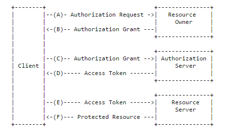

# OAuth 2.0 
## 인증(Authentication)과 권한부여(Authorization)의 필요성
대부분의 서비스는 인증(Authentication)과 리소스에 대한 권한부여(Authorization)기능이 필요합니다. 인증과 권한부여 기능은 다양한 방법으로 제공되고 있는데 대표적인 방법으로 OAuth를 사용하고 있습니다. Facebook, Google, Twitter 등 대형 서비스에서 널리 사용되고 있기 때문에 많은 개발자에게 친숙한 방법입니다.

인증 및 권한부여를 위해서 OAuth 프레임워크의 현재(2017.03.13) 버전은 2.0이며 해당 버전의 스펙 문서는 RFC 6749에서 확인할 수 있습니다. OAuth 2.0은 인증 및 권한부여에 관한 기본적인 흐름(flow)뿐만 아니라 목적에 맞게 확장할 수 있도록 설계 되어 있습니다.

OAuth는 서버와 클라이언트 사이에 인증을 완료하면 서버는 권한부여의 결과로써 access token을 전송합니다. 클라이언트는 access token을 이용해서 접근 및 서비스를 요청할 수 있습니다. 서버는 access token 기반으로 서비스와 권한을 확인하여 접근을 허용할지 말지를 결정하고, 결과 데이터를 클라이언트에게 보내줍니다. 서버는 access token을 기반으로 클라이언트를 확인하여 서비스하기 때문에, 세션(session)이나 쿠키(cookie를 이용해 클라이언트의 상태정보를 유지할 필요가 없습니다.

## OAuth의 구성 객체(Roles)
- **Resource Owner**(자원 소유자): protected resource(보호된 자원)에 접근하는 권한을 제공합니다.
- **Resource Server**(자원 서버): access token을 사용해서 요청(request)을 수신할 때, 권한을 검증한 후 적절한 결과를 응답합니다.
- **Client**(클라이언트): resource owner(자원 소유자)의 protected resource(보호된 자원)에 접근을 요청을 하는 애플리케이션(application)입니다.
- **Authorization Server**(권한 서버): client(클라이언트)가 성공적으로 access token을 발급받은 이후에 resource owner(자원 소유자)를 인증하고 obtaining authorization(권한 부여)를 합니다.

## Protocol Flow
앞에서 소개한 4가지 객체들이 서로 상호작용을 통해 허가 절차가 진행됩니다.

- (A) Client(클라이언트)가 Resource Owner(자원 소유자)에게 권한 요청(Authorization Request)하게 됩니다. 이 때 권한 요청은 Resource Owner(자원 소유자)에게 직접 하거나, Resource Server(권한 서버)를 통해 간접적으로 이루어 질 수도 있습니다.
- (B) Resource Owner(자원 소유자)가 권한을 허가하면, Client(클라이언트)는 권한 증서(Authorization Grant)를 발급 받습니다.
    - Authorization Grant(권한 증서)는 자원 소유자가 자원에 접근할 수 있는 권한을 부여하였다는 확인증으로 Client(클라이언트)가 access token 을 요청하여 얻어오는데 사용됩니다. 이 권한 증서는 총 4개의 타입이 있습니다.
        - **Authorization Code**는 Client(클라이언트)가 Resource Owner(자원 소유자)에게 직접 권한 부여를 요청하는 대신, Resource Owner(자원 소유자)가 Authorization Server(권한 서버)에서 인증을 받고 권한을 허가 합니다. 소유자가 권한을 허가하게 되면 Authorization Code(권한 코드)가 발급되고, 이 Authorization Code(권한 코드)를 클라이언트에게 전달하게 됩니다. 클라이언트는 이 코드를 권한 서버에 보내주면서 자신이 권한 허가를 받았다는 사실을 알리고 access token을 받게 됩니다. 이 방법은 보안상 이점이 있습니다. access token을 바로 Client(클라이언트)로 곧바로 전달하지 않기 때문에 전달과정에서 생길 수 있는 잠재적인 유출 위험을 방지하는데 도움을 줍니다.
        - **Implicit**는 Authorization Code(권한 코드)를 간소화한 절차입니다. Authorization Code(권한 코드) 방식에서 access token을 얻기 위한 중간 매개체로 Authorization Code(권한 코드)를 사용했던 것과 달리, 이 방식은 Authorization Code(권한 코드)가 별도로 발급되지 않고 access token이 바로 발급됩니다. 과정이 줄어들어 편해지는 대신 보안성은 낮아집니다.
        - **Resource Owner Password Credentials** 이 방식에서는 자원 소유자의 계정 아이디와 비밀번호 같은 계정 인증 정보가 access token을 얻기 위한 Authorization Grant(권한 증서)로 사용됩니다. 계정정보를 애플리케이션에 직접 입력해야 하므로, 신뢰할 수 있어야 합니다. access token 을 얻은 후에는 리소스 요청을 위해 계정 아이디, 비밀번호를 Client(클라이언트)가 보관하고 있을 필요는 없습니다.
        - **Client Credentials** 이 방식은 클라이언트 인증 방식이라고도 합니다. 자원 소유자가 유저가 아닌, 클라이언트인 상황에서 활용되는 방식입니다. Client(클라이언트)가 관리하는 리소스에만 접근할 경우로 권한이 한정되어 있을 때 활용할 수 있습니다. 즉 Client(클라이언트)가 곧 Resource Owner(자원 소유자)가 되는 상황입니다. Client(클라이언트)는 자기를 인증할 수 있는 정보를 Authorization Server(권한 서버)에 보내면서 access token을 요청하게 됩니다.
- (C) 권한 증서(Authorization Grant)를 받은 클라이언트(Client)는 최종 목적인 access token을 권한 서버에 요청합니다.
- (D) 요청을 받은 Authorization Server(권한 서버)는 클라이언트(Client)가 보내온 권한 증서(Authorization Grant)의 유효성을 검증합니다. 유효하다면 access token을 발급하고 결과를 클라이언트(Client)에 알려줍니다.
- (E) access token을 받은 클라이언트(Client)는 자원 서버(Resource Server)에 자원을 요청할 수 있게 됩니다.
- (F) 요청을 받은 자원 서버(Resource Server)는 access token의 유효성을 검증하고 유효하다면 요청을 처리해줍니다.

## Access and Refresh Token
Access Token은 요청 절차를 정상적으로 종료한 클라이언트에게 발급됩니다. 이 토큰은 보호된 자원에 접근할 때 권한 확인용으로 사용됩니다. 문자열 형태이며 클라이언트에 발급된 권한을 대표하게 됩니다. 계정 아이디와 비밀번호 등 계정 인증에 필요한 형태들을 이 토큰 하나로 표현함으로써, 리소스 서버는 여러 가지 인증 방식에 각각 대응 하지 않아도 권한을 확인 할 수 있게 됩니다.

Refresh Token은 한번 발급받은 access token은 사용할 수 있는 시간이 제한되어 있습니다. 사용하고 있던access token이 유효기간 종료 등으로 만료되면, 새로운 액세스 토큰을 얻어야 하는데 그때 이 refresh token 이 활용됩니다. 권한 서버가 access token을 발급해주는 시점에 refresh token도 함께 발급하여 클라이언트에게 알려주기 때문에, 전용 발급 절차 없이 refresh token을 미리 가지고 있을 수 있습니다. 토큰의 형태는 access token과 동일하게 문자열 형태입니다. 단 권한 서버에서만 활용되며 리소스 서버에는 전송되지 않습니다.

클라이언트가 권한 증서를 가지고 권한서버에 access token 을 요청하면, 권한 서버는 access token과 refresh token 을 함께 클라이언트에 알려줍니다. 그 후 클라이언트는 access token을 사용하여 리소스 서버에 각종 필요한 리소스들을 요청하는 과정을 반복합니다. 그러다가 일정한 시간이 흐른 후 액세스 토큰이 만료되면, 리소스 서버는 이후 요청들에 대해 정상 결과 대신 오류를 응답하게 됩니다. 오류 등으로 액세스 토큰이 만료됨을 알아챈 클라이언트는, 전에 받아 두었던 refresh token을 권한 서버에 보내어 새로운 액세스 토큰을 요청합니다. 갱신 요청을 받은 권한 서버는 refresh token 의 유효성을 검증한 후, 문제가 없다면 새로운 액세스 토큰을 발급해줍니다. 이 과정에서 옵션에 따라 refresh token 도 새롭게 발급 될 수 있습니다.