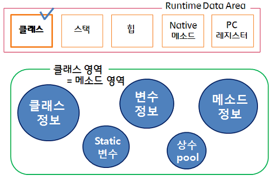
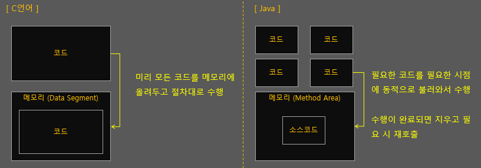
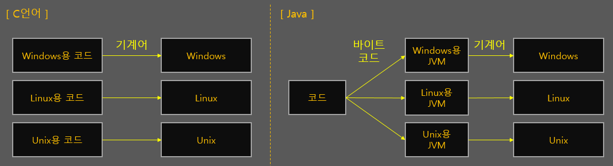
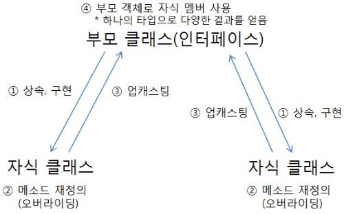

## static 
고정된 메모리 주소를 가짐
- 공유되는 객체/변수
- 클래스가 메모리 상에 올라갈 때(프로그램이 실행되면), 메모리에 올라감
- static이 붙은 변수를 클래스 변수라고 하는 것은 위에 그림에서 확인할 수 있듯이 변수가 존재하는 영역이 클래스가 존재하는 영역과 같기 때문



메소드 영역 (공유 메모리 영역)
- JVM이 동작해서 클래스가 로딩될때 생성됨
- 모든 쓰레드가 공유하는 영역

c언어에서의 static 변수 
- 선언된 함수 내에서만 사용 가능
- 전역 변수처럼 프로그램이 종료될 때까지 메모리공간에 존재 (함수가 반환되도 소멸되지 않음)

#### Static 사용의 단점
- 클래스가 많아지고 코드가 복잡해지면 static의 현재 상태를 추론하기가 힘들어짐
- 각 클래스의 독립성을 추구하는 객체지향 방식의 이념에서 벗어남 (객체간 의존도를 높임)
- 캡슐화를 통해 필드의 직접 노출을 막는 객체지향 방식의 이념에서 벗어남
- 프로그램 종료시까지 메모리를 점유하고 있어 메모리 낭비 발생 가능

## Garbage Collector
Heap 영역에 생성(적재)된 객체들 중에 참조되지 않는 객체들을 탐색 후 제거
- 참조가 없어지자마자 해제되는 것을 보장하지 않음
- GC가 수행되는 동안 GC를 수행하는 쓰레드가 아닌 다른 모든 쓰레드가 일시정지됨 
    - 메모리를 옮기고 있는데 다른 쓰레드가 메모리를 사용해버리면 안되기 때문 


- Minor GC : New 영역에서 일어나는 GC

1. 최초에 객체가 생성되면 Eden영역에 생성된다.

2. Eden영역에 객체가 가득차게 되면 첫 번째 CG가 일어난다.

3. survivor1 영역에 Eden영역의 메모리를 그대로 복사된다. 그리고 survivor1 영역을 제외한 다른 영역의 객체를 제거한다.

4. Eden영역도 가득차고 survivor1영역도 가득차게된다면, Eden영역에 생성된 객체와 survivor1영역에 생성된 객체 중에 참조되고 있는 객체가 있는지 검사한다.

5. 참조 되고있지 않은 객체는 내버려두고 참조되고 있는 객체만 survivor2영역에 복사한다.

6. survivor2영역을 제외한 다른 영역의 객체들을 제거한다.

7. 위의 과정중에 일정 횟수이상 참조되고 있는 객체들을 survivor2에서 Old영역으로 이동시킨다.

- 위 과정을 계속 반복, survivor2영역까지 꽉차기 전에 계속해서 Old로 비움


- Major GC(Full GC) : Old 영역에서 일어나는 GC

1. Old 영역에 있는 모든 객체들을 검사하며 참조되고 있는지 확인한다.

2. 참조되지 않은 객체들을 모아 한 번에 제거한다.

- Minor GC보다 시간이 훨씬 많이 걸리고 실행중에 GC를 제외한 모든 쓰레드가 중지한다.

- GC는 메모리 사용 낮추고 CPU 사용은 높인다
    - c는 GC가 없어서 상대적으로 하드웨어 오버헤드가 낮음 

Java가 c보다 느린 이유 
- 객체지향적 특성
    - 모든 코드를 미리 메모리에 올려두지 않고 필요할 때마다 가져다 쓰는 동적 할당 방식을 사용
    - 다른 클래스에 있는 일부 메소드나 정보를 사용하기 위해서는 전체 클래스를 인스턴스로 만들어 메모리에 저장해야 함

    

- JVM 사용
    - C언어는 컴파일 시 코드를 모두 기계어로 직접 번역해서 바로 메모리에 올려두고 실행함. 하지만 Java에서는 먼저 바이트코드로 컴파일을 한 뒤, 동적할당 된 코드를 JVM의 Excution Engine이 번역해서 실행(JVM이 OS나 기타 환경에 맞춰 약간씩 다르게 기계어로 번역한 뒤 실행해주기 때문)
    - Java의 심각한 단점 중 하나는, 실행하는 과정에서 Java Virtual Machine이 반드시 완벽하게 로딩되어야 하기 때문에 프로그램의 초기 시작 시간이 완전한 이진 코드로 컴파일된 프로그램을 실행하는 것에 비해 오래 걸림 
    - JVM이라는 하나의 프로그램 안에서 다시 프로그램이 실행되는 구조이므로 같은 프로그램이라도 C언어에서는 하나의 프로그램이, Java에서는 2개 이상의 프로그램이 동시에 작동 -> 메모리 사용과 연산 늘어남 

    

- GC
    - C언어에서는 동적할당한 메모리를 개발자의 명령에 따라 즉시 해제하지만, Java에서는 직접 메모리를 다루지 않도록 되어 있기 때문에 이 작업을 GC(가비지 컬렉터)가 대신함 
    - GC가 연산 작업을 동반함 

Java가 c에 근접하는 경우 
- JVM의 JIT 엔진은 프로그램 동작을 기반으로 런타임에 루틴을 최적화해서 사전 컴파일되는 C에서는 불가능한 다양한 종류의 최적화를 실현한다. 또한 자바 런타임은 메모리 관리를 자동화하는데, 일부 새로운 애플리케이션은 이를 우회하여 작동한다. 예를 들어 아파치 스파크는 JVM을 피해가는 맞춤형 메모리 관리 코드를 사용해서 메모리 내 프로세싱을 최적화한다.
- 


ref: https://qastack.kr/software/110634/why-would-it-ever-be-possible-for-java-to-be-faster-than-c
http://www.itworld.co.kr/news/124767#csidx3f51bde2a7c69479bc6be185e8319a6 


## java의 다형성
여러 객체에게 동일한 명령을 내렸을 때 다른 반응이 나오는 현상 
- 하나의 타입에 여러 객체를 대입 가능
- 부모 타입에 모든 자식 객체가 대입될 수 있음
    ```java
    public class Car {
        Tire t1 = new HankookTire();
        Tire t2 = new KumhoTire(); 
    }
    ```
    - 타입 변환된 객체 (t1, t2)는 각각 자식 객체를 참조한다. 
- 자동 타입 변환이 일어남 



```java
class Cat extends Animal {

}
```

```java 
Cat cat = new Cat(); 
Animal animal = cat; 
cat == animal // true
```

두 변수가 동일한 객체를 참조하므로 == 연산값이 true이다. 

부모 타입으로 자동 타입 변환된 이후에는 부모 클래스에 선언된 필드와 메소드에만 접근이 가능하다. 
메소드가 자식 클래스에서 오버라이딩 되었다면 자식 클래스의 메소드가 대신 호출된다. 

**필드 타입에는 변함이 없지만, 실행 도중에 어떤 객체를 필드로 저장하느냐에 따라 실행 결과가 달라질 수 있다.**
-> 필드의 값을 다양화 가능 

자식 클래스끼리 같은 기능(메소드)를 가지지만, 다르게 동작할 수 있다. 

효과 
- 하나의 타입으로 다양한 실행 결과를 얻음
- 객체를 부품화, 유지보수성 높임 

## 추상 클래스 
추상(abstract): 실체 간에 공통되는 특성을 추출한 것
- 곤충, 물고기 -> 동물 
- LG, 삼성, 현대, KT -> 회사 

실체 클래스: 객체를 직접 생성할 수 있는 클래스
추상 클래스: 실체 클래스들의 공통적인 특성을 추출해서 선언한 클래스


- 실체 클래스는 추상 클래스를 상속
    - 실체 클래스가 추상 클래스의 모든 필드와 메서드들을 물려받고, 추가적인 특성을 가짐
    - `@Override`를 통해 추상 메소드를 선언
    - 자식 클래스는 반드시 추상 메소드를 오버라이딩 해 내용을 작성해야 함 
- 추상 클래스는 new 연산자를 통해 인스턴스를 생성하지 못함
- 구현된 메서드 존재 가능 

추상 클래스의 용도 
- 실체 클래스들의 공통된 필드와 메소드의 이름을 통일
    - 공통된 규격/구조를 가지게 함 
    - 추상 메소드의 선언만 통일하고 내용은 다르게 할 수 있음 
- 실체 클래스 작성 시간 절약 

