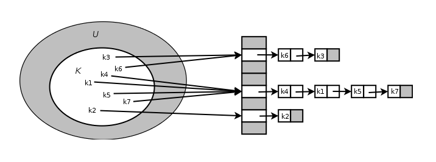
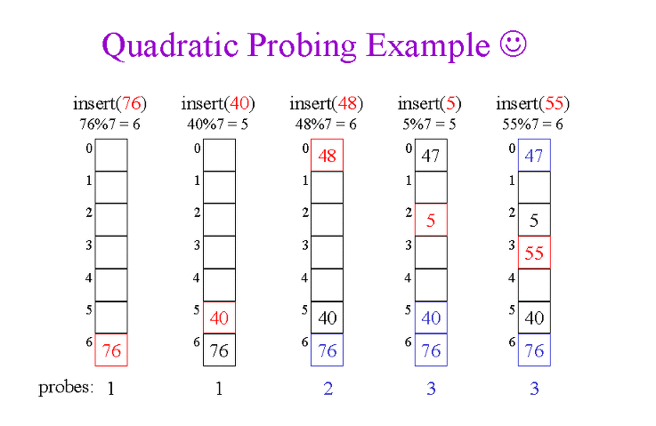

# Hash
해시함수(hash function)란 데이터의 효율적 관리를 목적으로 **임의 길이의 데이터를 고정된 길이의 데이터로 매핑**하는 함수이다.
- 키(key): 매핑 전 원래 데이터 값, ㄴ해시 함수의 input이 된다. 
- 값(value): 저장소에 최종적으로 저장되는 값
- 해시/해시값(hash value): 해시 함수의 결과물이며, 저장소에서 값(value)과 매칭되어 저장됨
- 해싱(hashing): 매핑하는 과정 자체 

해시함수는 해시값의 개수보다 대개 많은 키값을 해시값으로 변환하기 때문에 <u>해시함수가 서로 다른 두 개의 키에 동일한 해시값을 내는</u> **해시충돌(collision)** 이 발생하게 된다. 
해시충돌이 해시값 전체에 걸쳐 균등하게 발생하게끔 하는 것이 중요하다. 
- 해시 함수의 질은 해시 충돌 확률로 결정됨
- 해시 충돌 확률이 높을수록 검색 비용 증가
- 해시값으로 키 값을 알 수 없다.

## Direct Addressing Table 
키의 전체 개수와 동일한 크기의 버킷을 가진 배열을 이용해 key-value쌍의 데이터를 배열에 저장한다. 

- 키값을 직접적으로 배열의 인덱스로 사용
- 키 개수와 해시테이블 크기가 동일하기 때문에 해시충돌 문제가 발생하지 않는다.
- 전체 키(universe of key)가 실제 사용하는 키(actual key)보다 훨씬 많은 경우 사용하지 않는 키들을 위한 공간까지 마련해야 하는 탓에 메모리 효율성이 크게 떨어진다.

## 해시테이블 
해시함수를 사용해 키를 해시값으로 매핑하고, 이 해시값을 인덱스(index) 혹은 주소 삼아 데이터의 값을 키와 함께 저장하는 자료구조를 해시테이블(hash table)이라고 한다. 
이 때 데이터가 저장되는 곳을 버킷(bucket) 또는 슬롯(slot)이라고 한다. 

보통의 경우 Direct-address table보다는 “해시테이블 크기(m)가 실제 사용하는 키 개수(n)보다 적은 해시테이블”을 운용한다. 키값과 해시함수를 이용해 계산을 수행한 뒤, 그 결과값을 배열의 인덱스로 사용해 저장한다. 

load factor(α): n/m
- 해시테이블의 한 버킷에 평균 몇 개의 키가 매핑되는가를 나타내는 지표
- Direct-address table의 load factor는 1 이하이며, 1보다 큰 경우 해시충돌 문제가 발생

## 해시테이블의 장점 
해시테이블을 사용하면 적은 리소스로 많은 데이터를 효율적으로 관리할 수 있다. 
무한에 가까운 데이터(키)들을 유한한 개수의 해시값으로 매핑해 작은 크기의 캐시 메모리로도 프로세스를 관리할 수 있게 된다.

해시함수는 언제나 동일한 해시값을 리턴하고, 인덱스만 알면 해시테이블의 크기에 상관없이 데이터에 빠르게 접근할 수 있다. 인덱스 계산과 데이터 액세스는 O(1)로 작동하기 때문에 매우 효율적이다. 

다른 자료구조와의 비교 
- 이진탐색트리: 메모리를 효율적으로 사용하지만 데이터 탐색 시간은 O(logn)
- 배열: 데이터 탐색은 O(1)이지만, 메모리를 미리 할당해 둬야 함

## 충돌 해결 방법
### Chaining

한 버킷 당 들어갈 수 있는 엔트리의 수에 제한을 두지 않는다. 해당 버킷에 데이터가 이미 있다면, 체인처럼 노드를 추가해 다음 노드를 가리키는 방식으로 구현한다. 유연하지만 메모리 문제를 야기할 수 있다. 

- 삽입: O(1)
- 삭제: O(1)
- 탐색: 리스트의 길이만큼 발생
    - 최악의 경우 O(n)

#### Simple Uniform Hash
좋은 해시 함수를 만드는 것으로 충돌을 최소화할 수 있다. 좋은 해시 함수의 조건은 Simple Uniform Hash 함수를 만드는 것으로, 조건은 다음과 같다. 
- 계산된 해시값들은 0부터 '배열 크기-1' 사이의 범위를 동일한 확률로 고르게 분포할 것
    - 충돌 확률이 낮아진다. 
- 각각의 해시값들은 연관성을 가지지 않고 독립적으로 생성될 것
    - 연관성이 있으면 해시값이 등장하는 패턴이나 순서가 존재할 수 있다.
    - 반복적인 충돌을 일으킬 수 있다.

#### Division Method
modular 연산 방법을 이용해 특정 키를 어떤 수(m)로 나눈 나머지를 해시값으로 사용한다. 

m의 크기는 보통 키의 수의 3배가 적당하다고 한다. 적재율 30%쯤까지 충돌이 거의 일어나지 않는다고 한다. 
// 질문 : 키의 개수보다 테이블 항목 수가 더 많은 게 해시를 쓰는 의미가 있는가 (더 작은 자료구조에 매핑할려고 쓰는게 아닌가?)
-> key 수나 상황에 따라 다를 것 같다. 
고정된 크기 테이블로 매핑시키는게 1차 목표지만
충돌이 많다면 해시에서 오는 이익이 없기 때문

- m은 소수가 좋음(잘 분산시키기 위해)

### Open Addressing //probing? 
모든 데이터(키+데이터)를 테이블에 저장하는 방법이다.
테이블의 각 칸에는 1개의 데이터만 저장된다. 
데이터를 직접 모두 읽어오기 때문에 포인터를 쓸 일이 없어 포인터로 인한 오버헤드를 방지할 수 있다. 
(포인터 접근에 필요한 시간이 없다)

탐사(probing)방식으로 해시충돌을 해결할 수 있다. 탐사란 삽입, 삭제, 탐색을 수행하기 위해 해시테이블 내 새로운 주소(해시값)을 찾는 과정이다. 

### Linear Probing

최초 해시값에 해당하는 버킷에 데이터가 이미 저장되어 있으면, 해당 해시값에서 고정 폭(1칸)만큼 옮겨 다음 해시값에 해당하는 버킷에 액세스한다. 해당 버킷에도 데이터가 존재하면, 또 고정 폭만큼 이동한다. 

해시값 주변 버킷이 모두 채워져 있으면 탐사를 여러 번 수행해야 하는 단점이 있다. 

### Quadratic Probing

고정 폭으로 이동하는 linear probing과 달리, 이동 폭이 제곱수로 늘어난다. 
ex) 1^2 -> 2^2 -> 3^2

초기 해시값이 같다면 다음 탐사 위치 또한 동일하기 때문에 효율성이 떨어진다. 

### Double Hashing 

#### Reference 
<https://ratsgo.github.io/data%20structure&algorithm/2017/10/25/hash/> 
<https://hsp1116.tistory.com/35>

- 네이버 면접때 물어봤던거 
    - 해시함수 사용 전제
        - 매핑 후 길이가 더 짧아야 한다 (해시테이블 크기가 실제 사용하는 키 개수보다 적어야)
        - 
    - 어떻게 되야 효율적인 해시함수냐 
        - 해시값에 매핑되는 키의 수가 고르게 분포해야 함

        해시 함수는 닫힌 함수여야 할 것 같다 ( 테이블 길이가 고정되야 하므로 )
