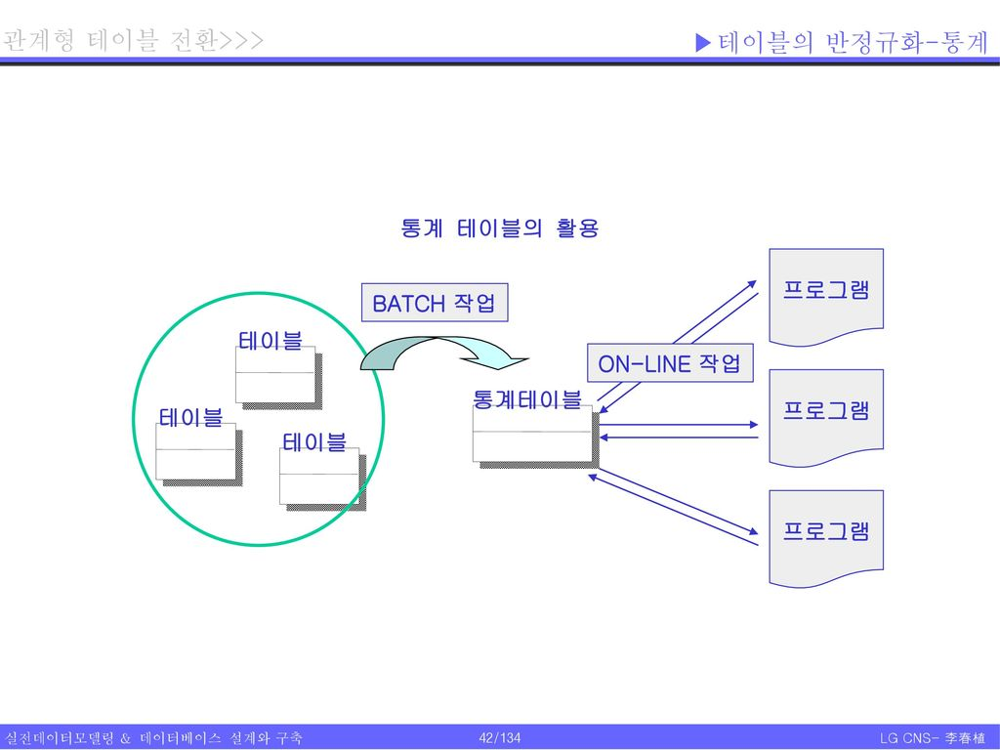

# 데이터베이스 구축
## ERD를 관계형 테이블로 전환
데이터베이스 구축을 위해, 논리 모델링에 의해 생성된 ERD를 물리적 ERD인 관계형 테이블로 전환해야 한다. 

관계형 테이블로 변환해야 하는 항목은 다음과 같다. 
- 엔티티타입 -> 테이블
- 주식별자 -> PK
- 속성 -> 컬럼
- 관계에 의한 외부 식별자 -> FK

### 엔티티타입과 테이블
**독립 엔티티타입은 독립 테이블로 전환된다**

**완전 종속 엔티티타입은 완전 종속 테이블로 전환된다**

**부분 종속 엔티티타입은 부분 종속 테이블로 전환된다**
부분 종속 엔티티타입의 주식별자는 스스로 생성되지만, 일반 속성은 부모 엔티티타입에서 상속받아 발생된다. 완전 종속 테이블에서 상속된 컬럼은 Null 값이 되지 못하는 것과 달리, 부분 종속 테이블에서 상속된 컬럼(FK) 값은 Null이 될 수 있다. 

### 주식별자와 PK
테이블에서 PK는 각 로우(Row)를 융리하게 할 뿐 아니라, 다른 테이블과의 관계에 의해 무결성 제약을 유지시키는 역할을 한다. 

**데이터 모델의 주식별자는 PK로 전환된다**
**무결성 제약(Referential Integrity)을 유지하는 역할을 한다**
테이블의 PK는 다른 테이블과의 관계에서 무결성 제약 조건에 참여하는 역할을 한다. 

'사원 테이블의 부서번호는 반드시 부서 테이블에 존재하는 데이터가 있어야 한다'고 하면 사원 테이블의 컬럼에는 부서 테이블의 PK가 포함된다. 

**PK는 테이블에 있는 각각의 로우를 유일하게 식별한다**
일반적으로 PK를 통해 로우를 유일하게 식별할 수 있도록 하지만, 테이블간 참조 무결성 제약 조건이 없다면 PK 대신 유니크 인덱스만 지정해 테이블을 생성할 수도 있다. 

**PK는 Null 값을 갖지 않는다**
PK는 해당 테이블에 있는 각각의 로우를 대표하므로 Null 값을 갖지 않는다. 

**PK는 변경되지 않는다**
PK는 수정이 아니라 삭제되었다가 다시 생성되는 것이다. 

**가능하면 모든 테이블에서 PK를 정의한다**
PK를 정의하지 않으면 FK 또한 생성할 수 없어 참조 무결성 제약을 걸지 못하는 경우가 발생한다. 

### 외부 식별자와 FK
**1:1 주식별자 관계 변환**
주식별자 관계에서는 부모의 PK가 자식에게 FK로 전달되며 PK로 이용된다. 
- 자식 테이블에 데이터 입력 시
    - 부모 테이블에 데이터가 존재하는지 체크
- 부모 테이블의 데이터 삭제 시
    - 자식 테이블에서 해당 데이터를 먼저 삭제해야 함 

**1:1 비식별자 관계 변환**
부모가 자식에게 PK를 상속하지 않고 일반 컬럼으로 존재하여 관계를 갖는다.
- 자식 테이블에 데이터 입력 시
    - 부모 테이블에 데이터가 존재하는지 체크하지 않아도 됨
    - FK 입력시에는 부모 테이블을 반드시 확인 
- 부모 테이블의 데이터 삭제 시
    - 자식 테이블에서 해당 데이터를 먼저 삭제해야 함 

**1:M 관계 변환**
주식별자 관계로 PK를 상속받았을 경우, PK 구성을 위해 상속받은 컬럼 외에 추가적인 컬럼이 더 필요하다. (FK만으로 PK를 구성하면 안됨)

**자기 참조 관계 변환**
자기 참조 관계는 자신의 PK가 일반 컬럼에서 FK로 포함되는 모습이다. 

**슈퍼타입/서브타입 관계 변환**
슈퍼타입과 서브타입의 관계를 테이블 관계로 변환하는 방법
- 각각의 테이블로 변환
    - 1:1 주식별자 관계에 의한 PK(FK) 생성
    - 슈퍼타입 테이블 내 종류 코드 등을 통해 각각의 레코드가 어느 서브타입 테이블과 연관되는지 구별
    - 각각의 테이블로 처리해 수행 속도가 빠름
    - 슈퍼타입에 속한 정보만 조회하는 경우 SQL 작성이 쉬움
    - 컬럼의 중복이 없음
    - 슈퍼타입과 서브타입의 정보를 같이 처리 시 항상 조인 발생 -> 성능 저하, 복잡한 SQL 문
- 서브타입 테이블로 변환 
    - 각각 PK를 생성해 테이블간 관계가 존재하지 않음
    - 테이블 스캔이 쉬움(부모 테이블과의 조인이 필요 없음)
    - 서브타입을 묶어 처리할 경우 처리가 복잡하거나 불가능
    - 테이블 별로 Not Null, 기본값 지정이 자유로움
- 통합 테이블로 변환
    - 구분 컬럼(종류 코드)이 필요
        - 항상 구분 컬럼을 통해 로우를 구분하는 작업이 필요함
    - 데이터 조회가 쉬움, SQL문 작성이 쉬움
    - 조인이 필요하지 않아 수행 속도가 좋아질 수 있음
    - Not Null과 기본값 지정이 자유롭지 않음

## 반정규화
반정규화: 정규화된 엔티티타입, 속성, 관계 등의 데이터 모델을 통합하는 프로세스
- 데이터의 정합성, 무결성 vs. 데이터베이스 구성의 단순화, 성능
- SQL 문장이 단순해지고 성능이 향상될 수 있음
- 데이터가 여러 테이블에 걸쳐 존재하므로 같은 성격의 데이터값이 다른 경우가 발생할 수 있음

### 주의 사항 
대부분은 데이터의 무결성 보장이 가장 중요한 관건이므로 정규화한 테이블을 그대로 유지하는 것을 목표로 한다. 
- 복잡성과 성능에 문제가 되는 테이블에 대해 뷰(View)의 생성, 파티셔닝 테이블 생성, 인덱스, 클러스터링 적용 등 다른 방안을 먼저 조사한 다음 반정규화를 고려
- 무분별한 반정규화는 데이터의 추적을 불가하게 만들거나 정합성을 맞출 수 없게 할 수 있음

### 절차 
1. 반정규화 대상 조사 
- 자주 사용되는 테이블에 접근하는 프로세스의 수가 많고, 항상 일정한 범위만을 조회하는 경우
- 테이블에 대량의 데이터가 있고 대량의 데이터 범위를 자주 처리하는 경우
- 통계 정보가 필요할 경우 별도의 통계 테이블(반정규화 테이블) 생성
- 테이블에 지나치게 많은 조인이 걸릴 경우

2. 다른 방법 유도 검토
- 지나치게 많은 조인이 걸리는 경우 -> 뷰 테이블을 사용
- 대량의 데이터 처리나 부분 처리 -> 클러스터링 적용 또는 인덱스 조정
- 대량의 데이터 -> 파티셔닝 적용
- 애플리케이션에서의 로직 변경 

3. 반정규화 적용
- 테이블 반정규화
- 속성 반정규화
- 관계 반정규화

### 반정규화 방법
#### 테이블 반정규화 방법
**테이블 병합**
- 두 개의 테이블에 발생하는 프로세스가 동일하게 처리되는 경우가 많을 경우
- 두 테이블을 함께 조회하는 경우가 많고, 두 테이블간의 관계가 1:1이면서(PK가 동일) 한쪽에 필수 관계인 경우
- 두 테이블의 관계가 1:M이지만 항상 두 테이블을 조인해 조회하는 경우
- 슈퍼타입과 서브타입의 관계로 연결되어 있을 경우

**테이블 분할**
하나의 테이블을 수직 혹은 수평 분할하는 것을 테이블 분할 또는 <u>파티셔닝</u>이라고 한다. 여기에서의 파티셔닝이라는 용어는 데이터베이스 디자인 단계에서의 데이터를 저장하는 방식의 파티셔닝과는 구분되는 개념이다.

다음은 테이블 분할을 고려하는 경우이다. 
- 테이블 내 특정 속성들만 집중적으로 사용하는 경우
- 모든 속성을 이용하더라도 특정 범위의 레코드만 집중적으로 사용하는 경우
- 지역별 데이터 분산 전략이나 데이터 서버별 분산 전략을 사용하는 경우

테이블 분할의 특징
- 전체적인 스캔 범위 축소, 한 테이블에서 접근하는 데이터 양 감소 
- 테이블에 걸린 잠금(Locking) 감소
- 분할된 테이블을 같이 조회할 경우 SQL 문이 복잡해지고 처리 속도가 느려짐

테이블 분할 방법
- 수직적 분할: 컬럼을 기준으로 테이블을 분리
    - PK는 모든 테이블에 동일하게 존재해 중복 발생
    - 컬럼은 한 테이블에 하나씩 존재 
    - 특정 컬럼에 대해 사용 빈도 차이가 심하고 길이가 긴 경우
    - 다중 테이블을 읽어야 하는 경우가 드문 경우
    - 테이블의 특정 컬럼이 아주 길거나 특별한 형식의 데이터타입인 경우
- 수평적 분할: 로우를 기준으로 테이블을 분리
    - 데이터베이스의 스키마는 동일하지만, 내부 데이터값을 이용하는 방법이 로우별로 다를 때
    - 테이블 내 특정 구간만 선별해 조회하는 경우가 많을 때
    - 분할된 데이터를 동시에 필요로 하는 경우 조인으로 인한 성능 저하 발생
    - PK를 포함한 각 테이블을 관리하기가 복잡함
        - 오라클에서는 수평 분할을 위해 파티셔닝 테이블 기능을 제공

**테이블 추가**
논리적인 데이터 모델링 이후에도 통계 관리, 이력 관리 등이 추가적으로 발생할 수 있다. 아래는 일반 테이블을 이용해 통계 데이터를 처리할 때 생길 수 있는 문제점이다. 
- 여러 테이블을 읽고 처리하는 데 부하가 발생
- 데이터 양이 많거나 내용이 복잡하면 실시간으로 처리하기에 느림

따라서 대량의 데이터를 처리할 때는 별도의 통계 테이블을 분리하고 배치(Batch) 작업으로 데이터를 산출한다. 

별도의 통계 테이블을 만들어 두고 시스템을 이용하지 않는 시간에 자동으로 처리하도록 스케줄 작업으로 데이터를 입력한다. 

검토 사항
- 해당 업무에서 통계 데이터를 필요로 하는지
- 통계 데이터의 유형이 정형화되어 이를 컬럼으로 보관할 수 있는지
- 실시간으로 처리해도 적합한지 

#### 컬럼 반정규화 방법
테이블의 성능이 저하되거나 데이터에 접근하는 경로가 너무 복잡한 경우 컬럼이나 로우의 중복을 통해 이를 해결할 수 있다. 

**중복 컬럼 추가**
- 접근 경로가 너무 복잡한 경우, 추가 컬럼을 통해 테이블에 대한 읽기 성능을 향상시킬 수 있다. 
- SQL 문장 작성을 용이하게 한다. 
- 데이터 입력, 수정, 삭제 시 여러 컬럼에 대해 수정해야 하므로 무결성 확보가 어렵다. 
    - 트리거(Trigger)를 통해 무결성을 보장할 수 있다. 
- 추가적인 디스크 공간이 필요하다. 

추가 방법
- 해당 테이블에서 자주 사용하는 컬럼인 경우에 컬럼을 중복시킨다. 
- 테이블을 조회하는 경로를 단축하기 위해 컬럼을 중복시킨다. 

**파생 컬럼 추가**
- 컬럼에 의한 파생 컬럼 추가
    - SQL 문장의 단순화와 읽기 성능 향상
    - 데이터 입력, 수정, 삭제 시 추가 컬럼에 대한 계산을 진행해야 하므로 성능 저하 가능 
- 로우에 의한 파생 컬럼 추가 
    - 특정 로우에 있는 값이 변경되는 경우 전체 로우의 데이터값을 다시 계산해야 할 수 있음

**이력 데이터 모델의 컬럼 추가**
이력 데이터에 대한 추가 컬럼을 사용하지 않을 경우, 다음과 같은 불편함이 존재한다. 
- 가장 최근 이력을 조회할 때 MAX(일자)를 사용하는 것은 성능 저하를 야기
- 복잡한 SQL 문장, 그룹 함수나 서브 쿼리를 사용해야 함

추가 방법
- 변경 이력, 발생 이력에 대한 최신 정보 컬럼 추가
- 진행 이력에 대한 종료 일자 컬럼 추가

**PK에 의한 컬럼 추가**
- 복합 PK에 의한 컬럼 추가
    - 복합 컬럼 내 특정 컬럼만을 대상으로 조회 작업이 필요한 경우
- PK에 의한 컬럼 추가
    - PK 구성 컬럼 수가 많아 PK를 복합 컬럼으로 대체하는 경우

**시스템 오작동 처리를 위한 컬럼 추가**
계산 결과값 저장 또는 일의 진행 상태 변경과 같은 업무에서 최신 정보만 관리하는 경우, 사용자의 오입력으로 인한 시스템 오작동 처리를 위해 이전 상태에 대한 정보를 저장하는 컬럼을 추가한다. 
이력 관리의 경우 데이터를 삭제해도 이전 이력이 있기 때문에 문제가 없다. 

#### 관계 반정규화 방법
테이블에 FK 형태로 중복 컬럼을 추가해 관계를 중복시켜 접근 경로를 단축할 수 있다.

