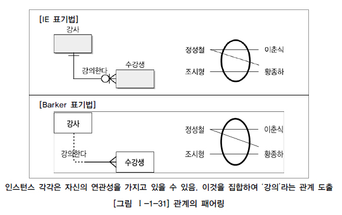

## 관계(Relationship)
### 관계의 개념
관계: 두 개의 엔티티타입 사이의 논리적인 관계
    - 엔티티와 엔티티가 존재의 형태나 행위로서 서로에게 영향을 주는 것
    - 업무의 흐름

### 관계 페어링(Relationship Pairing)
관계는 엔티티 안의 인스턴스가 개별적으로 관계를 가지는 것(Paring)으로, 관계 페어링의 집합을 논리적으로 표현한 것이다. 
따라서 개별 인스턴스가 각각 다른 종류의 관계를 가지고 있다면 두 엔티티 사이에 2개 이상의 관계가 형성 될 수 있다.

관계 페어링은 엔티티의 인스털스들이 자신이 관련된 인스턴스들과 관계의 어커런스로 참여하는 형태이다. 

### 관계의 명명 

### 관계의 카디낼리티(Cardinality)