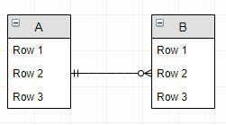

## 관계(Relationship)
### 관계의 개념
관계: 두 개의 엔티티타입 사이의 논리적인 관계
    - 엔티티와 엔티티가 존재의 형태나 행위로서 서로에게 영향을 주는 것
    - 업무의 흐름

### 관계 페어링(Relationship Pairing)
관계는 엔티티 안의 인스턴스가 개별적으로 관계를 가지는 것(Paring)으로, 관계 페어링의 집합을 논리적으로 표현한 것이다. 
따라서 개별 인스턴스가 각각 다른 종류의 관계를 가지고 있다면 두 엔티티 사이에 2개 이상의 관계가 형성 될 수 있다.

관계 페어링은 엔티티의 인스턴스들이 자신이 관련된 인스턴스들과 관계의 어커런스로 참여하는 형태이다. 

### 관계의 카디널리티(Cardinality)
데이터 모델링 관점에서 카디널리티란, 한 테이블과 다른 테이블의 관계이다. 
- 1:1(One to One)
    - one row in table A relates to one row in tableB
    ex) 구매신청-구매주문
- 1:M(One to Many)
    - one row in table A relates to many rows in tableB
    ex) 부서-사원
- M:N(Many to maNy)
    - Many rows in table A relate to many rows in tableB
    ex) 주문-제품

> 데이터베이스 쿼리 최적화 관점에서의 카디널리티는 테이블에 존재하는 unique한 컬럼값의 수이다.

### 관계 참여 방법
- 필수 참여 관계(Mandatory Membership)
    - 참여하는 모든 참여자가 반드시 타 엔티티타입의 참여자와 연결되어야 함
    ex) 주문서-주문목록(주문서에는 반드시 주문목록이 있어야 함)
- 선택 참여 관계(Optional Membership)
    - 타 엔티티타입의 참여자와 연결되지 않은 참여자가 있을 수 있음 
    - 물리 속성에서 FK로 연결된 경우 NULL을 허용함

선택 참여하는 엔티티타입쪽을 원으로 표시하고, 필수 참여는 아무런 표시를 하지 않는다. 

### 관계의 종류 
- 정상 관계(Normal Relationship)
    - 두 엔티티타입이 독립적으로 분리됨
    - 한 가지 관계만 성립

- 자기 참조 관계(Self Relationship, Recursive Relationship)
    - 하나의 엔티티타입 내에서 엔티티와 엔티티가 관계를 맺음
    - 계층 구조를 표현할 때 유용함

- 병렬 관계(Parallel Relationship)
    - 두 엔티티타입이 독립적으로 분리됨
    - 두 개 이상의 관계가 성립
    ex) 은행-고객 (예금을 하는 관계와 출금을 하는 관계)

- 슈퍼타입 서브타입 관계(Super-Type Sub-Type Relationship)
    - 슈퍼타입이 공통 컬럼을 가지고 두 개 이상의 서브 엔티티타입과 관계를 맺음
        - 배타적 관계(Exclusive Relationship): 슈퍼타입의 특정 엔티티가 반드시 하나의 서브타입에만 속해야 함 
        - 포함 관계(Inclusive Relationship): 슈퍼타입의 특정 엔티티가 두 개 이상의 서브타입에 속할 수 있음 

- 주식별자/비식별자 관계(Identifying/Non-Identifying Relationship)
    - 주식별자: 부모의 PK가 자식의 PK로 상속됨
    - 비식별자: 부모의 PK가 자식의 일반 속성으로 상속됨 
    
#### Reference
What is cardinality in Databases? - <https://stackoverflow.com/questions/10621077/what-is-cardinality-in-databases> 