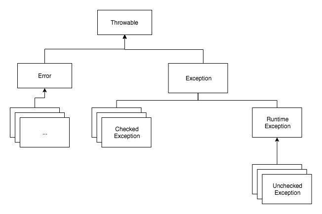
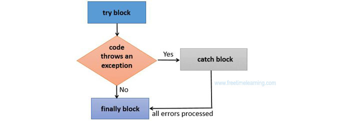

## Exception Handling 
### 예외와 예외 클래스 
에러: 컴퓨터 하드웨어의 오동작 또는 고장으로 인해 응용프로그램 실행 오류가 발생하는 것 
예외: 사용자의 잘못된 조작 또는 개발자의 잘못된 코딩으로 인해 발생하는 프로그램 오류 
- 일반 예외(Exception): 컴파일 오류를 발생시키는 예외
- 실행 예외(Runtime Exception): 컴파일 과정에서 예외 처리 코드를 검사하지 않는 예외



- Unchecked Exception
명시적인 예외 처리를 강제하지 않는다.

- Checked Exception
반드시 명시적으로 처리해야 한다. 미처리 시, 컴파일 에러를 발생시킨다. 

위 상속 구조를 처럼 Unchecked Exception는 RuntimeException을 상속하고 Checked Exception는 RuntimeException을 상속하지 않는다.<br>
// checked exception이 런타임 시 발생되지 않는다는 것이 아니다. 두 예외 다 런타임 시 발생되고 체크되지만, checked exception은 예외 처리(catch) 구문이 없을 경우 컴파일 에러를 발생시킨다. 

| | Checked Exception | Unchecked Exception |
|-|-|-|
| 처리 여부 | 반드시 처리 | 예외 처리 하지 않아도 됨 |
| 예외 발생 시 트랜잭션 Rollback 여부 | Rollback 안됨 | Rollback 진행 |
| 대표 Exception | 	IOException, SQLException | NullPointerException, IllegalArgumentException |

### 예외 처리 방법 
#### try-catch
예외가 발생했을 경우 프로그램의 갑작스러운 종료를 막고 정상 작동을 유지할 수 있도록 처리하는 코드를 예외 처리 코드라고 한다.<br>실행 예외는 컴파일러가 체크해주지 않기 때문에 예외 처리 코드를 개발자의 경험을 바탕으로 작성해야 한다. 

예외 처리 코드는 `try-catch-finally` 블록을 이용한다. 



사용법은 아래와 같다. 

```java
try{
    // 예외 발생 가능성이 있는 코드
}catch(예외 타입1 매개변수명){

    // 타입1의 예외가 발생할 경우 처리 
}finally{
    // 항상 수행
}
```

try 블록은 예외가 발생할 가능성이 있는 범위를 지정하는 블록이다.<br>try 블록은 최소한 하나의 catch 블록이 있어야 하며, catch 블록은 try 블록 다음에 위치한다.

catch 블록의 매개변수는 예외 객체가 발생했을 때 참조하는 변수명으로, 반드시 java.lang.Throwable 클래스의 하위 클래스 타입으로 선언되어야 한다.

지정된 타입의 예외 객체가 발생하면 try 블록의 나머지 문장들은 수행되지 않고, 발생한 예외 객체 타입이 동일한 catch 블록이 수행된다. 

finally 블록은 필수 블록은 아니다.<br>
finally 블록의 내용은 예외 발생 유무와 상관 없이 무조건 수행된다. 따라서, 데이터베이스나 파일을 사용한 후 닫는 기능과 같이 항상 수행해야 할 필요가 있는 경우에 사용한다.

> 예외를 catch 했으면 그냥 `e.printStackTrace();`로 출력만 할 게 아니라 반드시 처리해야 한다. 

##### 다중 catch
발생하는 예외별로 여러 개의 catch 블록을 작성할 수 있다.

```java
try{

} catch(ArrayIndexOutOfBoundsException e) {

} catch(NumberFormatException e){

}
```

catch 블록이 여러 개여도 단 하나의 catch 블록만 실행된다. try 내에서 하나의 예외가 발생하면 즉시 실행을 멈추고 catch 블록을 실행시키기 때문이다. 

##### catch 순서
아래와 같이 다중 catch 블록에서 상위 예외 클래스의 catch 블록이 더 위에 있다면, 하위 catch 블록은 실행되지 않는다. 

```java
try{

} catch(Exception e) {

} catch(ArrayIndexOutOfBoundsException e){

}
```

`ArrayIndexOutOfBoundsException`은 `Exception`을 상속받기 때문에 첫 번째 catch 블록만 실행된다. 따라서 `ArrayIndexOutOfBoundsException`의 catch 블록이 실행되게 하고 싶다면 아래처럼 코드를 수정해야 한다. 

```java
try{

} catch(ArrayIndexOutOfBoundsException e) {

} catch(Exception e){

}
```

##### 멀티 catch 
자바7부터 하나의 catch 블록에서 여러 개의 예외를 처리할 수 있다.<br>아래처럼 동일하게 처리하고 싶은 예외를 |로 연결하면 된다. 

```java
try{

} catch(ArrayIndexOutOfBoundsException | NumberFormatException e) {
    // 공통 처리
}
```

#### 예외 떠넘기기 
`throws`를 이용해 메서드를 호출한 곳으로 예외를 떠넘길 수 있다.

```java
리턴타입 메서드명(매개변수) throws 예외클래스1, 예외클래스2, ... {

}
```

혹은 `throws Exception`만으로 모든 예외를 떠넘길 수 있다. 

throws 키워드가 붙어 있는 메서드는 반드시 try 블록 내에서 호출되어야 한다.<br>
그리고 catch 블록에서 떠넘겨 받은 예외를 처리해야 한다.<br>
아니면 throws를 다시 이용해서 예외를 호출한 곳으로 떠넘겨야 한다. 

```java
public void method1(){
    try{
        method2();
    }catch(ClassNotFoundException e){
        //예외 처리 코드 
    }
}

public void method2() throws ClassNotFoundException {
    Class clazz = Class.forName("java.lang.String2"); 
}
```

메서드에서 예외를 던졌는데 catch 블록이 세 단계 위에 있다면 그 사이의 모든 메서드는 선언부에 해당 예외를 정의해야 한다. 

### 예외 발생시키기 


### 사용자 정의 예외
애플리케이션의 서비스와 관련되어 개발자가 직접 정의해서 만들어야 하는 예외를 애플리케이션 예외, 또는 사용자 정의 예외라고 한다. 

#### 사용자 정의 예외 클래스 선언 
사용자 정의 예외 클래스는<br>일반 예외로 선언할 경우 `Exception`을 상속하고,<br>실행 예외로 선언할 경우 `RuntimeException`을 상속하면 된다. 

```java
public class XXXException extends [ Exception | RuntimeException ] {
    public XXXException() { }
    public XXXException(String message) { super(message); }
}
```

사용자 정의 예외 클래스도 필드, 생성자, 메서드 선언들을 포함할 수 있지만, 대부분 생성자 선언만을 포함한다.<br>
생성자는 일반적으로 두 개를 선언한다. 
- 매개 변수가 없는 기본 생성자
- 예외 발생 원인(예외 메세지)를 전달하기 위해 String 타입의 매개 변수를 갖는 생성자

`Exception`을 상속할 경우, 컴파일러에 의해 체크되는 예외기 때문에 try-catch 블록으로 예외 처리가 필요하다. 

#### 사용자 정의 예외 사용법
```java
public class ExceptionRunner { 
    public static void main(String[] args) { 
        UserDao userDao = new UserDao(); boolean isExistUser;
        try{
            isExistUser = userDao.isExistUser("testId@test.net");
        } catch(UserAlreadyExistException e) {
            //예외 처리 
        }
    } 
}
```

```java
public class UserDao { 
    public boolean isExistUser(String userId) throws UserAlreadyExistException{ 
        //db에 유저가 있는지 검사하는 로직
        User user = userDao.findUserById(userId); 
        
        if(user != null){ 
            throw new UserAlreadyExistException("001"); 
        } 
    } 
}
```

### 예외 처리 전략


예외 처리 방법에는 일반적으로 예외 복구, 예외 처리 회피, 예외 전환이 있다. 

모든 방식에는 상황정보와 로그가 필수로 남겨져야 한다. 

#### 예외 복구 

```java
int maxretry = MAX_RETRY;  
while(maxretry -- > 0) {  
    try {
        // 예외가 발생할 가능성이 있는 시도
        return; // 작업성공시 리턴
    }
    catch (SomeException e) {
        // 로그 출력. 정해진 시간만큼 대기
    } 
    finally {
        // 리소스 반납 및 정리 작업
    }
}
throw new RetryFailedException(); // 최대 재시도 횟수를 넘기면 직접 예외 발생
```

**예외가 발생해도 애플리케이션은 정상적인 흐름으로 진행**되게 하는 방법이다.<br>
예외 발생 시 재시도를 통해 예외를 복구하고, 최대 재시도 횟수를 넘기면 `RetryFailedException`을 발생시킨다.<br>
예외가 발생할 것을 예측해 이를 다른 흐름으로 유도시키면 예외가 발생하더라도 정상적으로 작업을 종료할 수 있다. 

#### 예외 처리 회피

```java 
public void add() throws Exception {  
    // 실행 블럭 
}
```

`throws`를 통해 해당 메서드를 호출한 곳으로 예외를 떠넘기고 처리를 회피하는 방법이다. 

이 방법은 다음과 같은 단점을 지니기 때문에, 예외를 원거리에서 처리하는 것은 지양해야 한다. 
- 하위 단계에서 코드를 변경하면 상위 단계 메서드 선언부를 전부 고쳐야 함(연쇄적인 수정)
- throws 경로에 있는 모든 함수가 최하위 함수에서 던지는 예외를 알아야 하므로 캡슐화가 깨짐

> 예외를 회피하는 것은 의도가 분명해야 한다. 콜백/템플릿처럼 긴밀한 관계에 있는 다른 오브젝트에게 예외처리 책임을 분명히 지게 하거나, 상위 메서드에서 예외를 다루는 것이 최선이라는 확신이 있어야 한다. 

#### 예외 전환
예외 전환은 예외를 잡아 다른 예외를 던지는 방법이다.<br>
이 방법은 보통 두 가지 목적으로 사용된다. 
1. 예외를 그대로 던지는 것이 그 예외상황에 대한 적절한 의미를 부여해주지 못하는 경우에, 의미를 분명하게 해줄 수 있는 예외로 바꾸기 위해 

    ```java
    catch(SQLException e) {  
    ...
    throw DuplicateUserIdException();
    }
    ```
    호출한 쪽에서 예외를 받아 처리할 때 예외에 대해 더 정확하게 인지할 수 있도록 돕는다.

    이 경우, **더 구체적인 Unchecked Exception을 발생시키고 예외에 대한 메세지를 명확하게 전달**해야 한다. 

2. 예외를 처리하기 쉽고 단순하게 만들기 위해 

    ```java
    try{
        OrderHome orderHome = EJBHomeFactory.getInstance().getOrderHome();
        Order order = oderHome.findByPrimaryKey(Integer id); 
    } catch (NamingException ne) {
        throw new EJBException(ne); 
    } catch (SQLException se) {
        throw new EJBException(se);
    } catch (RemoteException re) {
        throw new EJBException(re);
    }
    ```

    check 예외를 uncheck 예외인 EJBException으로 포장해 던져, 트랜잭션을 자동으로 롤백해준다. <br>
    어차피 복구하지 못할 예외라면 코드에서는 런타임 예외로 포장해서 던져버리고, 자세한 로그를 남기거나 알림으로 통보해주는 편이 낫다. 
    
#### Reference
<https://cheese10yun.github.io/checked-exception/><br>
<https://hyeonstorage.tistory.com/203><br>
<https://dololak.tistory.com/88><br>
<http://www.nextree.co.kr/p3239/><br>
클린 코드<br>
<https://www.slideshare.net/dhrim/ss-2804901><br>
토비의 스프링