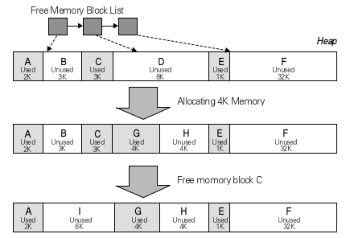
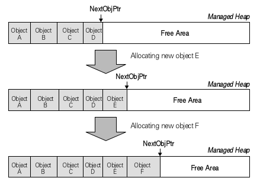
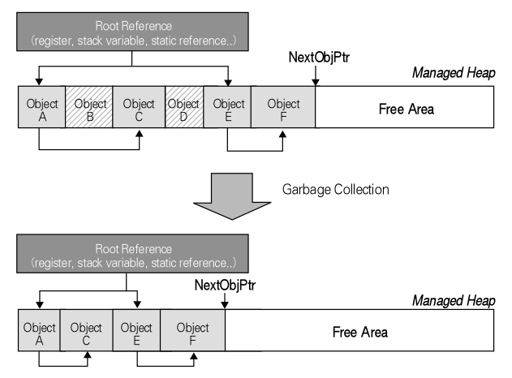
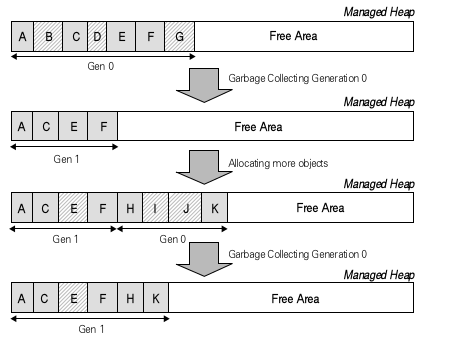
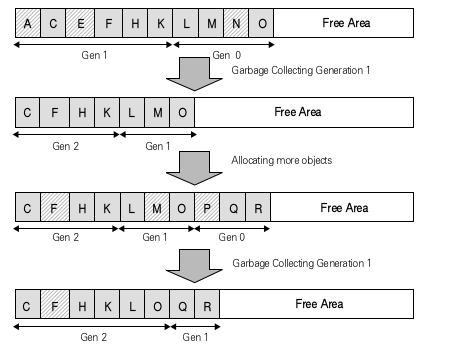
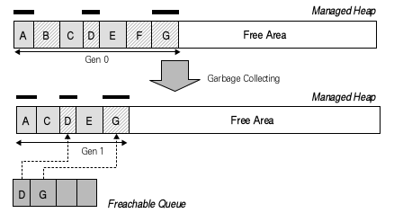
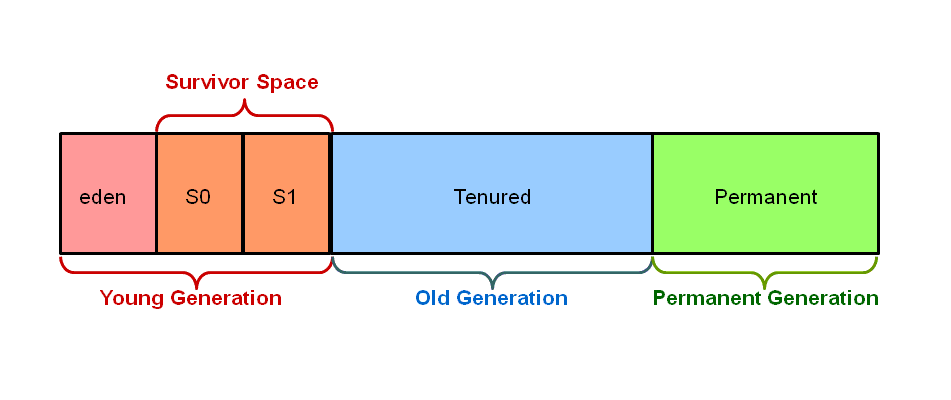

## GC
### C/C++ 메모리 할당 
힙의 자유 메모리 블럭(free memory block)을 런타임 라이브러리(runtime library)가 유지 
- new/malloc으로 메모리 할당
    - 메모리 블럭 리스트를 검색, 요청된 크기의 메모리를 할당할 메모리 블럭을 찾음 
- delete/free로 메모리 해제
    - 해제된 메모리는 다시 사용 가능한 메모리 리스트에 삽입됨 

단점 
- 메모리 할당에 소요되는 시간이 상대적으로 길다 
    - 할당/해제가 반복됨에 따라 메모리 사용 패턴은 조각남(사용 중/사용 가능한 메모리 블럭으로 쪼개어짐)
    - 조각난 메모리는 할당 시 자유 메모리 블럭 검색에 오버헤드를 가짐
- 해제 시 오버헤드 존재 
    - 인접한 자유 메모리 블럭 존재 시 병합

메모리 블럭의 할당과 해제가 잦아질수록, 메모리 블럭의 크기가 작을수록 메모리 조각 현상이 두드러진다. 메모리 할당은 연속적이어야 하기 때문에 힙의 크기가 충분함에도 불구하고 큰 메모리 블럭의 할당이 저해됨. 

### GC 작동 방식 
선형 메모리 할당, 사용하지 않는 메모리 블럭 제거 

선형 메모리 할당 
- 자유 메모리 블럭 리스트 사용 x
- 다음 메모리 할당을 위한 포인터만을 유지
- 메모리 할당 시 포인터 값 증가, 메모리를 초기화 
- 매우 빠름, 조각 발생 x -> 메모리 할당이 작고 잦을 때 효과적 

메모리 해제 
- 특정 조건을 만족하는 상황에서 현재 수행중인 쓰레드들을 모두 중단, GC 쓰레드를 활성화
    - 힙 상에서 사용 중인 객체들의 그래프를 생성
    - 사용 중인 객체들의 위치를 재조정, 사용하지 않는 객체들을 힙에서 제거 
- 객체가 사용중임을 판별하기 위해 참조 그래프를 만듦 
    - 루트 참조 필요
        - 현재 각 쓰레드가 수행 중인 메서드의 로컬 변수(스택 변수)
        - CPU 레지스터 변수가 가지고 있는 참조
        - 현재 사용중인 각 타입(클래스)의 정적 필드
        - 전역 변수 
    - 루트 참조가 참조하는 객체, 그 객체가 참조하는 다른 객체 등을 참조 그래프에 추가해 그래프를 완성
    - 참조 그래프에 포함되지 않는(현재 사용중이지 않은) 모든 객체는 가비지 컬렉션의 대상

### GC의 최적화 기법 
**세대별 가비지 컬렉션**은 힙 상의 객체를 객체의 생존 시간을 기준으로 객체를 몇 세대로 구분해 가비지 컬렉션을 수행하는 것을 말함 
0세대 -> 1세대 -> 2세대 (살아남은 GC 횟수)
2세대의 객체들은 GC 수행 동안 계속 2세대에 남음 
기본 가비지 컬렉션은 0세대에 대해서만 이루어지며, 1세대와 2세대는 수행하지 않음
0세대에 집중적으로 가비지 컬렉션을 수행하면 성능과 효율이 올라가는 근거 
- 최근 생성된 객체일수록 생명주기가 짧음
- 오래된 객체일수록 생명주기가 긺
- 최근 생성된 객체들끼리는 서로 연관성이 높으며 비슷한 시점에서 자주 액세스됨
- 전체 힙보다 일부분의 힙을 가비지 컬렉션하는 것이 빠름

0세대가 사용할 메모리 공간이 줄어들고 1세대가 늘어남에 따라 특정 한계에 도달하면 0세대와 1세대에 대해 가비지 컬렉션을 수행함

GC 0: 0세대에 대해서만 수행

GC 1: 0세대와 1세대에 대해 수행 

GC 1 수행 이후에도 공간이 부족한 경우 2세대 가비지 컬렉션(풀 가비지 컬렉션) 수행 
-> 전체 힙에 대해 가비지 컬렉션 

### Finalizer와 가비지 컬렉션 
Finalizer가 수행되는 시점이 가비지 컬렉션이 수행되는 시점. 
GC는 가비지 컬렉션을 통해 객체를 제거할 때 해당 객체의 클래스가 Finalizer를 정의하고 있는지 검사. 
Finalizer를 갖는 클래스의 인스턴스가 제거되야 한다면 이 객체를 Freachable 큐에 삽입, Finalizer 수행을 위한 별도의 쓰레드를 실행 -> 큐에서 객체를 하나씩 꺼내 Finalizer 수행 

- Finalizer가 실행되는 쓰레드는 애플리케이션 쓰레드가 아님
- Finalizer가 수행되는 순서나 시기는 예측 불가능

객체가 힙 상에서 제거되는 시점은 Finalizer 쓰레드가 객체의 Finalizer를 수행하고, 객체를 큐에서 제거한 다음에 발생하는 GC 시점이다. 
객체는 GC 동안 Finalizer 때문에 살아남았기 때문에 세대 증가

권장하지 않는 이유: Finalizer를 갖는 객체는 사용 중이 아니더라도 세대 승급 -> 힙에서 완전히 제거되는데 오래 걸림 

### 가비지 컬렉션의 고려사항들 
#### 장단점 
- 메모리 할당 속도 매우 빠름
- 해제는 C/C++의 메모리 해제 속도에 비해 느림
    - 참조 그래프 생성
    - 객체 위치 변경
    - 참조 값 변경 
- GC 발생 주기가 C/C++의 메모리 해제 함수 호출 빈도보다 낮아 전체적인 성능이 더 나쁘진 않음
- GC에 의해 관리되는 힙에 대해 개발자의 접근이 크게 제한됨 

#### 메모리 누수
메모리 누수란 할당된 메모리가 더 이상 사용되지 않음에도 불구하고 해제되지 않고 메모리 상에 남아 있음을 말한다. (C/C++의 경우, new/malloc 등을 통해 할당된 메모리가 delete/free 등으로 해제되지 않은 경우) 
- 메모리 자원 낭비 
- 메모리 부족 -> 성능 저하/시스템 다운

GC는 참조되지 않는 메모리가 해제되지 않는 경우는 발생 x, 하지만 불필요하게 길게 메모리를 점유할 수는 있음

#### 주의사항 
- 너무 잦은 객체 할당
- 너무 많은 참조
- 너무 많은 2세대 객체 
    - 생명주기가 매우 길고, 점유 영역은 잘 줄지 않음
    - Finalizer 사용 자제, 불필요한 참조 제거로 방지 
- Finalizer&Dispose 패턴
    - 객체의 사용이 완료되면 즉각 Dispose 메서드 호출 
    - Finalizer 호출 방지 

### Java에서의 GC
Hotspot JVM의 힙 영역은 3세대(Young, Old, Permanent), 5개의 영역(eden, survivor1, survivor2, old, permanent)으로 나뉜다.

##### Young Generation

Young Generation은 다시 Eden, Survivor0, Survivor1 영역으로 나뉜다.

객체가 생성되면 Eden 영역에 생성된다. Eden 영역이 꽉차게되면 Minor GC가 발생한다. Minor GC에서 살아남은 객체는 Survivor 영역 중 하나로 이동한다. Minor GC가 발생할때마다 살아남은 객체의 Age가 증가하는데, Age가 임계치를 넘은 객체는 Old 영역으로 이동하게 된다.

##### Old Generation

Young Generation에서 일정 Age가 될때까지 살아남으면 그 객체는 Old Generation으로 옮겨지게 된다. Old 영역은 가득차게 되면 Major GC가 발생한다. Major GC는 보통 Minor GC보다 훨씬 느린데, 그 이유는 Young 영역을 제외한 모든 살아있는 객체를 검사해야하기 때문이다. GC 수행 시간은 종류에 따라 다르다.

##### Permanent Generation

Permanent 영역은 클래스와 메서드의 메타데이터가 저장되는 공간이다.

JVM은 런타임에 참조하는 클래스의 메타데이터를 Permanent 영역에 적재하게 된다. 만약 적재된 클래스가 더이상 필요 없고, 다른 새로운 클래스를 위한 Permanent 영역의 크기가 모자르다면, GC는 적재된 클래스를 수집하게 된다. Permanent 영역의 GC는 Full GC(Major GC를 포함한 Heap 영역 전체에 대한 GC) 안에 포함 되어있다.

-> JDK7까지는 permanent영역이 heap에 존재했습니다. JDK8부터는 permanent 영역은 사라지고 일부가 "meta space 영역"으로 변경되었습니다.(위의 그림 JDK7 기준입니다.) meta space 영역은 Native stack 영역에 포함되었습니다.

GC는 Minor GC와 Major GC로 나뉜다.

##### Minor GC : New 영역에서 일어나는 GC
1. 최초에 객체가 생성되면 Eden영역에 생성된다.
2. Eden영역에 객체가 가득차게 되면 첫 번째 CG가 일어난다.
3. survivor1 영역에 Eden영역의 메모리를 그대로 복사된다. 그리고 survivor1 영역을 제외한 다른 영역의 객체를 제거한다.
4. Eden영역도 가득차고 survivor1영역도 가득차게된다면, Eden영역에 생성된 객체와 survivor1영역에 생성된 객체 중에 참조되고 있는 객체가 있는지 검사한다.
5. 참조 되고있지 않은 객체는 내버려두고 참조되고 있는 객체만 survivor2영역에 복사한다.
6. survivor2영역을 제외한 다른 영역의 객체들을 제거한다.
7. 위의 과정중에 일정 횟수이상 참조되고 있는 객체들을 survivor2에서 Old영역으로 이동시킨다.

위 과정을 계속 반복, survivor2영역까지 꽉차기 전에 계속해서 Old로 비움

##### Major GC(Full GC) : Old 영역에서 일어나는 GC
1. Old 영역에 있는 모든 객체들을 검사하며 참조되고 있는지 확인한다.
2. 참조되지 않은 객체들을 모아 한 번에 제거한다.

Minor GC보다 시간이 훨씬 많이 걸리고 실행중에 GC를 제외한 모든 쓰레드가 중지한다.

Major GC(Full GC)가 일어나면, Old영역에 있는 참조가 없는 객체들을 표시하고 그 해당 객체들을 모두 제거하게 된다.

그러면서 Heap 메모리 영역에 중간중간 구멍(제거되고 빈 메모리 공간)이 생기는데 이 부분을 없애기 위해 재구성을 하게 된다. (디스크 조각모음처럼 조각난 메모리를 정리함)

따라서 메모리를 옮기고 있는데 다른 쓰레드가 메모리를 사용해버리면 안되기 때문에 모든 쓰레드가 정지하게 되는 것이다.

> 요즘은 자유 메모리 블럭 방식보다 GC가 낫다. 해제가 바로 일어나지 않아 메모리 사용량은 더 많지만, 메모리가 비싸지 않기 때문. 

#### Reference 
닷넷 가비지 컬렉션 돌아보기
https://jeong-pro.tistory.com/148
https://lazymankook.tistory.com/83