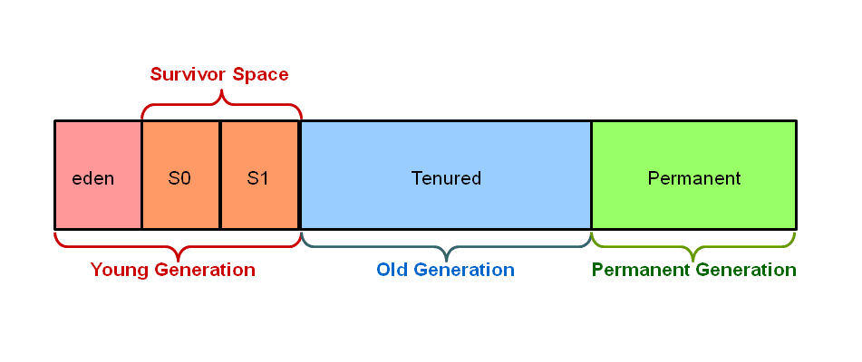

## Java에서의 GC
Hotspot JVM의 힙 영역은 3세대(Young, Old, Permanent), 5개의 영역(eden, survivor1, survivor2, old, permanent)으로 나뉜다.

##### Young Generation

Young Generation은 다시 Eden, Survivor0, Survivor1 영역으로 나뉜다.

객체가 생성되면 Eden 영역에 생성된다. Eden 영역이 꽉차게되면 Minor GC가 발생한다. Minor GC에서 살아남은 객체는 Survivor 영역 중 하나로 이동한다. Minor GC가 발생할때마다 살아남은 객체의 Age가 증가하는데, Age가 임계치를 넘은 객체는 Old 영역으로 이동하게 된다.

##### Old Generation

Young Generation에서 일정 Age가 될때까지 살아남으면 그 객체는 Old Generation으로 옮겨지게 된다. Old 영역은 가득차게 되면 Major GC가 발생한다. Major GC는 보통 Minor GC보다 훨씬 느린데, 그 이유는 Young 영역을 제외한 모든 살아있는 객체를 검사해야하기 때문이다. GC 수행 시간은 종류에 따라 다르다.

##### Permanent Generation

Permanent 영역은 클래스와 메서드의 메타데이터가 저장되는 공간이다.

JVM은 런타임에 참조하는 클래스의 메타데이터를 Permanent 영역에 적재하게 된다. 만약 적재된 클래스가 더이상 필요 없고, 다른 새로운 클래스를 위한 Permanent 영역의 크기가 모자르다면, GC는 적재된 클래스를 수집하게 된다. Permanent 영역의 GC는 Full GC(Major GC를 포함한 Heap 영역 전체에 대한 GC) 안에 포함 되어있다.

-> JDK7까지는 permanent영역이 heap에 존재했습니다. JDK8부터는 permanent 영역은 사라지고 일부가 "meta space 영역"으로 변경되었습니다.(위의 그림 JDK7 기준입니다.) meta space 영역은 Native stack 영역에 포함되었습니다.

GC는 Minor GC와 Major GC로 나뉜다.

##### Minor GC : New 영역에서 일어나는 GC
1. 최초에 객체가 생성되면 Eden영역에 생성된다.
2. Eden영역에 객체가 가득차게 되면 첫 번째 CG가 일어난다.
3. survivor1 영역에 Eden영역의 메모리를 그대로 복사된다. 그리고 survivor1 영역을 제외한 다른 영역의 객체를 제거한다.
4. Eden영역도 가득차고 survivor1영역도 가득차게된다면, Eden영역에 생성된 객체와 survivor1영역에 생성된 객체 중에 참조되고 있는 객체가 있는지 검사한다.
5. 참조 되고있지 않은 객체는 내버려두고 참조되고 있는 객체만 survivor2영역에 복사한다.
6. survivor2영역을 제외한 다른 영역의 객체들을 제거한다.
7. 위의 과정중에 일정 횟수이상 참조되고 있는 객체들을 survivor2에서 Old영역으로 이동시킨다.

위 과정을 계속 반복, survivor2영역까지 꽉차기 전에 계속해서 Old로 비움

##### Major GC(Full GC) : Old 영역에서 일어나는 GC
1. Old 영역에 있는 모든 객체들을 검사하며 참조되고 있는지 확인한다.
2. 참조되지 않은 객체들을 모아 한 번에 제거한다.

Minor GC보다 시간이 훨씬 많이 걸리고 실행중에 GC를 제외한 모든 쓰레드가 중지한다.

Major GC(Full GC)가 일어나면, Old영역에 있는 참조가 없는 객체들을 표시하고 그 해당 객체들을 모두 제거하게 된다.

그러면서 Heap 메모리 영역에 중간중간 구멍(제거되고 빈 메모리 공간)이 생기는데 이 부분을 없애기 위해 재구성을 하게 된다. (디스크 조각모음처럼 조각난 메모리를 정리함)

따라서 메모리를 옮기고 있는데 다른 쓰레드가 메모리를 사용해버리면 안되기 때문에 모든 쓰레드가 정지하게 되는 것이다.

> 요즘은 자유 메모리 블럭 방식보다 GC가 낫다. 해제가 바로 일어나지 않아 메모리 사용량은 더 많지만, 메모리가 비싸지 않기 때문. 

#### Reference 
닷넷 가비지 컬렉션 돌아보기
https://jeong-pro.tistory.com/148
https://lazymankook.tistory.com/83