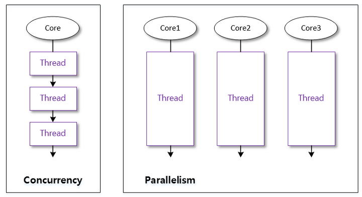
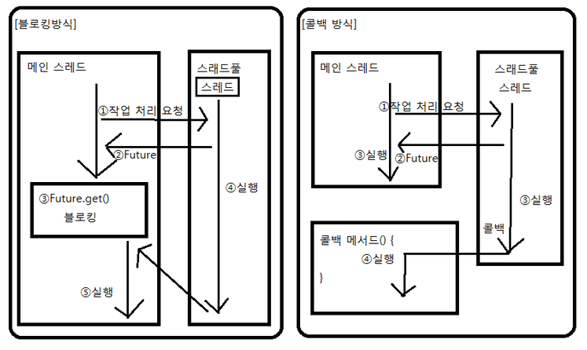

# 멀티 스레드
## 멀티 스레드 개념 
멀티 스레드는 하나의 프로세스가 두 가지 이상의 작업을 처리할 수 있도록 한다. 
ex) 메신저-채팅 기능을 제공하면서 파일 전송 기능도 수행

**멀티 프로세스**: 애플리케이션 단위의 멀티 태스킹
- 각자의 메모리를 가짐, 서로 독립적
    - 하나의 프로세스에서 오류가 발생해도 다른 프로세스에 영향 x

**멀티 스레드**: 애플리케이션 내부에서의 멀티 태스킹
- 프로세스 내부에 생성됨
    - 하나의 스레드가 예외를 발생시키면 프로세스 자체가 종료될 수 있음
        - 다른 스레드에게 영향을 미침

### 메인 스레드 
모든 자바 애플리케이션은 메인 스레드(main thread)가 main() 메서드를 실행하면서 시작된다. 

메인 스레드는 필요에 따라 작업 스레드들을 만들어 병렬적으로 코드를 실행할 수 있다. 


**싱글 스레드 애플리케이션**
- 메인 스레드가 종료하면 프로세스도 종료

**멀티 스레드 애플리케이션**
- 실행 중인 스레드가 하나라도 있다면 프로세스는 종료되지 않음
    - 메인 스레드가 작업 스레드보다 먼저 종료되더라도 작업 스레드가 아직 실행 중이라면 프로세스 종료 x

## 작업 스레드 생성과 실행
### Thread 클래스로부터 직접 생성 

### Thread 하위 클래스로부터 생성 

### 스레드의 이름

## 스레드 우선순위 
멀티 스레드는 동시성(Concurrency) 또는 병렬성(Parallelism)으로 실행된다.<br>
동시성: 멀티 작업을 위해 <u>하나의 코어에서 멀티 스레드가 번갈아가며 실행</u>하는 성질
병렬성: 멀티 작업을 위해 <u>멀티 코어에서 개별 스레드를 동시에 실행</u>하는 성질 



스레드의 개수가 코어의 수보다 많을 경우, 스레드를 어떤 순서에 의해 동시성으로 실행할 것인가를 결정하는 것을 스케줄링이라고 한다.<br>
스레드 스케줄링에 의해 스레드들은 아주 짧은 시간에 번갈아가면서 각자의 run() 메서드를 조금씩 실행한다.

자바의 스레드 스케줄링은 우선순위(Priority) 방식과 순환 할당(Round-Robin) 방식을 사용한다. 

- **우선순위 방식**: 우선순위가 높은 스레드가 실행 상태를 더 많이 가지도록 스케줄링하는 것
    - 스레드 객체에 우선순위 번호를 부여 -> 개발자가 코드로 제어 가능

- **순환 할당 방식**: 시간 할당량(Time Slice)를 정해서 하나의 스레드를 정해진 시간만큼 실행하고, 다시 다른 스레드를 실행하는 방식
    - 자바 가상 기계에 의해서 정해짐 -> 코드로 제어 불가 

// 방법

## 동기화 메서드와 동기화 블록
### 공유 객체를 사용 시 주의점
멀티 스레드 프로그램에서는 스레드들이 객체를 공유해서 작업하는 경우가 있다.<br>
이 경우, 스레드 A가 사용하던 객체가 스레드 B에 의해 상태가 변경될 수 있기 떄문에 스레드 A가 의도했던 것과 다른 결과가 산출될 수 있다. 

### 동기화 메서드 및 동기화 블록
스레드가 사용 중인 객체를 다른 스레드가 변경할 수 없도록 하려면 스레드 작업이 끝날 때까지 객체에 잠금을 걸어서 다른 스레드가 사용할 수 없도록 해야 한다. 

임계 영역(critical section): 단 하나의 스레드만 실행할 수 있는 코드 영역
- 공유 자원의 독점을 보장하는 영역 
- 지정된 시간이 지난 후 종료됨
- 임계 영역을 지정하기 위해 동기화(synchronized) 메서드와 동기화 블록을 제공

메서드 선언에 `synchronized` 키워드를 붙여 동기화 메서드를 만들 수 있다. 스레드가 객체 내부의 동기화 메서드 또는 블록에 들어가면, 즉시 객체에 잠금을 걸어 다른 스레드가 임계 영역 코드를 실행하지 못하도록 한다. 

```java
public synchronized void method() {
    // 임계 영역 
}
```

- 메서드 전체 내용이 임계 영역
- 스레드가 동기화 메서드를 실행하는 즉시 객체에는 잠금이 일어남(객체를 사용하려는 다른 스레드는 대기하게 됨)
- 스레드가 동기화 메서드를 실행 종료하면 잠금 풀림

아래와 같이 동기화 블록을 통해 일부 내용만 임계 영역으로 만들 수 있다.

```java
public void method() {
    // 여러 스레드가 실행 가능 역역

    synchronized(공유객체) {
        // 임계 영역 
    }
}
```

## 스레드 상태 
- 실행 대기 상태: 스케줄링이 되지 않아서 실행을 기다리고 있는 상태
- 실행 상태: 실행 대기 상태에 있는 스레드 중에서 스레드 스케줄링으로 선택된 스레드가 CPU를 점유하고 run() 메서드를 실행
- 종료 상태: run() 메서드가 종료됨
- 일시 정지 상태: 스레드가 실행할 수 없는 상태 
    - 일시 정지 상태에서 실행 대기 상태로 가야 다시 실행 상태로 갈 수 있음 


Thread 클래스의 `getState()` 메서드는 스레드의 상태에 따라 Thread.State 열거 상수를 리턴한다. 

|상태|열거 상수|설명|
|-|-|-|
|객체 생성|NEW|스레드 객체가 생성됨, 아직 start() 메서드가 호출되지 않은 상태|
|실행 대기|RUNNABLE|실행 상태로 언제든지 갈 수 있는 상태|
|일시 정지|WAITING|다른 스레드가 통지할 때까지 기다리는 상태|
|일시 정지|TIMED_WAITING|주어진 시간 동안 기다리는 상태|
|일시 정지|BLOCKED|사용하고자 하는 객체의 락이 풀릴때까지 기다리는 상태|
|종료|TERMINATED|실행을 마친 상태|

## 스레드 상태 제어


줄이 쳐진 메서드들은 deprecated 되었다. 

|메서드|설명|
|-|-|
|interrupt()|일시 정지 상태의 스레드에서 `InterruptedException` 예외를 발생시켜, 예외 처리 코드(catch)에서 실행 대기 상태로 가거나 종료 상태로 갈 수 있도록 함|
|notify()<br>notifyAll()|동기화 블록 내에서 wait() 메서드에 의해 일시 정지 상태에 있는 스레드를 실행 대기 상태로 만듦|
|sleep(long millis)<br>sleep(long millis, int nanos)|주어진 시간 동안 스레드를 일시 정지 상태로 만듦<br>주어진 시간이 지나면 자동적으로 실행 대기 상태가 된다.|
|join()<br>join(long millis)<br>join(long millis, int nanos)|join() 메서드를 호출한 스레드는 일시 정지 상태가 된다.<br>실행 대기 상태로 가려면 join() 메서드를 멤버로 가지는 스레드가 종료되거나, 매개값으로 주어진 시간이 지나야 한다.|
|wait()<br>wait(long millis)<br>wait(long millis, int nanos)|동기화 블록 내에서 스레드를 일시 정지 상태로 만든다. 주어진 시간이 지나면 자동적으로 실행 대기 상태가 된다. 시간이 주어지지 않으면 notify(), notifyAll() 메서드에 의해 실행 대기 상태로 갈 수 있다.|
|yield()|실행 중에 우선순위가 동일한 다른 스레드에게 실행을 양보하고 실행 대기 상태가 된다.|

// 사용 방법 새로 만들기 

## 데몬 스레드 
데몬(daemon) 스레드: 주 스레드의 작업을 돕는 보조적인 스레드
- 주 스레드가 종료되면 강제적으로 자동 종료 
    ex) 워드프로세서의 자동 저장, 미디어 플레이어의 동영상 및 음악 재생, 가비지 컬렉터 등

스레드를 데몬으로 만들기 위해서는 `setDaemon(true)`를 호출해주면 된다. 

```java
public static void main(String[] args){
    AutoSaveThread thread = new AutoSaveThread();
    thread.setDaemon(true); 
    thread.start();
    ...
}
```

`isDaemon()` 메서드를 통해 스레드가 데몬 스레드인지 아닌지 구별할 수 있다. 데몬 스레드일 경우 true를 리턴한다. 

## 스레드 그룹 
스레드 그룹(ThreadGroup): 관련된 스레드를 묶어서 관리할 목적으로 이용됨

- system 스레드 그룹
    - JVM이 실행될 때 만들어짐
    - JVM 운영에 필요한 스레드들이 생성되면 system 스레드 그룹에 포함됨
- main 스레드 그룹
    - system의 하위 스레드 그룹
    - 메인 스레드가 포함됨 

스레드는 반드시 하나의 스레드 그룹에 포함되는데, 명시적으로 스레드 그룹에 포함시키지 않으면 기본적으로 부모 스레드와 같은 스레드 그룹에 속하게 된다.<br>대부분의 작업 스레드는 메인 스레드가 생성하므로 main 스레드 그룹에 속하게 된다. 

### 스레드 그룹 이름 얻기
현재 스레드가 속한 스레드 그룹의 이름은 다음과 같이 얻을 수 있다. 

```java
ThreadGroup group = Thread.currentThread().getThreadGroup();
String groupName = group.getName(); 
```

`getAllStackTraces()`를 이용하면 프로세스 내에서 실행하는 모든 스레드에 대한 정보를 얻을 수 있다. 

```java
public class ThreadInfoExample {
    public static void main(String[] args) {
        AutoSaveThread autoSaveThread = new AutoSaveThread();
        autoSaveThread.setName("AutoSaveThread");
        autoSaveThread.setDaemon(true);
        autoSaveThread.start();

        Map<Thread, StackTraceElement[]> map = Thread.getAllStackTraces(); 
        Set<Thread> threads = map.keySet();

        for(Thread thread : threads){
            System.out.println("Name : " + thread.getName() + ((thread.isDaemon()) ? "[Daemon]" : "[Main]"));
            System.out.println("\t" + "Group : " + thread.getThreadGroup().getName());
            System.out.println();
        }
    }
}
```

### 스레드 그룹 생성 
스레드 그룹은 다음과 같이 명시적으로 만들 수 있다. 

```java
ThreadGroup tg = new ThreadGroup(String name); 
ThreadGroup tg = new ThreadGroup(Threadgroup parent, String name); 
```

생성 시 부모 스레드 그룹을 지정하지 않으면, 현재 스레드가 속한 그룹의 하위 그룹으로 생성된다.

Thread 객체를 생성할 때 생성자 매개값으로 스레드 그룹을 지정하면, 해당 스레드 그룹에 스레드를 포함시킬 수 있다. 

```java 
Thread t = new Thread(ThreadGroup group, Runnable target);
Thread t = new Thread(ThreadGroup group, Runnable target, String name);
Thread t = new Thread(ThreadGroup group, Runnable target, String name, long stackSize);
Thread t = new Thread(ThreadGroup group, String name);
```

### 스레드 그룹의 일괄 interrupt()
스레드 그룹에서 제공하는 interrupt() 메서드를 통해 그룹 내 포함된 모든 스레드들을 일괄 interrupt 할 수 있다. 


## 스레드풀 
스레드풀(ThreadPool): 작업 처리에 사용되는 스레드를 제한된 개수만큼 정해 놓고 작업 큐에 들어오는 작업들을 하나씩 스레드가 맡아 처리

**사용 이유**
- 프로그램의 성능 저하를 방지
    - 스레드를 매번 생성/수거하는데 따르는 부담은 애플리케이션의 성능을 저하시킴
- 다수의 사용자 요청을 처리 


**장점**
- 병렬 작업의 폭증으로 인한 스레드의 폭증을 막음
    - 작업 처리 요청이 폭증되어도 스레드의 전체 개수가 늘어나지 않음
    - 애플리케이션의 급격한 성능 저하를 막음
- **스레드를 생성/수거하는데 드는 비용이 들지 않음**
    - 처음 생성하는 비용은 들지만, 이전의 스레드를 재사용함으로써 시스템자원을 아낌
- 작업 요청 시 이미 스레드가 대기중인 상태여서 작업을 실행하는 데 딜레이가 발생하지 않음

**단점**
- 메모리 낭비의 가능성
    - 스레드를 너무 많이 생성해 두었다가 사용하지 않는 경우

### 스레드풀 생성 및 종료
#### 스레드풀 생성
ExecutorService 구현 객체(스레드풀)는 Executors 클래스의 다음 두 가지 메서드 중 하나를 이용해서 생성 가능하다.

|메서드명(매개 변수)|초기 스레드 수|코어 스레드 수|최대 스레드 수|
|--|--|--|--|
|newCachedThreadPool()|0|0|Integer.MAX_VALUE|
|newFixedThreadPool(int nThreads)|0|nThreads|nThreads|

- 초기 스레드 수: ExecutorService 객체가 생성될 떄 기본적으로 생성되는 스레드 수
- 코어 스레드 수: 스레드 수가 증가된 후 사용하지 않는 스레드를 스레드풀에서 제거할 때 최소한 유지해야 할 스레드 수
    - 나중에 스레드 수를 다시 늘려야 할 때 생길 부하를 줄일 수 있다<br>(이미 몇개는 만들어져 있으므로)
- 최대 스레드 수: 스레드풀에서 관리하는 최대 스레드 수

ExecutorService 구현 객체는 아래와 같이 얻을 수 있다.

```java
ExecutorService executorService = Executors.newCachedThreadPool();
```

다음은 CPU 코어의 수만큼 최대 스레드를 사용하는 스레드풀을 생성한다. 
```java
ExecutorService executorService = Executors.newFixedThreadPool(
    Runtime.getRuntime().availableProcessors()
);
```

또는 다음과 같이 직접 ThreadPoolExecutor 객체를 생성할 수 있다. 

```java
ExecutorService threadPool = new ThreadPoolExecutor(
    3, // 코어 스레드 수
    100, // 최대 스레드 수
    120L, // 놀고 있는 시간
    TimeUnit.SECONDS, // 놀고 있는 시간 단위
    new SynchronousQueue<Runnable>() // 작업 큐
);
```

#### 스레드풀 종료
스레드풀의 스레드는 기본적으로 데몬 스레드가 아니기 때문에, main 스레드가 종료되더라도 계속 실행 상태로 남아있다.<br>애플리케이션을 종료하려면 스레드풀을 종료시켜 스레드들이 종료 상태가 되도록 처리해주어야 한다. 

ExecutorService는 종료와 관련해서 다음 세 메서드를 제공한다. 

|리턴 타입|메서드명(매개 변수)|설명|
|--|--|--|
|void|shutdown()|현재 처리 중인 작업뿐만 아니라 작업 큐에 대기하고 있는 모든 작업을 처리한 후에 스레드풀을 종료시킨다.|
|List<Runnable>|shutdownNow()|현재 작업 중인 스레드를 interrupt해서 작업 중지를 시도하고 스레드풀을 종료시킨다.<br>리턴값은 작업 큐에 있는 미처리된 작업(Runnable)의 목록이다.|
|boolean|awaitTermination(long timeout, TimeUnit unit)|shutdown() 메서드 호출 이후, 모든 작업 처리를 timeout 시간 내에 완료하면 true를 리턴하고, 완료하지 못하면 작업 처리 중인 스레드를 interrupt하고 false를 리턴한다.|

일반적으로 남아있는 작업을 마무리하고 스레드풀을 종료할 때는 shutdown()을 호출하고, 남아있는 작업과 상관없이 강제로 종료할 때는 shutdownNow()를 호출한다. 

종료하지 않을 경우 메모리 릭이 발생할 수 있기 때문에, 종료는 필수적이다. 

### 작업 생성과 처리 요청
#### 작업 생성
하나의 작업은 Runnable 또는 Callable 구현 클래스로 표현한다. 차이점은 작업 처리 완료 후 리턴값이 있느냐 없느냐이다. 

**Runnable 구현 클래스**

```java
Runnable task = new Runnable() {
    @Override 
    public void run() {
        // 작업 내용 
    }
}
```

**Callable 구현 클래스**

```java
Callable<T> task = new Callable<T>() {
    @Override 
    public T call() throws Exception {
        // 작업 내용 
        return T; 
    }
}
```

스레드풀의 스레드는 작업 큐에서 Runnable 또는 Callable 객체를 가져와 run()과 call() 메서드를 실행한다. 

#### 작업 처리 요청 
작업 처리 요청: ExecutorService 작업 큐에 Runnable 또는 Callable 객체를 넣는 행위 

ExecutorService는 작업 처리 요청을 위해 두 가지 종류의 메서드를 제공한다. 

|리턴 타입|메서드명(매개 변수)|설명|
|-|-|-|
|void|execute(Runnable command)|Runnable을 작업 큐에 저장<br>작업 처리 결과를 받지 못함(리턴값 없음)|
|Future<?><br>Future<V><br>Future<V>|submit(Runnable task)<br>submit(Runnable task, V result)<br>submit(Callable<V> task)|Runnable 또는 Callable을 작업 큐에 저장<br>리턴된 Future을 통해 작업 처리 결과를 얻을 수 있음|

**execute()**
- 작업 처리 결과를 받지 못함
- 작업 처리 도중 예외가 발생하면 스레드가 종료되고 해당 스레드는 스레드풀에서 제거됨
    - 다른 작업 처리를 위해 새로운 스레드 생성

**submit()**
- Future 리턴을 통해 작업 처리 결과를 받음
- 작업 처리 도중 예외가 발생하더라도 스레드는 종료되지 않고 다음 작업을 위해 재사용됨 
    - 스레드 생성 오버헤더를 줄여줌

### 블로킹 방식의 작업 완료 통보
Executorservice의 submit() 메서드는 매개값으로 준 Runnable 또는 Callable 작업을 스레드 풀의 작업 큐에 저장하고 즉시 Future 객체를 리턴한다. 

|리턴 타입|메서드명(매개 변수)|설명|
|-|-|-|
|Future<?><br>Future<V><br>Future<V>|submit(Runnable task)<br>submit(Runnable task, V result)<br>submit(Callable<V> task)|Runnable 또는 Callable을 작업 큐에 저장<br>리턴된 Future을 통해 작업 처리 결과를 얻을 수 있음|

Future: 지연 완료(pending completion) 객체
- 작업이 완료될 때까지 기다렸다가(지연했다가=블로킹되었다가) 최종 결과를 얻는 데 사용됨

Future의 get() 메서드를 호출하면 스레드가 작업을 완료할 때까지 블로킹되었다가 작업을 완료하면 처리 결과를 리턴한다 -> <u>블로킹을 사용하는 작업 완료 통보 방식</u>

다음은 Future가 가지고 있는 get() 메서드에 대한 표이다. 

|리턴 타입|메서드명(매개 변수)|설명|
|-|-|-|
|V|get()|작업이 완료될 때까지 블로킹되었다가 처리 결과 V를 리턴|
|V|get(long timeout, TimeUnit unit)|timeout 시간 전에 작업이 완료되면 결과 V를 리턴하지만, 작업이 완료되지 않으면 TimeoutException을 발생시킴|

다음은 세 가지 submit() 메서드별로 Future의 get() 메서드가 리턴하는 값이 무엇인지 보여준다. 

|메서드|작업 처리 완료 후 리턴 타입|작업 처리 도중 예외 발생|
|-|-|-|
|submit(Runnable task)|future.get()->null|future.get()->예외 발생|
|submit(Runnable task, Integer result)|future.get()->int 타입 값|future.get()->예외 발생|
|submit(Callable<String> task)|future.get()->String|future.get()->예외 발생|

Future를 이용한 블로킹 방식의 작업 완료 통보에서 작업을 처리하는 스레드가 작업을 완료하기 전까지는 get() 메서드가 블로킹되어 다른 코드를 실행할 수 없다.<br>그렇기 떄문에 get() 메서드를 호출하는 스레드는 새로운 스레드이거나 스레드풀의 또 다른 스레드가 되어야 한다. 

- 새로운 스레드를 생성해서 호출

    ```java
    new Thread(new Runnable() {
        @Override
        public void run() {
            try {
                future.get();
            } catch (Exception e) {
                e.printStackTrace();
            }
        }
    }).start();
    ```

- 스레드풀의 스레드가 호출

    ```java
    executorService.submit(new Runnable() {
        @Override
        public void run() {
            try {
                future.get();
            } catch (Exception e) {
                e.printStackTrace();
            }
        }
    });
    ```

Future 객체는 get() 메서드 이외에도 다음과 같은 메서드를 제공한다. 
|리턴 타입|메서드명(매개 변수)|설명|
|-|-|-|
|boolean|cancel(boolean mayInterruptIfRunning)|작업 처리가 진행 중일 경우 취소시킴|
|boolean|isCancelled()|작업이 취소되었는지 여부|
|boolean|isDone()|작업 처리가 완료되었는지 여부|

- cancel(): 작업을 취소하고 싶을 경우 호출
    - 작업이 시작되기 전이라면 mayInterruptIfRunning 매개값과는 상관없이 작업 취소 후 true를 리턴
    - 작업이 진행 중이라면 mayInterruptIfRunning 매개값이 true일 경우에만 작업 스레드를 interrupt 함
    - 작업이 이미 완료되었거나 취소할 수 없을 경우, false를 리턴
- isCancelled()
    - 작업이 완료되기 전에 취소되었을 경우에만 true를 리턴
- isDone()
    - 작업이 정상적/예외/취소 등 어떤 이유에서건 작업이 완료되었다면 true를 리턴 

#### 리턴값이 없는 작업 완료 통보
리턴값이 없는 작업일 경우는 Runnable 객체로 생성한다.

```java
Runnble task = new Runnable() {
    @Override
    public void run() {
        // 작업 내용
    }
};
```

작업 처리 요청은 submit(Runnable task) 메서드를 이용한다.<br>리턴값인 Future 객체는 스레드가 작업 처리를 정상적으로 완료했는지, 작업 처리 도중에 예외가 발생했는지 확인하기 위해서이다. 

```java
Future future = executorService.submit(task); 
```

작업 처리가 정상적으로 완료되었다면 Future의 get() 메서드는 null을 리턴한다.<br>아래는 예외 처리 방법이다. 

```java
try{
    future.get();
} catch (InterruptedException e) {
    // 작업 처리 도중 스레드가 interrupt 될 경우
} catch (ExecutionException e) {
    // 작업 처리 도중 예외가 발생된 경우
}
```

#### 리턴값이 있는 작업 완료 통보
스레드가 작업을 완료한 후에 애플리케이션이 처리 결과를 얻어야 한다면 작업 객체를 Callable로 생성한다.<br>제네릭 타입 파라미터 T는 call() 메서드가 리턴하는 타입이다. 

```java
Callable<T> task = new Callable<T>() {
    @Override
    public T call() throws Exception {
        // 작업 내용
        return T; 
    }
};
```

작업 처리 요청은 ExecutorService의 submit() 메서드를 호출한다.<br>submit() 메서드는 작업 큐에 Callable 객체를 저장하고 즉시 Future<T>를 리턴한다.

```java
Future<T> future = executorService.submit(task);
```

스레드가 Callable 객체의 call() 메서드를 모두 실행하고 T 타입의 값을 리턴하면, Future<T>의 get() 메서드는 블로킹이 해제되고 T 타입의 값을 리턴한다. 

```java
try{
    T result = future.get();
} catch (InterruptedException e) {
    // 작업 처리 도중 스레드가 interrupt 될 경우
} catch (ExecutionException e) {
    // 작업 처리 도중 예외가 발생된 경우
}
```

#### 작업 처리 결과를 외부 객체에 저장
외부 Result 객체는 대개 공유 객체가 되어, 두 개 이상의 스레드 작업을 취합할 목적으로 이용된다. 


`submit(Runnable task, V result)` 메서드를 호출하면 즉시 Future<V>가 리턴되는데, Future의 get() 메서드를 호출하면 스레드가 작업을 완료할 때까지 블로킹되었다가 작업을 완료하면 V 타입 객체를 리턴한다. 

```java
Result result = ...;
Runnable task = new Task(result); 
Future<Result> future = executorService.submit(task, result); 
result = future.get();
```

외부 Result 객체는 생성자를 통해 주입받는다. 

```java
class Task implements Runnable {
    Result result;
    Task(Result result) { this.result = result; }
    @Override
    public void run() {
        // 작업 코드
        // 처리 결과를 result 저장
    }
}
```

#### 작업 완료 순으로 통보
`CompletionService`를 이용해 작업 처리가 완료된 것부터 결과를 통보받을 수 있다.<br>CompletionService는 처리 완료된 작업을 가져오는 poll()과 take() 메서드를 제공한다. 

|리턴 타입|메서드명(매개 변수)|설명|
|-|-|-|
|Future<V>|poll()|완료된 작업의 Future를 가져옴<br>완료된 작업이 없다면 즉시 null을 리턴|
|Future<V>|poll(long timeout, TimeUnit unit)|완료된 작업의 Future를 가져옴<br>완료된 작업이 없다면 timeout까지 블로킹됨|
|Future<V>|take()|완료된 작업의 Future를 가져옴<br>완료된 작업이 없다면 생길 때까지 블로킹됨|
|Future<V>|submit(Callable<V> task)|스레드풀에 Callable 작업 처리 요청|
|Future<V>|submit(Runnable task, V result)|스레드풀에 Runnable 작업 처리 요청|

CompletionService 구현 클래스는 ExecutorCompletionService<V>이다.<br>객체를 생성할 때 생성자 매개값으로 ExecutorService를 제공하면 된다. 

```java
ExecutorService executorService = Executors.newFixedThreadPool(
    Runtime.getRuntime().availableProcessors()
);
CompletionService<V> completionService = new ExecutorCompletionService<V>(
    executorService
);
```

poll()과 take() 메서드를 이용해서 처리 완료된 작업의 Future를 얻으려면 CompletionService의 submit() 메서드로 작업 처리 요청을 해야 한다.

```java
completionService.submit(Callable<V> task); 
completionService.submit(Runnable task, V result); 
```

take() 메서드가 리턴하는 완료된 작업은 submit()으로 처리 요청한 작업의 순서가 아니다.<br>작업의 내용에 따라서 먼저 요청한 작업이 나중에 완료될 수도 있기 때문이다. 

### 콜백 방식의 작업 완료 통보
콜백: 애플리케이션이 스레드에게 작업 처리를 요청한 후, 스레드가 작업을 완료하면 특정 메서드(<u>콜백 메서드</u>)를 자동 실행하는 기법 



- 블로킹 방식: 작업 처리를 요청한 후 작업이 완료될 때까지 블로킹됨
- 콜백 방식: 작업 처리를 요청한 후 결과를 기다릴 필요 없이 다른 기능 수행 가능
    - 작업 처리가 완료되면 자동으로 콜백 메서드가 실행되어 결과를 알 수 있기 때문

ExecutorService는 콜백을 위한 별도의 기능을 제공하지 않지만, Runnable 구현 클래스를 작성할 때 콜백 기능을 구현할 수 있다. 

콜백 메서드를 가진 클래스는 직접 정의하거나 `java.nio.channels.CompletionHandler`를 이용한다. 이 인터페이스는 비동기 통신에서 콜백 객체를 만들 때 사용된다. 

```java
CompletionHandler<V, A> callback = new CompletionHandler<V, A>() {
    @Override
    public void completed(V result, A attachment) {

    }

    @Override
    public void failed(Throwable exc, A attachment) {

    }
};
```

- completed(): 작업을 정상 처리 완료했을 때 호출되는 콜백 메서드
- failed(): 작업 처리 도중 예외가 발생했을 때 호출되는 콜백 메서드

아래는 작업 처리 결과에 따라 콜백 메서드를 호출하는 Runnable 객체이다. 

```java
Runnable task = new Runnable() {
    @Override
    public void run() {
        try{
            // 작업 처리
            V result = ...;
            callback.completed(result, null); 
        } catch(Exception e) {
            callback.failed(e, null); 
        }
    }
};
```

#### Reference 
threadpool 장단점 - <https://www.wrapuppro.com/programing/view/jAuG3VNBCbGnQWU>