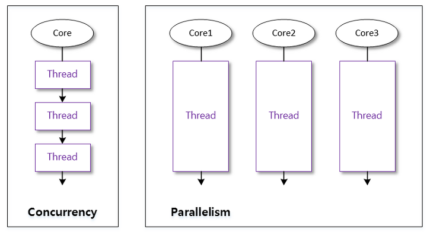
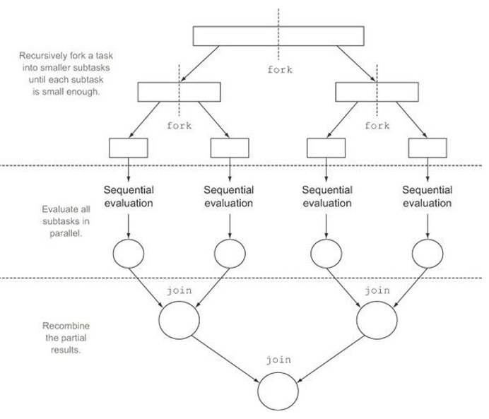

## 스트림 병렬 처리
병렬 처리(Parallel Operation): 멀티 코어 CPU 환경에서 하나의 작업을 분할해 각각의 코어가 병렬적으로 처리하는 것<br>
병렬 처리의 목적은 작업 처리 시간을 줄이기 위한 것이다. 

### 동시성과 병렬성
멀티 스레드는 동시성(Concurrency) 또는 병렬성(Parallelism)으로 실행된다.<br>
- 동시성: 멀티 작업을 위해 멀티 스레드가 번갈아가며 실행하는 성질
- 병렬성: 멀티 작업을 위해 멀티 코어를 이용해 동시에 실행하는 성질



병렬성은 **데이터 병렬성(Data parallelism)**과 **작업 병렬성(Task parallelism)**으로 구분할 수 있다. 
- 데이터 병렬성: 전체 데이터를 쪼개어 서브 데이터들로 만들고 이 서브 데이터들을 병렬 처리해서 작업을 빨리 끝내는 것
    - 병렬 스트림은 데이터 병렬성을 구현한 것이다. 
    - 멀티 코어의 수만큼 대용량 요소를 서브 요소들로 나눈다.
- 작업 병렬성: 서로 다른 작업을 병렬 처리하는 것
    - 웹 서버 등

### 포크조인(ForkJoin) 프레임워크
병렬 스트림은 요소들을 병렬 처리하기 위해 포크조인 프레임워크를 사용한다. 포크조인 프레임워크는 런타임 시에 동작한다. 
- 포크 단계: 전체 데이터를 서브 데이터로 분리
- 조인 단계: 서브 결과를 결합해서 최종 결과를 만듦 



포크조인 프레임워크는 ExecutorService의 구현 객체인 ForkJoinPool을 사용해서 작업 스레드를 관리한다. 

### 병렬 스트림 생성
병렬 스트림은 다음 두 가지 메서드로 얻을 수 있다. 
- parallelStream(): 컬렉션으로부터 병렬 스트림을 바로 리턴함
- parallel(): 순차 처리 스트림을 병렬 처리 스트림으로 변환해서 리턴함 

|인터페이스|리턴 타입|메서드(매개 변수)|
|-|-|-|
|java.util.Collection|Stream|parallelStream()|
|java.util.Stream.Stream|Stream|parallel()|
|java.util.Stream.IntStream|IntStream|parallel()|
|java.util.Stream.LongStream|LongStream|parallel()|
|java.util.Stream.DoubleStream|DoubleStream|parallel()|

**수정 전 코드**

```java
MaleStudent maleStudent = totalList.stream()
    .filter(s->s.getSex() == Student.Sex.MALE)
    .collect(MaleStudent :: new, MaleStudent :: accumulate, MaleStudent :: combine);
```

- MaleStudent 객체는 하나만 생성됨
- 남학생을 MaleStudent에 수집하기 위해 accumulate() 호출
- combine()은 호출되지 않음
    - 순차 처리 스트림이므로 결합할 서브 작업이 없기 때문 

**병렬 처리 스트림으로 변경 후**

```java 
MaleStudent maleStudent = totalList.parallelStream()
    .filter(s->s.getSex() == Student.Sex.MALE)
    .collect(MaleStudent :: new, MaleStudent :: accumulate, MaleStudent :: combine);
```

내부 동작 순서는 다음과 같다. 
1. 쿼드 코어 CPU일 경우 전체 요소는 4개의 서브 요소로 나눠지고, 4개의 스레드가 병렬 처리한다. 4개의 MaleStudent 객체를 생성하기 위해 `MaleStudent::new`를 4번 실행시킨다. 
2. 각 스레드는 `MaleStudent::accumulate`를 매번 실행시킨다.
3. 수집이 완료된 각 MaleStudent를 결합하기 위해 `MaleStudent::combine`이 3번 실행된다. 

### 병럴 처리 성능 
스트림 병렬 처리가 스트림 순차 처리보다 항상 실행 성능이 좋다고 판단해서는 안 된다. 병렬 처리에 영향을 미치는 다음 3가지 요인을 잘 살펴보아야 한다. 
- 요소의 수와 요소당 처리 시간 
    - 컬렉션에 요소의 수가 적고 요소당 처리 시간이 짧으면 순차 처리가 더 빠를 수 있다. 
        - 병렬 처리는 스레드풀 생성, 스레드 생성이라는 추가적인 비용이 발생하기 때문이다.
- 스트림 소스의 종류
    - ArrayList, 배열은 병렬 처리가 좋다. 
        - 인덱스로 요소를 관리하기 때문에 포크 단계에서 요소를 쉽게 분리할 수 있어 병렬 처리 시간이 절약된다. 
    - HashSet, TreeSet, LinkedList는 상대적으로 병렬 처리가 늦다. 
        - 요소 분리가 쉽지 않다. 
- 코어의 수
    - 싱글 코어 CPU의 경우에는 순차 처리가 빠르다. 
        - 병렬 스트림을 사용할 경우 스레드의 수만 증가하고 동시성 작업으로 처리되기 때문이다. 
    - 코어의 수가 많을수록 병렬 작업 처리 속도가 빨라진다. 