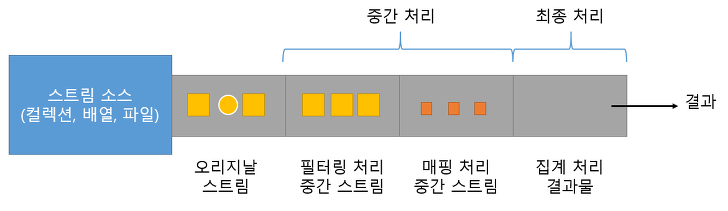

## 스트림 파이프라인
스트림은 중간 처리와 최종 처리를 **파이프라인(pipelines)**으로 해결한다. 
- 중간 처리: 필터링, 매핑, 정렬, 그룹핑 등
- 최종 처리: 합계, 평균, 카운팅, 최대값, 최소값 등

최종 처리가 시작되기 전까지 중간 처리는 지연(lazy)된다. 최종 처리가 시작되면 컬렉션의 요소가 하나씩 중간 스트림에서 처리되고 최종 처리까지 오게 된다. 

## 중간 처리 메서드와 최종 처리 메서드 
리턴 타입이 스트림 -> 중간 처리 메서드 
리턴 타입이 기본 타입이거나 OptionalXXX -> 최종 처리 메서드

<https://yongho1037.tistory.com/705>