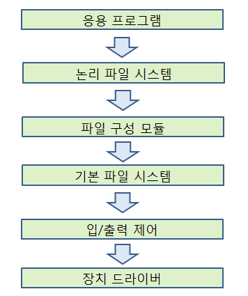
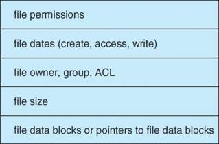
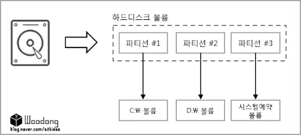
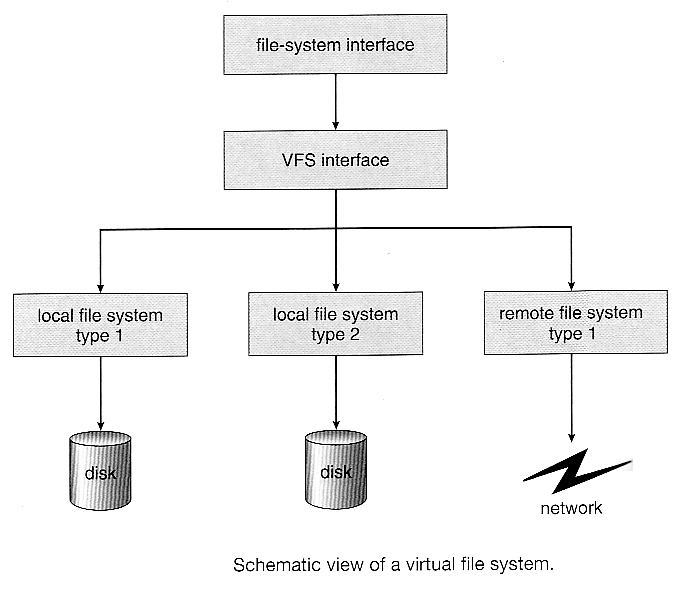
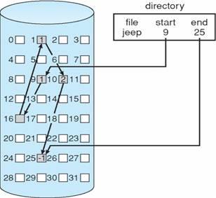
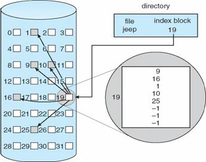
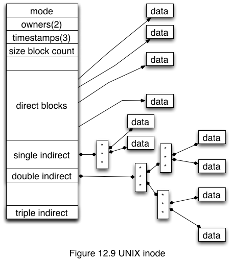
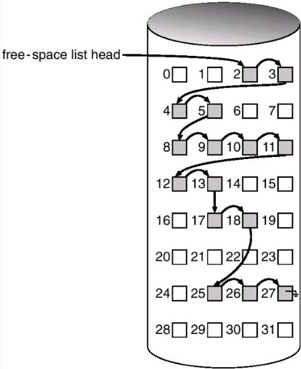

# 파일 시스템 구현
## 파일 시스템 구조
파일 시스템은 여러 층으로 이루어져 있다. 계층 구조를 통해 하드 디스크, 시디롬 드라이브, 플래시 메모리 등 다양한 형태의 저장 장치를 지원할 수 있고, 하나의 시스템에 여러 개의 파일 시스템을 사용하는 것이 가능해진다.

계층 구조의 장점
- 코드의 중복 최소화
    - I/O제어, 기본 파일 시스템 코드 등은 여러 파일 시스템에 의해 사용될 수 있음

계층 구조의 단점
- 더 많은 운영체제 오버헤드 

입출력 제어(I/O control) 층: 메모리와 디스크 시스템간의 정보 전송을 담당
- 장치 드라이버(device driver)와 인터럽트 핸들러로 이루어짐
- 장치 드라이버: 특정 블록을 검색하는 등의 고수준의 명령을 입출력장치를 시스템의 다른 부분에 접속시키는 저수준의 명령으로 변환
    - 입출력 제어기 메모리의 특별한 위치에 특정 비트 패턴을 설정해 장치 내 어떤 위치에 무슨 작업을 해야 할지 알림

기본 파일 시스템(basic file system) 층: 적절한 장치 드라이버에게 디스크 상의 물리 블록을 읽고 쓰도록 명령을 내리는 층
- 다양한 파일 시스템, 디렉터리 및 데이터 블록을 저장하는 메모리 버퍼와 캐시를 관리함 
    - 버퍼 내 블록은 디스크 블록의 전송이 일어나기 전에 할당된다. 
    - 버퍼가 가득 차면, 버퍼 관리자는 요청된 입출력이 완료될 수 있도록 버퍼 공간을 확보해야 한다. 

파일-구성 모듈(file-organization module) 층: 파일의 논리 블록 주소를 물리 블록 주소로 변환하며, 가용 공간을 관리한다. 
- 각 파일의 논리 블록은 0(또는 1)부터 N까지 번호가 매겨진다. 
- 실제로 데이터를 저장하고 있는 물리 블록은 논리 번호와 일치하지 않기 때문에 각 블록의 위치를 알아내기 위해서 변환이 필요하다. 
- 가용 공간 관리자는 할당되지 않은 블록을 추적하고, 요청이 있을 때 파일-구성 모듈에게 블록을 공급한다. 

논리 파일 시스템(logical file system) 층: 메타데이터 정보를 관리한다. 
- 메타데이터는 실제 파일의 내용을 제외한 모든 파일 시스템 구조를 포함
- 디렉터리 구조 관리, 심벌릭 이름 제공, 파일-구성 모듈이 필요로 하는 정보 제공
- 파일 제어 블록(File Control Block, PCB)를 통해 파일 구조 유지
    - 소유, 허가, 파일 내용의 위치 등 파일에 관한 정보 포함

## 파일 시스템 구현 
- 부트 제어 블록(boot control block): 시스템이 볼륨으로부터 운영체제를 부트시키기 위해 필요한 정보를 가지고 있다. 
    - 디스크가 운영체제를 가지고 있지 않다면 비어 있다. 
- 볼륨 제어 블록(volume control block): 상세한 볼륨 정보를 저장한다. 
    - 볼륨(또는 파티션)의 블록 수, 블록의 크기, 가용 블록 수와 포인터, 가용 FCB 수와 포인터 등
- 디렉터리 구조는 파일 시스템마다 존재하며 파일을 조직하는 데 사용된다. 
- FCB: 파일별로 존재하며, 자세한 파일 정보를 가지고 있다.
    - 디렉터리 항목과의 연결을 위해 고유한 식별 번호를 가진다. 
    

메모리 내 정보는 <u>파일 시스템 관리와 캐싱</u>을 위해 사용된다. 아래 정보들은 마운트 시점에 적재되고, 파일 시스템 동작 중에 갱신되며, 마운트 해제 시 제거된다. 
- 메모리 내 마운트 테이블
    - 각 마운트 된 볼륨 정보를 저장 
- 메모리 내 디렉터리 구조 캐시
    - 최근 접근된 디렉터리의 디렉터리 정보를 유지함 
    - 볼륨이 마운트된 디렉터리의 경우, 볼륨 테이블에 대한 포인터를 포함
- 범 시스템 열린 파일 테이블(system wide open file table)
    - 모든 열린 파일의 FCB 복사본을 가짐
- 프로세스별 열린 파일 테이블(per-process open file table)
    - 범 시스템 오픈 파일 테이블 내의 해당 항목에 대한 포인터를 포함 
- 파일 시스템 블록
    - 파일 시스템이 디스크로부터 읽혀지거나 써질 때 저장됨

### 파일 생성, open(), close()

---

## 디스크, 파티션, 볼륨의 차이 
**디스크(Disk)**
시스템에 장착되어 있는 물리적인 저장장치를 의미한다. 

**파티션(Partition)**
물리적인 디스크를 여러 독립적인 공간으로 구분해 놓은 것을 의미한다. 

파티션은 하나의 물리적인 저장 장치(디스크)를 여러 개의 독립적인 저장 장치처럼 사용할 수 있게 구분해준다.

각 파티션은 미가공 파티션과 가공 파티션으로 나눌 수 있다. 
- 미가공(raw) 파티션: 파일 시스템을 포함하지 않음
    - 어떤 파일 시스템도 적합하지 않은 곳에 사용됨 
    ex) UNIX 스왑 공간 
- 가공(cooked) 파티션: 파일 시스템을 포함함

**볼륨(Volume)**
볼륨은 단일 파일 시스템을 사용해 액세스할 수 있는 저장 공간을 의미한다. 

일반적으로 디스크를 파티션으로 구분하고, <u>각 파티션을 파일 시스템으로 포맷해 볼륨을 구성</u>한다. 볼륨은 여러 디스크의 여러 파티션에 걸쳐있을 수 있다. 

---

### 가상 파일 시스템(Virtual File System, VFS)
**가상 파일 시스템**은 실제 파일 시스템 위의 추상 계층으로, 클라이언트 응용 프로그램이 여러 파일 시스템에 같은 방법으로 접근할 수 있게 하는 것이다. 

현대의 운영체제는 동시에 여러 타입의 파일 시스템을 지원하기 위해 VFS를 사용한다. 

VFS는 주로 객체 지향 방식의 오버로딩 개념을 통해 구현되며, 다음과 같이 세 가지 계층으로 구성된다. 

파일 시스템 추상화의 장점
- 동일한 방법으로 접근 가능
- 파일 시스템간의 이식성이 좋음
- 새로운 파일 시스템이 추가되더라도 설계를 변경할 필요 없음 

--- 

## 디렉터리 구현 방법
### 선형 리스트(Linear List)
디렉터리를 구현하는 가장 간단한 방법으로, 파일 이름과 데이터 블록을 가리키는 포인터들의 선형 리스트를 사용한다. 

파일 생성: 디렉터리를 탐색해 같은 이름을 가진 파일이 없다는 것을 확인 후, 디렉터리의 끝부분에 새로운 항목을 추가한다.  
파일 삭제: 디렉터리에서 이름을 찾아 해당 파일에 할당된 공간을 방출한다. 

파일 삭제 후 해당 항목을 미사용으로 표시하거나, 디렉터리 항목의 가용 리스트에 연결해 항목을 재사용할 수 있다. 

장점 
- 구현이 쉽다. 

단점 
- 파일을 찾기 위해 선형 탐색을 해야 한다. 
    - 실행 시간이 길다. 
    - 정렬된 리스트는 이진 탐색이 가능해 평균 탐색시간이 줄지만, 리스트가 정렬 상태를 유지하려면 파일의 생성과 삭제가 복잡해진다. 

### 해시 테이블(Hash Table)
선형 리스트에 디렉터리 항목들을 저장하고 해싱도 함께 사용하는 방법이다. 파일 이름을 통해 얻은 키 값을 포인터로 활용해 리스트에 접근한다. 

장점 
- 충돌 보완만 된다면 삽입과 삭제 성능이 크게 올라간다. 

단점 
- 해시 테이블의 크기가 고정되어있기 때문에, 충돌의 여지가 있다. 
    - 대안으로 체인 오버플로우 해시 테이블을 사용할 수 있다. 
        - 각 해시 항목을 연결 리스트로 구성한다. 

## 할당 방법 
### 연속 할당(Contiguous Allocation)
연속 할당 방식에서 각 파일은 디스크 내에서 연속적인 공간을 차지한다.
디스크 주소들은 디스크 상에서 선형 순서를 갖는다. 

한 파일의 연속 할당은 디스크 주소와 길이로 정의된다. 각 파일을 위한 디렉터리 항목(entry)은 파일의 디스크 내 시작 블록 주소와 크기만 표시하면 된다. 

특징
- 디스크 탐색 횟수와 탐색 시간이 최소화된다. 
    - 연속적인 파일 접근을 위한 b블록에서 b+1 블록 접근은 헤드 이동을 요구하지 않는다. 
    - 헤드 이동이 필요한 경우, 한 트랙만 이동하면 된다. 
- 순차 접근과 직접 접근을 모두 지원할 수 있다. 
- 새로운 파일을 위한 가용 공간을 찾기가 어렵다. 
    - 외부 단편화를 낳는다.
- 만들어질 파일의 크기를 예측하기가 어렵다. 

### 연결 할당(Linked Allocation)
연결 할당 방식에서 파일은 디스크 블록의 연결 리스트 형태로 저장되고, 디스크 블록들은 디스크 내에 흩어져 저장될 수 있다. 디렉터리는 파일의 첫 번째와 마지막 블록에 대한 포인터를 가지고 있다. 

새 파일 생성 시 디렉터리 내에 새로운 항목(entry)가 만들어지고, 파일 쓰기가 일어나면 자유 블록을 할당받아 쓰기를 수행한 후 이전 디스크 블록에 연결한다.

특징
- 외부 단편화가 없고, 블록들의 크기가 모두 같아 어떤 가용 블록을 사용해도 무방하다. 
- 파일 생성 시 파일의 크기가 미리 고정될 필요가 없다. 
- 직접 접근 방식에는 매우 비효율적이다. 
- 포인터를 위한 공간이 필요하다. 
    - 여러 블록들을 하나의 클러스터로 구성해 해결할 수 있다.
        - 내부 단편화를 허용하지만, 파일 탐색과 전송 성능을 향상시킨다. 
-  오류나 하드웨어의 고장으로 포인터를 잃어버리거나 잘못된 포인터 값을 가지게 되면 모든 데이터를 잃는 결과를 초래할 수 있다. 

변형으로, 파일 할당 테이블(FAT, File Allocation Table)을 사용할 수 있다. 
각 파티션의 시작 부분이 FAT로 사용되며, FAT 테이블은 각 디스크 블록마다 한 개의 항목을 가지고 있다. 블록 번호를 가지고 FAT로 가면 그 항목은 다음 블록의 블록 번호를 가리킨다. 
FAT를 통해 연결 할당 방식은 직접 접근을 지원할 수 있다. 

### 색인 할당(Indexed Allocation)
색인 할당은 모든 포인터들을 하나의 장소에서 색인 블록으로 관리한다. 
각 파일들은 디스크 블록 주소를 모아놓은 배열인 색인 블록을 가진다. 색인 블록의 i번째 항목은 파일의 i번째 블록을 가리킨다. 디렉터리는 색인 블록의 주소를 가지고 있다. 

특징
- 외부 단편화 없이 직접 접근을 제공한다. 
- 공간이 낭비될 수 있다. 
    - 대부분의 파일들이 하나 또는 두 개의 블록만으로 구성되어 있는데, 색인만을 위해 한 블록이 할당되어야 한다. 

색인 블록으로 인한 공간 낭비를 막기 위해, 아래와 같은 기법들이 존재한다. 
- **연결 기법(linked scheme)**: 하나의 색인 블록이 한 디스크 블록이며, 파일의 크기가 크면 여러 개의 색인 블록들을 연결시킨다. 
- **다중 수준 색인(multilevel index)**: 연결 기법의 변형으로, 여러 개의 두 번째 수준 색인 블록들의 집합을 가리키기 위해 첫 번째 수준의 색인 블록을 사용한다. 두 번째 수준의 색인 블록이 실제 파일 블록들을 가리킨다. 파일의 크기에 따라 세 번쨰, 네 번째 수준으로까지 계속될 수 있다. 
- **결합 기법(combined scheme)**: 파일의 inode에 색인 블록의 15개 포인터를 유지한다. 
    - 처음 12개 포인터들은 직접 블록(direct block)을 가리키고, 파일의 데이터를 저장하고 있는 블록들의 주소를 저장한다. 
    - 3개의 포인터는 간접 블록(indirect block)을 가리킨다. 
        - 첫 번째 포인터: 단일 간접 블록(single indirect block)을 가리킨다. 데이터를 저장하고 있는 블록의 주소를 저장한다. 
        - 두 번째 포인터: 이중 간접 블록(double indirect block)을 가리킨다. 실제 데이터 블록을 가리키는 포인터를 저장하고 있는 블록의 주소를 저장한다. 
        - 세 번째 포인터: 삼중 간접 블록(triple indirect block)을 가리킨다. 
    
    

## 자유 공간의 관리(Free-Space Management)
삭제된 파일들이 차지하던 디스크 공간을 새로운 파일들이 재사용하기 위해, 시스템은 자유 공간을 리스트로 유지하고 관리한다. 디스크의 모든 자유 블록들은 리스트에 등록되고, 새로운 파일을 만드려면 자유 공간 리스트를 탐색해 공간을 할당받아야 한다. 

### 비트 벡터(Bit Vector)
자유 공간 리스트가 비트맵(bit map) 또는 비트 벡터(bit vector)로 구현되고, 각 블록은 1비트로 표현된다. 만약 블록이 자유로우면 비트는 1이고, 블록이 할당되어 있다면 그 비트는 0이 된다. 

특징
- 자유 블록이나 n개의 연속된 자유 블록을 찾는 일이 간편하고 효율적이다. 
    - 많은 컴퓨터가 효율적인 비트 조작 명령을 제공한다. 
- 비트 벡터 전체가 주 메모리에 존재하지 않으면 비효율적이다. 
- 용량이 큰 디스크의 경우, 전체 비트 벡터를 주 메모리에 유지하는 것이 어렵다. 

### 연결 리스트(Linked List)
자유 디스크 블록들을 연결시키는 방법으로, 각 자유 블록은 다음 자유 블록을 가리키는 포인터를 가진다. 시스템은 첫 번째 자유 블록에 대한 포인터를 디스크의 특정 위치에 두고 메모리에 캐싱한다. 

특징
- 리스트를 순회하려면 매번 디스크를 접근해야 해 효율적이지 못하다. 
    - 파일 할당은 주로 한 블록만으로 이루어져, 자유 리스트 순회는 빈번하지는 않다. 

### 그룹핑(Grouping)
자유 리스트 방식의 변형으로 첫 번째 자유 블록 내에 n개의 블록 주소를 저장하는 방법이다. 
처음 n-1개는 실제로 비어있는 블록의 주소이고, 마지막 1개는 n-1개의 빈 블록 주소를 가지고 있는 자유 블록을 가리킨다. 

특징
- 연결 리스트 방법과는 달리, 다수 개의 자유 블록 주소들을 쉽게 찾을 수 있다. 

### 계수(Counting)
디스크 공간의 할당과 반환이 여러 연속된 블록 단위로 이루어진다는 점을 이용한 방법이다.
자유 공간 리스트의 각 항은 하나의 디스크 주소와 연속된 블록의 개수로 구성된다. 

특징 
- 연속 할당 알고리즘이나 클러스터링을 통해 공간을 할당할 경우 유용하다. 

### 공간맵(Space Maps)
Oracle의 ZFS 파일 시스템은 대규모의 파일, 디렉터리, 파일 시스템을 저장할 수 있도록 설계되었다. ZFS는 자유 공간을 관리할 때 자료 구조의 크기를 제어하고 제어에 필요한 입출력을 최소화하기 위해 여러 기법을 조합하여 사용한다. 
- 장치의 공간을 관리 가능한 크기의 덩어리로 나누기 위해 메타슬랩(metaslabs)을 생성한다. 
    - 볼륨은 수백 개의 메타슬랩을 포함할 수 있다. 
    - 각 메타슬랩은 연관된 공간맵을 가지고 있다. 
- 자유 블록에 관한 정보를 저장하기 위해 계수 알고리즘을 사용한다. 
    - 디스크에 계수 구조를 기록하는 것이 아니라, 로그-구조 파일 시스템 기법을 사용해 이 정보를 저장한다.
    - 공간맵은 할당과 반환의 모든 블록 활동을 계수 형식으로 시간 순서로 기록한다. 
- ZFS가 메타슬랩으로부터 공간을 할당하거나 반환하려고 할 때, 관련된 공간맵을 변위에 따라 색인된 균형-트리 형태로 메모리에 적재하고, 로그를 재실행해 이 구조에 반영한다.
    - 로그와 균형 트리가 합쳐져 자유 리스트 역할을 한다. 
- 연속된 자유 블록을 결합해 하나의 항으로 만들어 맵을 가능한 한 압축한다. 
- ZFS의 트랜잭션 기반 연산의 일부분으로 디스크에 존재하는 자유 공간 리스트가 갱신된다. 

