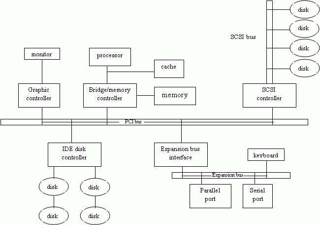

# 입출력 시스템 
## 입출력 하드웨어 
운영체제는 입출력 시 입출력 작업 및 입출력 장치를 관리하고 제어한다. 하드웨어 장치는 케이블을 통하거나 무선으로 신호를 보내 컴퓨터 시스템과 통신한다. 

**포트(port)**: 하드웨어 장치를 컴퓨터 시스템에 접속시켜주는 연결점

**버스(bus)**: 하나 이상의 장치들이 공동으로 여러 선을 사용하는 것(회선의 집합)으로, 메시지 전송 프로토콜을 포함한다. 

**데이지 체인(daisy chain)**: 여러 장치들이 연쇄적으로 연결된 것으로, 하나의 버스처럼 동작한다. 

**제어기(controller)**: 포트, 버스, 입출력 장치를 제어하는 전자 회로의 집합체 

입출력 포트(I/O port)는 보통 네 개의 레지스터로 이루어져 있다. 
- 입력(data-in) 레지스터: 호스트가 입력을 얻기 위해 읽기를 수행
- 출력(data-out) 레지스터: 호스트가 데이터를 출력하기 위해 쓰기를 수행
- 상태(status) 레지스터: 호스트가 읽는 용도이며, 비트들에 대한 현재의 명령이 완료되었는지, 입력 레지스터로부터 한 바이트를 읽어도 되는지, 오류가 있었는지와 같은 상태들을 보고함
- 제어(control) 레지스터: 호스트가 주변 장치에게 입출력 명령을 내리거나 장치의 모드를 변경하기 위해 쓰기를 수행

### Memory Mapped I/O, I/O Mapped I/O
CPU가 제어기에게 관련 명령어와 자료를 넘기는 방법에는 두 가지가 있다. 

**Memory Mapped I/O**

**I/O Mapped I/O**

--- 
폴링과 인터럽트는 CPU와 입출력 장치 사이의 통신 방식이다. 

### 폴링(Polling)
폴링은 호스트가 계속 루프를 돌며 입출력 장치를 기다리는 방식이다. 

제어기는 상태 레지스터의 비지(busy) 비트를 통해 자신의 상태를 나타낸다. 제어기가 작업을 하느라 바쁠 때 비지 비트는 1이고, 다음 명령을 받아들일 준비가 되었을 떄 비지 비트는 0이다. 호스트는 명령 레지스터의 명령 준비 완료 비트를 통해 자신이 입출력을 원한다는 신호를 보낸다. 

매 바이트는 다음과 같은 순서로 호스트와 제어기의 핸드셰이킹을 통해 출력된다. 
1. 호스트가 반복적으로 비지 비트를 검사한다. 
2. 호스트가 명령 레지스터에 쓰기 비트를 설정하고 출력 레지스터에 출력할 바이트를 쓴다. 
3. 호스트가 명령 준비 완료 비트를 설정한다. 
4. 제어기가 명령 준비 완료 비트가 설정된 것을 알아차렸을 때, 자신의 비지 비트를 1로 설정한다. 
5. 제어기는 명령 레지스터를 읽고, 쓰기 명령임을 알게 된다. 출력 레지스터를 읽어 해당 바이트를 가져와 해당 하드웨어 장치로 출력한다. 
6. 제어기는 명령 준비 비트를 0으로 바꾸고, 입출력이 성공했음을 알리기 위해 상태 레지스터의 오류 비트도 0으로 설정한다. 또한, 입출력이 끝났음을 알리기 위해 비지 비트도 0으로 설정한다. 

호스트는 비지 비트가 0으로 바뀔 때까지 검사를 반복한다. 이 과정에서 호스트는 **바쁜 대기**(busy-waiting), 즉 폴링을 하게 된다.  

### 인터럽트(Interrupt)
인터럽트는 입출력 장치가 CPU에게 자신의 상태 변화를 통보하는 방식이다. 

1. CPU는 매 명령어를 끝내고 다음 명령어를 수행하기 전에 **인터럽트 요청 라인**(interrupt request line)이라는 선을 검사한다. 
2. 제어기가 요청 라인에 신호를 보내면 CPU가 알아차리고 각종 레지스터 값과 상태 정보를 저장한 다음, 메모리 상의 **인터럽트 핸들러 루틴**으로 이동한다. 
3. 인터럽트 핸들러는 인터럽트의 발생 원인을 조사하고 필요한 작업을 수행한다. 
4. 인터럽트 핸들러는 CPU를 인터럽트 전의 실행 상태로 되돌리기 위해 인터럽트 이전으로 복귀 명령을 실행한다. 

위 과정을 통해 제어기는 인터럽트 요청 라인에 신호를 보냄으로써 인터럽트를 야기하고, CPU는 인터럽트 상황을 알아차리고 인터럽트 핸들러를 수행한다. 인터럽트 핸들러는 입출력 장치를 서비스함으로써 인터럽트를 처리한다. 

### 현대의 인터럽트 
현대 운영체제에서는 더욱 세분화된 인터럽트 핸들링 방법이 필요하다. 현대의ㅡ 컴퓨터는 아래의 세 가지 요소들을 CPU와 **인터럽트 제어기 하드웨어**에 제공한다. 
- 특정 상황에서 인터럽트 발생을 연기시킴
- 어떤 장치가 인터럽트를 일으켰는지 모든 장치를 폴링하지 않고 알아냄 
- 운영체제가 인터럽트의 우선순위를 구분하고 긴급한 정도에 따라 우선적으로 응답하기 위한 다수준 인터럽트(multi-level interrupt)

**인터럽트 발생을 연기**
대부분의 CPU들은 두 종류의 인터럽트 요청 라인을 가진다. 
- **마스크 불가 인터럽트(nonmaskable interrupt)**: 회복 불가능한 메모리 오류와 같은 이벤트를 위해 사용됨
- **마스크 가능 인터럽트(maskable inerrupt)**: 필요 시 인터럽트 기능을 잠시 중단시켜 놓을 수 있는 인터럽트 
    - 인터럽트 되어서는 안되는 주요 명령 시퀀스를 수행하기 위해 사용

**인터럽트의 진원지 탐색**
**인터럽트 벡터**: 인터럽트 핸들러들의 메모리 주소들을 가지고 있는 일종의 테이블이다. 테이블의 오프셋을 통해 특정 인터럽트 핸들링 루틴을 바로 선택할 수 있다. 

**인터럽트 사슬화**: 인터럽트 벡터의 각 원소들이 여러 인터럽트 핸들러들로 이루어진 리스트의 헤더를 가리킨다. 인터럽트가 일어나면 리스트 상의 핸들러를 하나씩 검사한다.

인터럽트 사슬화는 핸들러를 모두 탐색해야 해 효율성이 떨어지지만, 인터럽트 벡터 테이블보다 큰 수의 장치들를 수용 가능하다. 

**인터럽트 우선순위**
**인터럽트 우선순위 수준**(interrupt priority levels)의 구현은 자동적으로 높은 우선순위 인터럽트가 낮은 우선순위의 인터럽트의 실행을 선점할 수 있게 한다. 

인터럽트의 우선순위는 다음과 같은 용도로 사용된다. 
- 가상 메모리 페이징
    - 페이지 폴트는 인터럽트를 일으키는 예외로, 발생 시 CPU는 하던 일을 멈추고 페이지 폴트를 처리하는 핸들러를 수행한다. 
- 시스템 호출(system call)
    - 시스템 호출이 소프트웨어 인터럽트, 트랩 등의 명령어를 수행 시 인터럽트 하드웨어가 사용자 코드의 상태를 저장한 후 커널 모드로 전환하고 요구되는 서비스를 구현하는 커널 루틴을 수행한다. 
    - 시스템 호출은 네트워크나 디스크 서비스보다 긴급하지 않기 때문에, 비교적으로 낮은 우선순위를 가진다. 
- 커널 내 제어 흐름 관리
    - 우선순위 핸들러는 효율에 따라 작업에 우선순위를 둬 실행할 수 있다. 

입출력 장치, 하드웨어 고장, 시스템 호출 등은 모두 인터럽트를 야기하고 커널 루틴을 촉발하지만, 효율성을 위해 각기 다른 우선순위가 부여된다. 