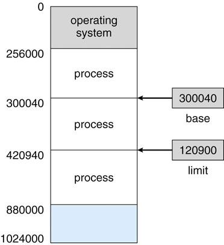
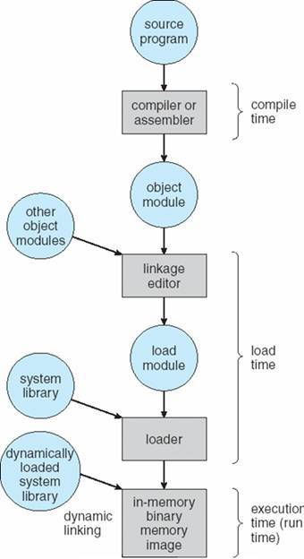
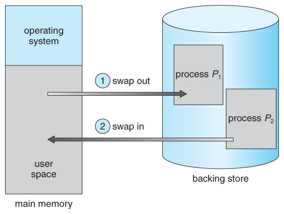
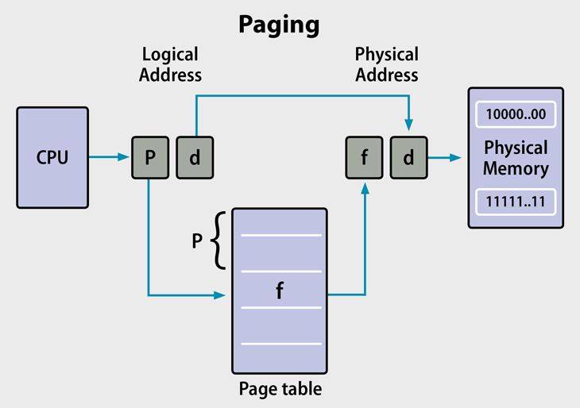
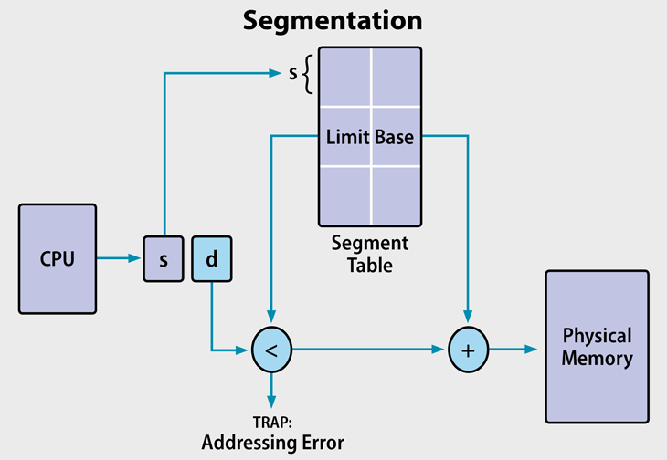

# 메모리 관리 전략
## 메모리 관리 배경지식
### 기본 하드웨어 
레지스터: CPU가 직접 접근할 수 있는 유일한 저장장치
- 주 메모리와 프로세서 자체에 내장됨
- 실행되는 명령어와 데이터가 모두 있어야 함 
    - 기계 명령어들은 메모리 주소만을 인수로 취하기 때문

CPU 내장 레지스터 -> 일반적으로 CPU 클록의 1 사이클 내에 접근 가능

주 메모리 -> 더 많은 CPU  클록 틱 사이클 필여 
-> 접근 시간 차이로 인한 연산 지연을 줄이고자 캐시 사용 

- 사용자 프로그램으로부터 os 영역 보호 
- 사용자 프로그램이 다른 특정 사용자 프로그램에 접근하는 것 막음
--> 이걸 위한 방법 예시
각 프로세스는 독립된 메모리 공간 가짐
특정 프로세스만 접근할 수 있는 합법적(legal) 메모리 주소 영역 설정
->기준(base)과 상한(limit) 레지스터 사용해 프로세스가 합법적인 영역만을 접근하도록 보장
기준 레지스터: 가장 작은 합법적인 물리 메모리 주소값 저장
상한 레지스터: 주어진 영역 크기 저장
ex) 기준:300040, 상한:120900 -> 프로그램은 300040부터 420940까지 접근 가능 
 

### 논리 주소 공간/물리 주소 공간
논리 주소(logical address): CPU가 생성하는 주소
물리 주소(physical address): 메모리가 취급하는 주소
- 메모리 주소 레지스터(MAR)에 주어지는 주소

컴파일 시 바인딩/ 적재 시 바인딩 -> 논리, 물리 주소가 같음
실행시간 바인딩 -> 논리(가상), 물리 주소 다름

논리 주소 공간(logical address space): 프로그램에 의해 생성된 모든 논리 주소 집합
물리 주소 공간(physical address space): 논리 주소에 상응하는 모든 물리 주소 집합 

**MMU(Memory Management Unit)**
메모리 관리기(MMU)가 프로그램 실행 중 가상 주소를 물리 주소로 바꿔주는 역할 함 

### 주소의 할당(Address Binding)
**주소 바인딩**
- 한 주소 공간에서 다른 주소 공간으로 맵핑하는 것
- 프로세스가 접근해야 하는 값과 함수에 대한 주소가 정해지는 것 

명령어와 데이터의 바인딩은 바인딩이 이루어지는 시점에 따라 구분된다.
- 컴파일 시간 바인딩
    - 프로그램이 컴파일 될 때 컴파일러에서 명령어들의 변수와 메모리 주소가 정해지는 것
    - 컴파일 시간에 프로세스가 메모리 내 들어갈 위치를 미리 아는 경우 가능
    - CPU에서 명령어를 실행할 때 이미 주소가 정해져있으므로 따로 주소 계산을 하지 않음
- 적재 시간(load time) 바인딩
    - 프로그램이 컴파일되고 메모리에 올라갈 때 CPU에서 주소 계산이 일어나는 것
    - 프로그램 내 각 변수나 명령어의 주소는 특정 값을 기준으로 정해짐
        - 프로그램이 올라간 메모리 주소의 Base Register 값에 이를 더하여 주소를 만들어낸다.
    - 한번 메모리에 올라가면 종료될 때까지 그 위치에 존재하게 됨 
- 실행시간 바인딩
    - 프로세스가 실행되는 중간에 매번 명령어가 실행될 때마다 주소가 계산됨
    - 프로세스는 메모리 공간 안에서 위치가 바뀔 수 있음
        - CPU에서 나온 임의의 주소는 MMU를 거쳐 실제 주소로 바뀌어 접근하게 됨

### 동적 적재(Dynamic Loading)
한정적인 메모리 공간으로 인해 생겨났으며, 프로세스의 모든 모듈을 메모리에 올리기는 공간이 부족해 해당 모듈이 필요할 때 올려주는 방법이다. 

**동작 방식**
1. 각 모듈은 실제 호출되기 전까지 메모리에 올라오지 않고 재배치 가능한 상태로 디스크에서 대기하고, main 프로그램이 먼저 메모리에 올라와 실행된다. 
2. 다른 모듈을 호출 시 호출된 모듈이 이미 메모리에 적재되어 있는지 조사한다.  
3. 만약 없다면 재배치 가능 연결 적재기(relocatable linking loader)가 불려져 요구된 모듈을 메모리로 가져오고 프로그램 주소 테이블에 기록한다. 

**장점**
- 메모리 공간의 이용률 높임
- 사용되지 않는 모듈들의 경우 미리 적재되지 않음
    - 발생 빈도는 낮으면서 많은 양의 코드가 필요할 경우 유용함

paging기법은 운영체제가 직접 해주는 거고 Dynamic Lodaing은 프로그래머가 명시적으로 하는 개념
운영체제가 동적 적재 구현 라이브러리 루틴 제공 ( 뭔소린지 )

현재는 가상 메모리 기법을 사용해 메모리 공간이 충분히 많다고 가정하고 적재하기 때문에, 이 방법은 사용되지 않는다. 

### Dynamic linking, Static Linking
#### 정적 링킹(Static Linking)
링킹 과정에서 라이브러리를 모두 포함시켜 실행 파일을 만드는 것

장점
- 실행 시 라이브러리 필요 없음 
    - 정적 라이브러리를 사용해 컴파일 시 링커가 프로그램이 필요로 하는 부분을 라이브러리에서 찾아 실행파일에 복사함
- 미리 컴파일 되어있어 컴파일 시간 단축됨
- 기술 유출 방지로 사용 가능

단점
- 실행 파일 내 라이브러리 코드가 저장되어 메모리를 많이 사용
- 여러 프로그램에서 같은 라이브러리 사용 시 중복으로 메모리에 올라가 공간 낭비

#### 동적 링킹(Dynamic Linking)
실행 전까지는 링킹되지 않고, 특정 라이브러리 코드가 필요 시 메모리에 올라간다. 
이 라이브러리를 사용하는 프로세스들은 라이브러리 루틴 위치를 가리키는 코드 조각인 stub을 통해 라이브러리를 참조한다.

장점
- 메모리 낭비를 막음
    - 같은 라이브러리가 메모리에 여러 번 올라가는 것을 방지 
- 라이브러리 버전 업이 정적 링킹에 비해 효율적
    - 실행 파일을 새로 생성할 필요가 없다. 

단점 
- 프로그램 영역 -> 라이브러리 저장 주소로의 점프로 인한 오버헤드 발생

**DLL(Dynamic Link Library)**
- 소프트웨어 개발에서 자주 쓰고 기초적인 함수들을 중복 개발하는 것을 피하기 위해 표준화된 함수 및 데이터 타입을 만들어서 모아 놓은 것.
    - 자주 사용되는 표준적인 함수를 매번 직접 작성해서 사용하는 것은 지나치게 시간 소모적이므로 표준화할 수 있는 함수를 미리 만들어서 모아 놓은 것.
- 실행 파일에서 해당 라이브러리의 기능을 사용 시에만, 라이브러리 파일을 참조하여(혹은 다운로드받아) 기능을 호출한다.
- 정적 링크와는 다르게 컴파일 시점에 실행 파일에 함수를 복사하지 않고, 함수의 위치정보만 갖고 그 함수를 호출할 수 있게 한다.

**DLL의 장점**
- 더 적은 리소스 사용
    - 한 코드를 여러 프로그램에서 동시에 사용 -> 메모리 절약 
    - 디스크 공간 줄임 
        - 정적링크의 경우 실행 파일에 라이브러리의 함수가 모두 포함되어 실행파일 크기가 커짐 
    - 운영 체제와 프로그램이 더 빠르게 로드 및 실행됨 
- 모듈식 아키텍처 활용 // 뭔소리 
- 손쉬운 배포와 설치 
    - DLL 내의 함수를 업데이트하거나 수정해야 하는 경우 DLL을 배포하고 설치할 때 프로그램을 DLL과 다시 연결하지 않아도 됨
    - 여러 프로그램이 같은 DLL을 사용하는 경우에는 모든 프로그램에 업데이트나 수정 내용이 적용됨
- 개발 시 분담 작업이 쉽고 재사용성이 뛰어남 

<https://goddaehee.tistory.com/185>
<https://jhnyang.tistory.com/42>

### 스와핑(Swapping)
**스왑**: 실행 도중에 프로세스가 임시로 보조 메모리로 교체되어 나갔다가 다시 메모리로 되돌아 오는 것
ex) 문맥 교환을 위해 메모리 관리자가 프로세스를 보조 메모리로 교체해 내보내고 다른 프로세스를 메모리로 불러들임
- swap-in: 디스크에 저장해놓은 프로세스를 메모리에 로딩하는 것
- swap-out: 현재 메모리에 올라와 있는 프로세스를 디스크로 내보내는 것 

디스패처는 다음에 실행할 프로세스가 메모리에 올라와 있는지 확인하고, 올라오지 않았다면 디스크에서 불러들인다. 메모리에 공간이 충분하지 않다면 현재 올라와 있는 프로세스를 내보낸다.

- 보조 메모리를 필요로 함 (보통은 디스크 사용)
    - 용량이 커 모든 사용자 이미지를 저장하기에 충분하고 어느 이미지도 곧장 꺼내올 수 있기 때문
    - 
- 문맥 교환 시간이 매우 오래 걸림 (대부분은 디스크 전송 시간)
    - 전송 시간은 스왑 될 메모리의 크기와 비례 
- 스왑될 프로세스가 완전히 유휴 상태에 있음을 확인해야 함

--- 

## 메모리 할당, 관리 방법 
### 연속 메모리 할당(Contiguous Memory Allocation)
연속 할당: 연속된 공간의 메모리를 프로세스에게 할당해주는 방법 
Hole: 할당된 메모리 공간 사이에 있는 할당되지 않은 빈 공간(할당, 해제를 반복해 생김)

연속 할당 방법 
- First-Fit : 메모리 요청이 들어왔을 때 요청한 크기를 만족하는 Hole 중 가장 첫 번째 Hole을 할당
- Best-Fit : 메모리 요청이 들어왔을 때 요청한 크기를 만족하는 Hole 중 가장 작은 크기의 Hole을 할당
- Worst-Fit : Best-Fit과 반대로 요청한 크기를 만족하는 Hole 중 가장 큰 크기의 Hole을 할당

### 단편화(Fragmentation)
**단편화**: 기억 장치의 빈 공간 또는 자료가 여러 개의 조각으로 나뉘는 현상
- Contiguous memory allocation의 단점
    - 메모리를 연속적으로 할당해야 하는데, 크기에 맞는 연속된 빈 공간이 없을 때 발생 
- 사용 가능한 메모리가 충분하지만 할당할 수 없는 상태
- 잦은 동적할당으로 인해 발생 
- 읽기와 쓰기 수행 속도를 늦춤

**내부 단편화**: 메모리를 할당할 때 프로세스가 필요한 양보다 더 큰 메모리가 할당되어서 프로세스에서 사용하는 메모리 공간이 낭비 되는 상황
- 해당 자원 내에서 사용하지 않는 부분이 생김
- 메모리 할당 단위가 Byte가 아니라 시스템의 Block 단위일 때 발생 

**외부 단편화**: 총 메모리 공간은 충분하지만 실제로 할당할 수 없는 상황
-  할당과 해제를 반복해 많은 hole이 생기게 되어 연속적으로 메모리를 할당할 수 없음 

### 페이징(Paging)
프로세스의 logical memory를 조각으로 나누어 physical memory의 조각과 대응시켜 메모리를 할당하는 방법

페이지(Page): logical memory의 조각
프레임(Frame): physical memory의 조각 
페이지 테이블(Page Table): 대응되는 페이지와 프레임을 맵핑해놓은 것
- PCB에 저장됨
- 프로세스가 종료되면 같이 사라짐

장점
- 외부 단편화 해결
- 최근의(updated) OS에서는 내부 단편화 일어나지 않음
- 프레임이 연속적일 필요 없음

단점 
- 세그멘테이션보다 메모리 탐색 시간이 긺
    - TLB 메모리 캐시 사용을 통해 속도 향상시킴 

**Paging Address Translation**

### 세그멘테이션(Segmentation)
메모리를 서로 크기가 다른 논리적인 블록 단위인 세그먼트로 분할하는 것

세그먼트(Segment):
세그먼트 테이블(Segment Table): 세그먼트를 관리하는 테이블
- 세그먼트의 시작주소(base)와 길이(limit) 정보가 담김
- 세그먼트를 offset 단위로 관리함 
- 시작주소와 offset 값을 통해 실제 물리적 위치로 변환 

장점
- 내부 단편화 일어나지 않음
- 세그멘테이션 테이블은 페이지 테이블에 비해 적은 공간을 차지함
- 연산 오버헤드 적음
- 디스크에서 연속적인 주소 공간을 재할당하는 것보다 세그멘트를 재할당하는 것이 더 단순함

단점
- Uses legacy technology in x86-64 servers.
- Linux only supports segmentation in 80x86 microprocessors: states that paging simplifies memory management by using the same set of linear addresses.
- Porting Linux to different architectures is problematic because of limited segmentation support.
- 외부 단편화를 유발함 

### 페이징과 세그멘테이션의 차이
**Size**
페이징 
- 페이지, 프레임 사이즈 고정
    - 크기는 하드웨어가 결정

세그멘테이션
- 세그멘트의 사이즈가 다양
    - 유저가 지정 

**단편화**
페이징
- 예전 하드웨어 시스템의 경우, 내부 단편화 발생
    - 메모리와 페이지의 크기가 완벽히 일치하지 않음

세그멘테이션
- 외부 단편화 발생

**테이블**
페이징
- Page tables direct the MMU to page location and status
    - 세그멘테이션 테이블을 사용하는 것보다 속도 느림
    - TLB 메모리 캐시로 인해 속도 향상

세그멘테이션
- 세그멘테이션 테이블은 세그멘트ID와 정보를 포함
- 페이징 테이블보다 속도 빠름

#### Reference
<https://www.enterprisestorageforum.com/storage-hardware/paging-and-segmentation.html> 