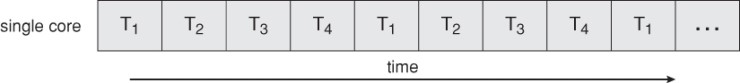
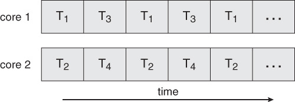

# 다중코어 프로그래밍 
다중 스레딩 프로그래밍은 다중 코어를 더 효율적으로 사용할 수 있고 병행성을 더 향상시킬 수 있는 기법을 제공한다.

- 코어가 한 개인 시스템 상에서의 병행성: 스레드의 실행이 시간에 따라 교대로 실행되는 것
- 다중 코어 시스템에서의 병행성: 스레드들이 병렬적으로 실행될 수 있다는 것
    - 시스템이 개별 스레드를 각 코어에 배정 가능

||
|---|
|단일 코어 시스템에서의 병행 실행| 

||
|-|
|다중 코어 시스템에서의 병렬 실행|

다중코어의 활용도를 높이기 위해서는 여러 코어를 활용하는 스케줄링 알고리즘 개발이 필요하다.

**다중코어 시스템 상에서의 프로그래밍을 위한 극복 과제**
- 작업 나누기(dividing activities)
    - 프로그램을 분석해 각 태스크를 독립된 병행가능 태스크로 나누는 작업
- 균형(balance)
    - 찾아낸 태스크들이 전체 작업에 균등안 기여도를 가져야 함
    - 기여도가 상대적으로 적은 태스크는 별도의 코어를 사용하는 것이 가치가 없음
- 데이터 분리(data spliting)
    - 태스크가 접근하고 조작하는 데이터 또한 개별 코어에서 사용할 수 있도록 나누어져야 함
- 데이터 종속성(data dependency)
    - 태스크가 접근하는 데이터는 둘 이상의 태스크 사이에 종속성이 없어야 함
    - 데이터가 종속적인 경우, 프로그래머가 데이터 종속성을 수용할 수 있도록 태스크의 실행을 잘 동기화해야 함
- 시험 및 디버깅(testing and debugging)
    - 다중 코어 시스템은 실행 경로가 더 다양함
    - 단일 스레드 응용의 시험과 디버깅보다 어려움
    
