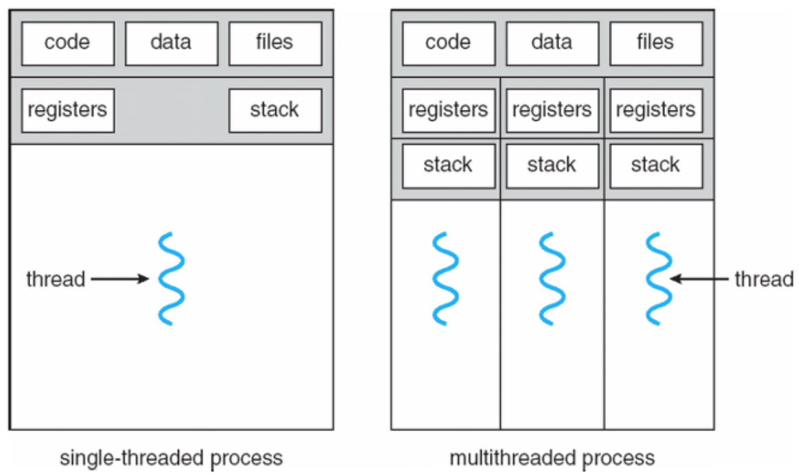
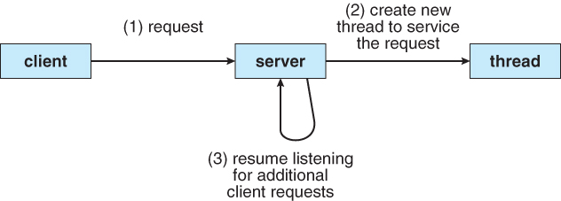
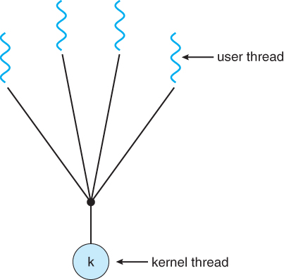
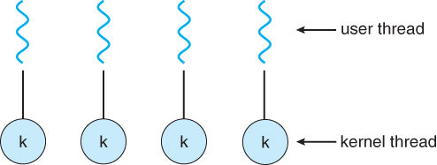
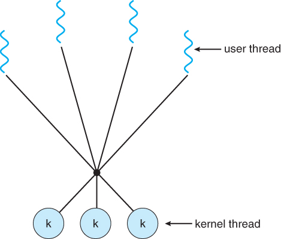
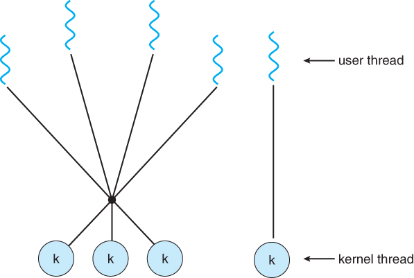

# 멀티스레드 프로그래밍
스레드(thread)는 CPU 이용의 기본 단위이다.
- 스레드 ID, 프로그램 카운터, 레지스터 집합, 스택으로 구성
- 같은 프로세스에 속한 다른 스레드와 코드, 데이터 섹션, 그리고 열린 파일이나 신호와 같은 운영체제 자원들을 공유

만약 프로세스가 다수의 제어 스레드를 가진다면, 프로세스는 동시에 하나 이상의 작업들을 실행할 수 있다. 

서버에게 요청이 들어올 때마다 요청을 수행할 프로세스를 새로 생성하는 것은 너무 많은 시간과 자원을 필요로 한다. 
새 프로세스가 기존의 프로세스와 동일한 작업을 수행한다면, 오버헤드를 감수하는 것보다 여러 스레드를 만드는 것이 더 효율적이다. 

웹 서버가 다중 스레드화 되면, 서버는 클라이언트의 요청을 서비스 할 새로운 스레드를 생성한다. 

**장점**
- 응답성(responsiveness)
    - 응용 프로그램의 일부분이 봉쇄되거나, 긴 작업을 실행하는 중이더라도 프로그램의 실행이 계속됨
        - ex) 한 스레드가 이미지 파일을 로드하는 동안 다른 스레드에서 사용자와의 상호작용이 가능함
- 자원 공유(resource sharing)
    - 프로세스는 공유 메모리나 메시지 전달 기법을 통해서만 자원을 공유할 수 있는 반면, 스레드는 자동으로 해당 스레드가 속한 프로세스의 자원들과 메모리를 공유함
    - 한 응용 프로그램이 같은 주소 공간 내에 여러 개의 다른 작업을 하는 스레드를 가질 수 있음 
- 경제성(economy)
    - 프로세스 생성을 위해 메모리와 자원을 할당하는 것보다 비용이 작음
    - context switch보다 경제적
- 규모 가변성(scalability)
    - 각각의 스레드는 다른 처리기에서 병렬로 실행될 수 있기 때문에, 다중처리기 구조에서 효율적임
    - 다중 CPU에서 멀티스레딩을 병렬성을 증가시킴 

### 멀티스레드 모델 
- 사용자 스레드
    - 사용자 수준에서 제공됨
    - 커널 위에서 지원되며 커널의 지원 없이 관리됨
- 커널 스레드 
    - 커널 수준에서 제공됨 
    - 운영체제에 의해 직접 지원되고 관리됨

사용자 스레드와 커널 스레드의 연관 관계를 확립하는 방법에는 일반적으로 아래 세 가지가 존재한다. 

#### 다대일 모델(Many-to-One Model)
많은 사용자 수준 스레드를 하나의 커널 스레드로 사상한다. 
스레드 관리는 사용자 공간의 스레드 라이브러리에 의해 행해진다. 
- 한 스레드가 봉쇄형 시스템 호출을 할 경우 전체 프로세스가 봉쇄됨
- 한 번에 하나의 스레드만이 커널에 접근
    - 멀티스레드가 다중처리기에서 돌아도 병렬로 작동할 수 없음
- 개발자가 원하는 만큼의 사용자 수준 스레드를 생성 가능
- 한 번에 하나의 스레드만이 커널에 의해서 스케줄됨
    - 진정한 동시성 x

#### 일대일 모델(One-to-One Model)
각 사용자 스레드를 각각 하나의 커널 스레드로 사상한다. 
- 하나의 스레드가 봉쇄적 시스템을 호출하더라도 다른 스레드가 실행될 수 있음
    - 다대일 모델보다 더 높은 병렬성 제공
- 다중처리기에서 멀티스레드가 병렬로 실행되는 것 허용 
- 사용자 수준 스레드를 생성할 때 그에 따른 커널 스레드를 생성해야 함
    - 커널 스레드를 생성하는 오버헤드가 응용 프로그램의 성능을 저하시킬 수 있음
    - 따라서 대부분의 구현은 시스템에 의해 지원되는 스레드의 수를 제한함 

#### 다대다 모델(Many-to-Many Model)
여러 개의 사용자 수준 스레드를 그보다 작거나 같은 수의 커널 스레드로 멀티플렉스한다. 
커널 스레드의 수는 응용 프로그램이나 특정 기게에 따라 결정된다(응용 프로그램은 단일처리기보다 다중처리기에서 더 많은 커널 스레드를 할당받을 수 있다).
- 개발자는 원하는 만큼의 사용자 수준 스레드 생성 가능
- 커널 스레드가 다중 처리기에서 병렬로 실행됨
- 스레드가 봉쇄형 시스템 호출을 발생시켰을 때, 커널이 다른 스레드의 실행을 스케줄할 수 있음

두 수준 모델(two-level model) 은 다대다 모델의 변형으로, 많은 사용자 스레드를 적거나 같은 수의 커널 스레드로 멀티플렉스시키는 것을 유지하지만 하나의 사용자 스레드가 하나의 커널 스레드에 종속되도록 허용한다. 

### Threading Issues
다음은 멀티스레드 프로그램에서 고려해야 할 몇몇 문제들이다. 

#### Fork() 및 Exec() 시스템 호출
스레드가 fork() 호출 시 새로운 프로세스는 어떻게 생성되어야 하는가?
- 모든 스레드를 복사
- fork()를 호출한 스레드만 복제 

exec() 호출 시 매개변수로 지정된 프로그램이 모든 스레드를 포함한 전체 프로세스를 대체시킨다. 

fork의 두 가지 방법 중 어느 쪽을 택할 것인지는 응용 프로그램에게 달려있다. 
- fork()를 부르자마자 다시 exec()을 부른다면 모든 스레드를 다 복제해서 만들어주는 것은 불필요함
    - exec()에서 지정된 프로그램이 곧 전체 프로세스를 다시 대체할 것이기 때문
    - fork()를 호출한 스레드만 복사해주는 것이 적절
- 새 프로세스가 fork() 후 exec()을 하지 않는다면 새 프로세스는 모든 스레드를 복제해야 함 

#### 취소(Cancellation)
**스레드 취소**(thread cancellation)는 스레드가 끝나기 전에 그것을 강제 종료시키는 작업이다. 
ex) 여러 스레드들이 데이터베이스를 병렬로 검색하고 있다가 그 중 한 스레드가 결과를 찾은 경우, 사용자가 웹 페이지를 더 이상 적재하지 않기 위해 stop 버튼을 눌린 경우 웹 페이지를 가져오던 모든 스레드가 취소됨 

취소되어야 할 스레드를 **목적 스레드**(target thread)라고 부른다. 목적 스레드의 취소 방식은 다음과 같다. 
- 비동기식 취소(asynchronous cancellation): 한 스레드가 목적 스레드를 즉시 강제 종료시킨다.
- 지연 취소(deferred cancellation): 목적 스레드가 주기적으로 자신이 강제 종료되어야 하는지 검사한다.
    - 한 스레드가 목적 스레드를 취소해야 한다고 표시
    - 실제 취소는 목적 스레드가 취소 여부를 결정하기 위한 플래그 검사 이후에 일어남 

스레드 취소를 어렵게 만드는 것은 취소 스레드들에게 할당된 자원 문제이다. 스레드가 다른 스레드와 공유하는 자료구조를 갱신하는 도중에 취소 요청이 와도 문제가 된다. 

**비동기식 취소**의 경우
- 운영체제는 취소된 스레드로부터 모든 시스템 자원을 회수하지 못하는 경우도 존재
    - 필요한 시스템 자원을 모두 사용 가능한 상태로 만들지 못할 가능성

**지연 취소**
- 스레드들이 자신이 취소되어도 안전하다고 판단되는 시점(취소점)에서 취소 여부를 검사

#### 신호 처리(Signal Handling)

#### 스레드 풀(Thread Pools)

#### 스레드별 데이터(Thread-Specific Data)

#### 스케줄러 액티베이션(Scheduler Activations)