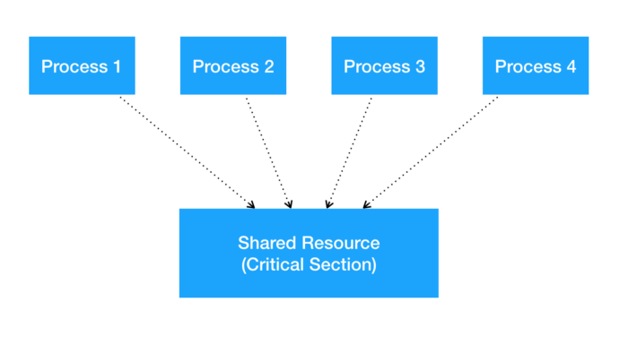

# 프로세스 동기화(Process Synchronization)
프로세스들이 공유 데이터에 동시 접근하는 것은 데이터의 일관성을 해칠 수 있다.<br>
프로세스 동기화는 프로세스들의 질서있는 실행과 데이터의 일관성을 유지하는 방법에 대해 다룬다. 

## 임계 영역 문제(The Critical-Section Problem)

**임계 영역(Critical Section)**



임계 영역이란 각 프로세스에서 공유 데이터에 접근하는 프로그램 코드 부분을 의미한다.<br>
임계 영역은 다른 프로세스와 공유하는 변수를 변경하거나, 테이블을 갱신하거나 파일을 쓰는 등의 작업을 실행한다.<br>
<u>한 프로세스가 자신의 임계 영역에서 실행할 동안, 다른 프로세스는 자신의 임계 영역에 들어갈 수 없다.</u> 

공유 자원의 독점을 보장하기 위해, 다음 세 가지 요구조건을 충족해야 한다. 
- **상호 배제(Mutual exclusion)**: 한 프로세스가 자신의 임계 영역에서 실행할 동안, 다른 프로세스는 자신의 임계 영역에서 실행될 수 없다. 
- **진행(Progress)**: 어떤 프로세스도 임계 영역에서 실행되고 있지 않다면, 임계 영역으로 진입하려는 프로세스들 중 하나는 유한한 시간 내에 진입할 수 있어야 한다. 
- **유한 대기(Bounded waiting)**: 한 프로세스가 임계 영역에 대한 진입을 요청하면, 다른 프로세스의 임계 영역 진입은 유한한 횟수로 제한되어야 한다. 
- 임계 영역에 대한 진입 요청 후 무한히 기다리지 않음

## 피터슨의 해결안(Peterson's Solution)

## 동기화 하드웨어(Synchronization Hardware)
가장 기본적인 해결 방법은 락(lock)을 사용하는 것이다.  
- 프로세스는 임계 영역에 진입하기 전에 반드시 락을 획득해야 한다. 
- 임계 영역을 나올 때는 락을 방출한다. 

```c++
do {
    // 락 획득 

    임계 영역 

    //락 방출

    나머지 영역
} while(true)
```

다중처리기(멀티프로세서) 환경에서는 적용할 수 없다. 
- 인터럽트의 불능화가 시스템 효율을 떨어뜨림
    - 인터럽트 불능화에 대한 메시지가 모든 프로세서에게 전달되는 과정

## 세마포(Semaphores)

## 고전적인 동기화 문제들

## 모니터(Monitors)

## 원자적 트랜잭션(Atomic Transactions)