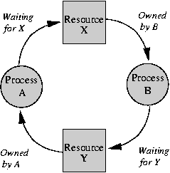

# 프로세스 동기화(Process Synchronization)
프로세스들이 공유 데이터에 동시 접근하는 것은 데이터의 일관성을 해칠 수 있다.<br>
프로세스 동기화는 프로세스들의 질서있는 실행과 데이터의 일관성을 유지하는 방법에 대해 다룬다. 

// 왜 동기화가 필요한지 

## 임계 영역 문제(The Critical-Section Problem)

**임계 영역(Critical Section)**


임계 영역이란 각 프로세스에서 공유 데이터에 접근하는 프로그램 코드 부분을 의미한다.<br>
임계 영역은 다른 프로세스와 공유하는 변수를 변경하거나, 테이블을 갱신하거나 파일을 쓰는 등의 작업을 실행한다.<br>

공유 자원의 독점을 보장하기 위해, 다음 세 가지 요구조건을 충족해야 한다. //말이 애매함 
- **상호 배제(Mutual exclusion)**: 한 프로세스가 자신의 임계 영역에서 실행할 동안, 다른 프로세스는 자신의 임계 영역에서 실행될 수 없다. 
- **진행(Progress)**: 어떤 프로세스도 임계 영역에서 실행되고 있지 않다면, 임계 영역으로 진입하려는 프로세스들 중 하나는 유한한 시간 내에 진입할 수 있어야 한다. 
- **유한 대기(Bounded waiting)**: 한 프로세스가 임계 영역에 대한 진입을 요청하면, 다른 프로세스의 임계 영역 진입은 유한한 횟수로 제한되어야 한다. 
- 임계 영역에 대한 진입 요청 후 무한히 기다리지 않음
 // read만 하는 경우?
## 해결 방법 
### 동기화 하드웨어(Synchronization Hardware)
임계 영역 문제에 대한 가장 기본적인 해결 방법은 락(lock)을 사용하는 것이다.  
- 프로세스는 임계 영역에 진입하기 전에 반드시 락을 획득해야 한다. 
- 임계 영역을 나올 때는 락을 방출한다. 
- CPU, 하드웨어 수준에서 Lock을 건다.

```c++
do {
    // 락 획득 

    임계 영역 

    //락 방출

    나머지 영역
} while(true)
```

비선점형 커널 
- 단일처리기 환경에서는 공유 변수가 변경되는 동안은 인터럽트를 허용하지 않음으로써 해결 가능
    - 선점되지 않음 //?
- 다중처리기(멀티프로세서) 환경에서는 적용할 수 없다. 
    - 인터럽트 불능화에 대한 메시지가 모든 프로세서에게 전달되는 과정이 매 임계 영역에 진입하는 것을 지연시킴  
- 락을 원자적으로 처리하는 하드웨어 명령어
    - 중간에 인터럽트 되지 않는 명령어(non-preemptive)
    - TestAndSet() : 한 워드의 내용을 확인하고 수정하는 연산을 원자적으로 처리
    - Swap() : 두 워드에 내용을 서로 교환하는 연산을 원자적으로 처리

> 원자적(atomic): 수행 도중 중단될 수 없는 동작 단위

### 세마포어(Semaphore)
세마포어 S는 정수 변수로, 초기화를 제외하고는 원자적 계산 wait(), signal()로만 접근이 가능하다.

- wait(): 락 획득

    ```c++
    wait(S) {
        while (S<=0)
        ; // 아무런 작업을 하지 않음 
        S--; 
    }
    ```

- signal(): 락 해제

    ```c++
    signal(S) {
        S++; 
    }
    ```

- 세마포어 값을 변경하는 연산은 원자적이다. 
    - 한 스레드가 세마포어 값을 변경하면 다른 어떤 스레드도 동시에 동일한 세마포어 값을 변경할 수 없다.
- 세마포어는 가용한 자원의 개수로 초기화됨

#### 사용법
- 카운팅(counting) 세마포어: 값에 제한이 없음
    - 유한한 개수를 가진 자원에 대한 접근 제어에 사용
- 이진(binary) 세마포어: 0과 1 사이의 값만 가짐
    - <u>뮤텍스(mutex) 락</u>이라고 부름

다중 프로세서 시스템에서 n개의 프로세서들은 뮤텍스라는 세마포어를 공유하고, 초기값은 1이다.<br>
세마포어 값이 0 -> 모든 자원이 사용중임 

```c++
do {
    wait(mutex);
    
    // critical section

    signal(mutex);

    // remainder section
} while(TRUE); 
```

#### 구현
위와 같은 세마포어의 구현은  **바쁜 대기**(busy waiting)를 요구한다.<br>
바쁜 대기(spinlock): 한 프로세스가 자신의 임계 영역에 있으면 다른 프로세스들은 진입 코드를 계속 반복 실행해야 함

**장점**
- 락이 짧은 시간 동안만 소유될 경우 유용함 
    - 문맥 교환 비용을 절약 // 왜 절약 ?
    - 멀티프로세서 시스템에서 채택됨

**단점**
- CPU 시간을 낭비하게 됨 

**바쁜 대기 해결 방법**
세마포어 값이 양수가 아닌 경우 프로세스는 대기하는 것이 아니라, 자신을 봉쇄한다. 
- 프로세스는 세마포어에 연관된 대기 큐에 넣어짐 
- 프로세스를 대기 상태로 전환
- 봉쇄된 프로세스는 `wakeup()` 연산에 의해 재시작됨 
    - 프로세스를 대기에서 준비 완료 상태로 변경

이 경우, 세마포어는 구조체로 정의된다. 

```c
typedef struct {
    int value; 
    struct process *list;
} semaphore; 
```

프로세스가 세마포어를 기다려야 한다면, 이 프로세스는 세마포어의 프로세스 리스트에 추가된다.  signal() 연산은 프로세스 리스트에서 한 프로세스를 꺼내서 그 프로세스를 깨워준다. 

```c
void wait(semaphore *S) {
    S->value--; 
    if (S->value < 0){
        프로세스를 s->list 안에 넣음;
        block(); 
    }
}

void signal(semaphore *S) {
    S->value++;
    if (S->value <= 0) {
        S->list로부터 프로세스 P를 꺼냄;
        wakeup(P);
    }
}
```

// wakeup 하면 다시 준비완료 큐에 가는건지 바로 실행인지 

// 임계 구역이 길 경우 spinlock은 다른 프로세스들이 너무 오래 대기 -> 계속 cpu를 낭비 
queue에 넣으면 기다리는동안 다른 문맥교환은 안일어나니까 길 때는 큐 사용하는게 유리할 수 있음 

// block, wakeup cost 높음 

이 정의에서 `S->value`의 값은 음수일 수 있다. 음수일 때, 그 절댓값은 대기하고 있는 프로세스들의 수이다. 

#### 교착상태와 기아(Deadlock and Starvation)



데드락과 관련된 다른 문제는 무기한 봉쇄(undefinite blocking)또는 기아(starvation)로, 프로세스들이 세마포어에서 무기한 대기하는 것이다.<br>
-> 프로세스들이 대기 큐에서 LIFO 순서로 제거될 경우 발생할 수 있다. 

#### 우선순위 역전(Priority Inversion)
우선순위 역전: 높은 우선순위의 프로세스가 낮은 우선순위의 프로세스로 인해 수행이 block된 상태

**발생 상황**(우선순위가 높은 순서대로 A, B, C)
- C가 먼저 세마포어를 요청해 획득한 상태. 실행 도중 A가 세마포어를 요청하지만, C가 세마포어를 반환할 때까지 block 됨.
-> 우선순위가 높더라도 세마포어가 없으면 공유자원을 사용하지 못함(제한된 우선순위 역전 상황)
-  C가 먼저 세마포어를 요청해 획득한 상태. 실행 도중 A가 세마포어를 요청하지만, C가 세마포어를 획득한 상태이므로 block 됨. C보다 더 높은 우선순위의 프로세스들(B 수준)이 실행되고, C는 세마포어를 반납하지 못하는 상태가 지속됨. 

**우선순위 상속 프로토콜(priority-inheritance protocol)**
더 높은 우선순위 프로세스가 필요로 하는 자원에 접근하는 모든 프로세스들은 해당 자원을 사용하는 동안 더 높은 우선순위를 상속받는다. 자원 사용이 끝나면 원래 우선순위로 되돌아간다. 

위 예에서 우선순위 상속 프로토콜에 따르면 C가 A의 우선순위를 상속받고, B가 선점해 실행되는 것을 막는다. 

### 모니터(Monitors) - Java, c# 찾을것 
세마포어는 특정 실행 순서로 진행되었을 때 타이밍 오류를 야기할 수 있다는 단점이 있다. 세마포어는 동기화 함수의 제약 조건을 고려해야 하는 반면, 모니터는 프로시져를 호출하여 간단히 해결할 수 있다.

모니터는 자바 프로그램에서 스레드를 동기화하는 방법으로써 활용도가 높다. 

**구조**


- 공유자원과 공유자원에 대한 접근함수(임계구역)가 존재함
-  두 개의 큐
    - **배타 동기 큐(Mutual Exclusion Queue)**: 하나의 스레드만 공유자원에 접근하도록 함
        - 특정 스레드가 임계구역에 있으면 다른 스레드는 배타 동기 큐에서 대기함 
    - **조건 동기 큐(Conditional Synchronization Queue)**: 진입 스레드가 block되고 새 스레드를 진입 가능하게 하는 공간
        - 공유자원을 사용중인 스레드가 `wait()`을 통해 들어감
        - `notify()`를 통해 조건 동기 큐의 스레드를 깨울 수 있음 

배타 동기는 `synchronized` 키워드를 사용해서 지정할 수 있다. 아래 코드에서 func1 메서드와 func2 메서드는 **같은 임계구역을 갖는다**. 

```java
class C {
    private int value;
    synchronized void func1() {
        ...
    }

    synchronized void func2() {
        ...
    }
}
```

조건 동기는 `wait()`, `notify()`, `notifyAll()` 메서드를 사용한다. 
- wait(): 호출한 쓰레드를 조건동기 큐에 삽입한다.

    

- notify(): 조건동기 큐에 있는 하나의 쓰레드를 깨워준다.
    
    
    
    - 현재 수행중인 스레드의 synchronized 블록이 끝나면 대기중이던 스레드가 실행된다. 
- notifyAll(): 조건동기 큐에 있는 모든 쓰레드를 깨워준다.

모니터 역시 notify(), wait() 메서드를 이용해 스레드의 실행 순서를 조정할 수 있다.<br>프로세스 1과 프로세스 2에 대해 프로세스 1을 먼저 실행시키고 싶은 경우
1. 프로세스 2의 실행 코드 전에 wait()을 호출
    - 프로세스 2는 임계구역에서 코드를 실행시키기 전에 조건 동기 큐에 들어가게 됨
    - 실행 권한이 프로세스 1로 넘어감
2. 프로세스 1의 실행이 끝나고 notify()를 통해 프로세스 2를 깨움

## 고전적인 동기화 문제들
아래는 병행 제어로 일어나는 문제에 대한 예시이다. 새로 제안된 동기화 방법들을 테스트하는 데 사용된다. 

### 유한 버퍼 문제(The Bounded-Buffer Problem)
- 생산된 데이터는 버퍼에 저장됨
- 현실 시스템에서 버퍼의 크기는 한정되어 있음
- 생산자는 버퍼가 가득 차면 더 넣을 수 없음
- 소비자는 버퍼가 비어있으면 뺄 수 없음
- 생산과 소비의 속도 차이 존재

**유한 버퍼 문제의 원인**
유한 버퍼 문제는 상호배제가 잘 지켜지지 않아 발생한다. 
- 공통변수 count(), buf[]에 대한 동시 접근 진행
- 공통변수 업데이트 구간(임계구역)에 대한 동시 진입이 진행

**예시**


1. 소비자가 if(count==0)을 실행하자마자 스케쥴링이 일어나서 생산자가 cpu사용권을 획득했다.
2. 생산자는 아이템을 생산하고 공유변수인 count를1증가시킨후에 자고 있지도 않은 소비자를 깨운다.
3. 아무일도 일어나지 않은 상태로 다시 스케쥴링이 일어나서 소비자가 sleep()을 실행해서 잠에 든다.
4. 그리고 다시 스케쥴링이 일어나서 생산자 프로세스가 실행되면 생산자는 count값이 2부터 시작해서 계속 증가하게 된다.
5. 생산자는 버퍼가 꽉찰때까지 (N이 100이 될때까지) 계속 생산하다가 count == N을 만족해서 잠이든다.
6. 결국에는 생산자 소비자가 둘다 잠에 든다는 문제가 발생한다.


**해결 방법** 
- 임계구역에 대한 동시 접근 방지(상호배타)
- 세마포를 사용한 상호배타 (mutual exclusion)
- 세마포: mutex.value = 1(# of permit)

**생산자 프로세스의 구조**

```c
do {
    ...
    // produce an item in nextp
    ...
    wait(empty);
    wait(mutex);
    ...
    // add nextp to buffer
    ...
    signal(mutex);
    signal(full);
} while(true);
```

**소비자 프로세스의 구조**

```c
do {
    wait(full); 
    wait(mutex);
    ...
    // remove an item from buffer to nextc
    ...
    signal(mutex);
    signal(empty);
    ...
    // consume the item in nextc
    ...
} while(true); 
```

생산자가 소비자를 위해 꽉 찬 버퍼를 생산해내고, 소비자는 생산자를 위해 비어 있는 버퍼를 생산해낸다. 

### Readers-Writers 문제
주로 공통된 데이터베이스에 접근할 때 발생한다. 
데이터베이스의 경우 writer에게는 배타적 접근을 보장해야 하지만, 동시에 여러 reader가 접근하는 것은 허용되어야 한다. 

**문제의 변형**
- The first R/W problem(readers-preference): 항상 reader 에게 우선권을 준다.
- The second R/W problem(writer-preference): writer에게 우선권을 준다.
- The third R/W problem: 우선권을 아무에게도 주지 않는것

문제의 해결책으로, reader-writer 락이 존재한다. Reader-writer 락은 획득할 때 읽기/쓰기 모드를 지정해야 한다.

Reader-writer 락은 다음과 같은 상황에서 유용하다.
- 공유 데이터를 읽기만 하는 프로세스와 쓰기만 하는 프로세스를 식별하기 쉬울 때
- writer보다 reader가 많을 때
    - 일반적으로 reader-writer 락을 설정하는 것이 세마포어나 상호 배제 락 설정보다 오버헤드가 큼
    - 오버헤드를 여러 reader를 접근하게 해 병행성을 높이는 것으로 상쇄함 

### 식사하는 철학자들 문제(The-Dining-Philosophers Problem)

철학자는 자신의 양 옆에 있는 젓가락을 모두 집거나, 둘 중 하나의 젓가락만 집을 수 있다. 이미 옆 사람 손에 들어간 젓가락은 집을 수 없으며, 젓가락을 집으면 놓지 않고 식사를 한다. 식사를 마치면 젓가락을 놓고 다시 생각한다. 

## 원자적 트랜잭션(Atomic Transactions)
### 시스템 모델(System Model)
트랜잭션: 하나의 논리적인 기능을 실행하는 명령어의 집합
- 완료(commit): 트랜잭션이 성공적으로 실행됨
- 철회(abort): 논리적인 문제나 시스템 고장 때문에 실행이 중간에 끝남

원자성을 보장하기 위해, 철회된 트랜잭션에 의해 접근된 데이터의 상태는 트랜잭션 시작 이전의 값들로 복원시켜 주어야 한다. 
-> 트랜잭션이 **롤백(roll back)**된다고 표현

**하드웨어 장치들의 데이터 저장 방법**
- 휘발성(volatile) 저장장치
    - 시스템이 고장나면 저장된 정보는 사라짐
    - 속도가 매우 빠름
- 비휘발성(nonvolatile) 저장장치
    - 시스템이 고장나더라도 내부의 정보는 보존됨
    - 휘발성 저장장치보다 수십, 수백 배 이상 느림
        - 물리적인 동작을 거쳐 액세스하기 때문
- 안전(stable) 저장장치
    - 모든 실패에도 살아남는 이론적인 형태의 저장장치
    - 이는 서로 다른 비휘발성 매체에 여러 사본을 유지함으로써 이루어진다.

### 로그 기반 복구
원자성을 보장해 주는 한 방법은 트랜잭션에 의한 모든 데이터 변경 내역을 안전 저장장치에 기록해 놓는 것이다. **로그 우선 쓰기(write-ahead logging)**방식에서 시스템은 안전 저장장치에 **로그(log)**라고 불리는 자료구조를 유지한다. 

각 로그 레코드는 트랜잭션의 하나의 쓰기 연산을 설명하고, 아래와 같은 필드를 가진다. 
- 트랜잭션 이름
- 데이터 항목 이름
- 이전 값
- 새 값

**로그 레코드**
- \<T starts>: 트랜잭션 T가 시작되기 전에 쓰임
- \<T commits>: T가 완료되면 쓰임 

복구 알고리즘은 두 개의 프로시저를 사용한다. 
- undo(T): T가 갱신한 모든 데이터 항목의 값들을 T가 시작되기 이전으로 되돌린다. 
- redo(T): T가 갱신한 데이터 항목에 새로운 값들을 넣는다. 

undo와 redo 연산은 반드시 idempotent 해야(연산을 여러 번 실행해도 한번 실행한 것과 결과가 같아야) 한다.

트랜잭션 분류 작업은 다음과 같이 이루어진다. 
- 로그에 <T starts> 레코드는 있지만 <T commits> 레코드가 없다면 T는 undo 된다. 
- 로그에 <T starts>와 <T commits>라는 두 개의 레코드가 다 있다면, T는 redo 된다. 

**로그 기반 복구 방식의 단점**
- 검색 시간에 시간이 너무 많이 소모된다. 
- redo 대상 트랜잭션들은 이미 데이터 항목도 갱신된 상태인데, 중복해서 redo 하는 것은 시스템 복구 시간을 늘린다. 

### 검사점(Checkpoints)
검사전 기반 복구 시스템은 전과 마찬가지로 로그 우선 쓰기(write-ahead log)를 유지한다. 이에 더해 시스템은 주기적으로 다음 순서와 같은 작업들로 구성된 **검사점**을 실행한다. 
1. 그 때까지 휘발성 저장장치(주기억장치)에 있던 로그 레코드들을 모두 안전 저장장치로 출력한다. 
2. 그 때까지 휘발성 저장장치에서 변경된 모든 데이터 항목들을 안전 저장장치로 출력한다. 
3. <checkpoint>라는 로그 레코드를 안전 저장장치로 출력한다. 

검사점 이전에 완료된 트랜잭션에서 실행한 모든 변경은 안전장치에 이미 쓰였다. 따라서 시스템 복구 시 검사전 이전의 트랜잭션에 대한 redo는 할 필요가 없다. 

시스템 고장이 일어나면 복구 루틴은 가장 최근 검사점 직전의 트랜잭션을 찾기 위해 로그를 조사한다.<br>
해당 트랜잭션과 그 이후의 모든 트랜잭션들의 집합을 T라 할때, T에 대해서만 redo와 undo를 적용하면 된다. 
- <T commits>가 로그에 기록되어 있으면, redo(T)를 실행시킨다. 
- <T commits>가 로그에 기록되어 있지 않으면, undo(T)를 실행시킨다. 

### 동시 실행 원자적 트랜잭션(Concurrent Atomic Transactions)
다수의 트랜잭션들이 동시에 활성화되는 경우
- 결과가 모든 트랜잭션들을 어떤 임의의 순서에 따라 순차적으로 실행시킨 것과 같아야 함(**직렬가능성**)
- 각 트랜잭션들이 임계 영역 내에서 실행되어야 함
    - 모든 트랜잭션들이 뮤텍스(mutex)를 공유
    - 시작 - wait(mutex), 완료/철회 - signal(mutex)

아래의 동시성 알고리즘들은 직렬가능성을 보장하면서 트랜잭션들의 실행을 중첩시킬 수 있다. 

#### 직렬가능성(Serializability)
스케줄(schedule): 트랜잭션들의 실행 순서
- 직렬 스케줄(serial schedule): 각 트랜잭션들이 원자적으로 실행되는 스케줄
    - 각 트랜잭션에 속한 명령어들이 연속된 한 집합으로 나타남 
    - n개의 트랜잭션 -> n!개의 유효한 직렬 트랜잭션 
    - 올바르다(임의의 순서로 원자적으로 실행시키는 것과 동등함)
- 비직렬 스케줄(nonserial schedule): 트랜잭션이 중첩되어 실행

충돌 직렬가능(conflict serializable): 비직렬 스케줄에 있는 비충돌 연산들을 서로 swap 시켜줌으로써 직렬 스케줄로 변환시킬 수 있음 

#### 락킹 프로토콜(Locking Protocol)

#### 타임스탬프 기반 프로토콜(Timestamp-Based Protocols)

#### Reference
유한 버퍼 문제 - <https://simsimjae.tistory.com/70>, <https://velog.io/@zehye/%EC%A0%84%ED%86%B5%EC%A0%81-%EB%8F%99%EA%B8%B0%ED%99%94-%EC%98%88%EC%A0%9C%EC%83%9D%EC%82%B0%EC%9E%90-%EC%86%8C%EB%B9%84%EC%9E%90%EB%AC%B8%EC%A0%9C-RW%EB%AC%B8%EC%A0%9C-%EC%8B%9D%EC%82%AC%ED%95%98%EB%8A%94-%EC%B2%A0%ED%95%99%EC%9E%90-%EB%AC%B8%EC%A0%9C>