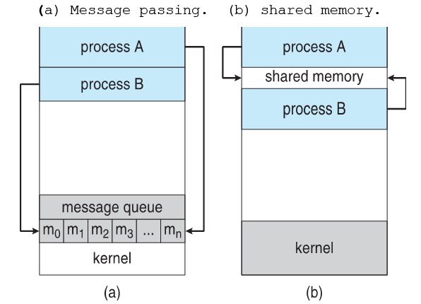

## 프로세스
프로세스란 ?
- 실행 중인 프로그램
- 프로그램 카운터의 값과 처리기 레지스터의 내용으로 대표되는 현재 활동
    - 함수의 매개변수, 복귀 주소, 로컬 변수와 같은 임시적인 데이터를 가지는 프로세스 스택을 포함
    - 전역 변수를 수록하는 데이터 섹션 포함
    - 힙 포함

프로그램과의 차이점 
- 프로그램: 명령어 리스트를 내용으로 가진 디스크에 저장된 파일(실행 파일)
    - 수동적
- 프로세스: 프로그램 카운터 및 관련된 자원의 집합을 가짐
    - 능동적 

실행 파일이 메모리에 적재될 때 프로그램은 프로세스가 됨. 

### 프로세스 상태 
프로세스의 상태는 그 프로세스의 현재의 활동에 따라서 일부 정의된다. 

- new: 프로세스가 생성 중
- running: 실행 중
- waiting: 입출력 완료, 신호의 수신 등을 기다림
- ready: 프로세스가 처리기에 할당되기를 기다림 
- terminated: 실행 종료됨

어느 한 순간에 하나의 처리기 상에는 오직 하나의 프로세스만 실행된다. 

### 프로세스 제어 블록(Process Control Block, PCB)
각 프로세스는 운영체제에서 프로세스 제어 블록(PCB)에 의해 표현된다. PCB는 특정 프로세스와 연관된 여러 정보를 가진다.
- 프로세스 상태
- 프로그램 카운터 
- CPU 레지스터들
- CPU-스케줄링 정보
- 메모리 관리 정보
- 회계(accounting) 정보
- 입출력 상태 정보

---

## 프로세스 스케줄링(Process Scheduling)
스케줄링이란 메모리에 있는 준비(ready) 상태의 프로세스들 사이의 우선 순위를 관리하고, 이 중 하나를 선택해 CPU 자원을 할당하는 것이다. 스케줄링은 처리율과 CPU 이용률을 증가시키고, 오버헤드/응답시간/반환시간/대기시간을 최소화시키기 위한 기법이다. 

#### 스케줄링 큐(Scheduling Queues)
- 잡 큐: 시스템 안의 모든 프로세스로 구성됨
- 준비완료 큐(ready queue): 프로세스들이 준비완료 상태에서 실행을 대기함
    - 일반적으로 연결 리스트의 형태 
    - 큐의 헤더는 리스트의 첫 번째와 마지막 PCB를 가리키는 포인터를 포함
    - 각 PCB는 준비완료 큐에 있는 다음 프로세스를 가리키는 포인터 필드를 가짐
- 장치 큐(device queue): 특정 입출력 장치를 대기하는 프로세스들의 리스트
    - 각 장치는 자신의 장치 큐를 가짐

새로운 프로세스는 준비완료 큐에 놓인다. 프로세스에 CPU가 할당되어 실행되면, 다음 사건들 중 하나가 발생할 수 있다. 
- 프로세스가 입출력을 요청하여 입출력 큐에 넣어질 수 있다. 
- 프로세스가 새로운 서브프로세스를 생성하고 그 프로세스의 종료를 기다릴 수 있다. 
- 프로세스가 인터럽트의 결과에 따라 강제로 CPU로부터 제거되어 준비완료 큐에 다시 놓일 수 있다. 

프로세스는 종료될 때까지 이 주기를 계속하며, 종료되면 모든 큐에서 삭제되고 PCB와 자원을 반납한다. 

#### 스케줄러(Schedulers)
프로세스 선택 절차(스케줄링)은 스케줄러에 의해 실행된다. 

**장기 스케줄러(잡 스케줄러)**
- 프로세스들을 선택해 실행하기 위해 메모리로 적재
- 메모리의 사용 가능 공간 및 자원을 확인
- 새로운 프로세스를 생성하거나 프로세스가 시스템을 떠날 때만 호출됨
- 실행 빈도 적음(수 분)

**단기 스케줄러(CPU 스케줄러)**
- 실행 준비가 완료된 프로세스들 중 하나를 선택해 CPU를 할당
- 프로세스의 실행상태를 대기 혹은 준비 상태로 변화시킴 
- 실행 간격 짧음(백 밀리초) -> 실행 속도 빠름 

**중기 스케줄러**
- 프로세스 스와핑 수행
    - 메모리에서 프로세스를 제거해 다중 프로그래밍의 정도를 완화
    - 나중에 다시 프로세스를 메모리로 불러와서 중단되었던 지점부터 실행
- 프로세스 혼잡 상태 개선, 메모리를 비울 때 필요

#### 문맥 교환(Context Swtich)
Context switch는 CPU를 다른 프로세스에게 할당하기 위해 현재 프로세스의 상태를 PC에 저장하고 다른 프로세스의 저장된 상태를 복구하는 작업이다. 

- context switch 동안 시스템은 아무 일도 하지 못함 
    - context switch 시간은 오버헤드
    - 속도는 메모리의 속도, 복사되어야 하는 레지스터의 수, 레지스터 명령어 등에 좌우됨
    - 주로 수 밀리초 정도
- context switch 시간은 하드웨어의 지원에 크게 좌우됨 
    - 레지스터 수, 활성 프로세스가 레지스터 수보다 많은지(많다면 레지스터 값을 메모리로 복사해야)
    - 메모리 관리 기법 등

---

## 프로세스에 대한 연산
#### 프로세스 생성 
프로세스는 실행 도중에 여러 개의 새로운 프로세스들을 생성할 수 있다. 생성 과정을 반복해 프로세스의 트리가 형성된다. 

운영체제는 유일한 프로세스 **식별자**(pid)로 프로세스를 구분한다. 

부모 프로세스: 생성하는 프로세스 
자식 프로세스: 새로운 프로세스 
- 자식 프로세스는 운영체제로부터 직접 자원을 얻거나 부모 프로세스 자원의 일부를 사용
    - 자식 프로세스가 부모 프로세스 자원의 일부분만을 사용하도록 제한하면, 어떤 프로세스가 너무 많은 서브프로세스들을 만들어 시스템을 과부하 상태로 만드는 것을 방지할 수 있음 
- 부모 프로세스는 자원을 분할해 자식들에게 나누어주거나 여러 자식들과 일부 자원(메모리, 파일 등)을 공유 
- 프로세스가 생성될 때 초기화 자료(파일명, 터미널 장치 등)가 부모에서 자식 프로세스로 전달될 수 있다. 

프로세스가 새로운 프로세스를 생성할 때 실행 가능성
- 부모가 계속해서 자식과 병렬로 실행됨
- 부모가 모든 자식 또는 일부 자식이 끝날 때까지 기다림

새로운 프로세스들의 주소 공간 측면에 대한 가능성
- 자식 프로세스는 부모 프로세스의 복사본(똑같은 프로그램과 데이터를 가짐)
- 자식 프로세스가 자신에게 적재될 새로운 프로그램을 가짐 

fork(): 새로운 프로세스 생성 
- 새로운 프로세스는 원래 프로세스의 주소 공간의 복사본으로 구성됨 -> 통신 가능

exec(): fork() 이후 두 프로세스 중 하나가 자신의 메모리 공간을 새로운 프로그램으로 바꿈
- 이진 파일을 메모리로 적재(load)하고(원 프로그램의 메모리 이미지는 파괴) 적재된 프로그램을 실행 

wait(): 자식이 끝날 때까지 기다림
    - 준비완료 큐에서 부모 프로세스를 제거함

exit(): 프로세스 종료 

#### 프로세스 종료 
프로세스가 실행을 모두 끝내고, `exit()`을 사용해 운영체제에게 자신의 제거를 요청하면 프로세스는 종료한다. 
프로세스는 자신의 부모 프로세스에게 상태 값을 반환할 수 있다. 
물리 메모리, 가상 메모리, 열린 파일, 입출력 버퍼를 포함한 프로세스의 모든 자원이 운영체제로 반납된다. 

exit()을 사용하지 않고 부모 프로세스가 `TerminateProcess()`를 통해 자식 프로세스를 종료시킬 수도 있다. 

자식 프로세스의 종료 요인
- 자식이 할당된 자원을 초과해 사용할 때
- 자식에게 할당된 태스크(task)가 더 이상 필요 없을 때
- 부모가 exit하는데, 운영체제는 부모가 exit한 후에 자식이 실행을 계속하는 것을 허용하지 않는 경우 

---

## 프로세스간 통신 
운영체제 내에서 실행되는 병행 프로세스들은 독립적이거나 협력적인 프로세스들이다. 
- 독립적인 프로세스: 시스템에서 실행중인 다른 프로세스들에게 영향을 주거나 받지 않는다.
    - 다른 프로세스와 데이터를 공유하지 않음
- 협력적인 프로세스: 다른 프로세스들과 영향을 주고받는다. 
    - 자료를 공유 

프로세스 협력 허용 이유 
- 정보 공유
    - 정보(공유 파일 등)에 병행적으로 접근할 수 있는 환경 제공 
- 계산 가속화
    - 특정 태스크가 서브태스크로 나뉘어 서로 병렬적으로 실행되는 경우, 복수 개의 처리 요소(CPU, 입출력 채널 등)이 필수적임
- 모듈성
    - 시스템 기능을 별도의 프로세스나 스레드로 나누어 모듈식 형태로 시스템을 구성할 경우 
- 편의성
    - 한 사용자가 여러 태스크를 동시에 작업할 경우

협력적 프로세스들은 데이터와 정보를 교환할 수 있는 **프로세스간 통신**(interprocess communication, IPC) 기법을 필요로 한다. 

프로세스간 통신 모델에는 두 가지가 있다. 
- 공유 메모리 
- 메시지 전달

#### 공유 메모리 시스템 
일반적으로 운영체제는 한 프로세스가 다른 프로세스의 메모리에 접근하는 것을 금지한다. 하지만 공유 메모리 영역 사용을 위해서는 둘 이상의 프로세스가 이 제약 조건을 제거하는 것에 반드시 동의해야 한다. 

데이터의 형식과 위치는 이들 프로세스에 의해 결정되며, 프로세스들은 동시에 동일한 위치에 write 하지 않아야 한다. 

// 질문 - 뭔말인지 모르겠다 
공유메모리 시스텝은 생산자-소비자 문제(한정 버퍼 문제)를 해결할 수 있다.
버퍼가 생산자와 소비자가 공유하는 메모리 영역에 존재해, 프로세스들이 병행으로 실행되며 버퍼에 정보를 채워 넣고 소모하게 된다. 
- 무한 버퍼(unbounded buffer): 버퍼의 크기에 실질적인 한계가 없다 
    - 소비자는 새로운 항목을 기다려야 할 수 있다. 
    - 생산자는 항상 새로운 항목을 생산할 수 있다. 
- 유한 버퍼(bounded buffer): 버퍼의 크기가 고정되어있다고 가정한다. 
    - 버퍼가 비어있으면 소비자는 대기해야 한다. 
    - 모든 버퍼가 채워져있으면 생산자가 대기해야 한다. 
    
#### 메시지 전달 시스템 
운영체제가 메시지 전달 설비를 통해 서로 협력하는 프로세스간의 통신 수단을 제공해 주는 방법이다. 통신하는 프로세스들이 네트워크에 의해 연결된 다른 컴퓨터들에 존재할 수 있는 분산 환경에서 유용하다. 최소 두 가지 연산(send, receive)를 제공한다. 

다음과 같은 방법들을 통해 하나의 통신 링크와 send/receive연산을 논리적으로 구현할 수 있다. 
- 직접 또는 간접 통신
- 동기식 또는 비동기식 통신
- 자동 또는 명시적 버퍼링 

##### 직접/간접 통신 
<u>직접 통신</u> 하에서, 통신을 원하는 각 프로세스는 다음과 같이 수신자 또는 송신자의 이름을 명시해야 한다. 
- send(P, message): 프로세스 P에게 메시지를 전송한다. 
- receive(Q, message): 프로세스 Q로부터 메시지를 수신한다. 

특징
- 통신을 원하는 모든 프로세스의 쌍 사이에 연결이 자동적으로 구축된다. 프로세스들은 통신하기 위해 서로 상대방의 신원(identity)만 알면 된다. 
- 연결은 정확히 두 프로세스 사이에만 연관된다. 
- 통신하는 프로세스들의 각 쌍 사이에는 정확하게 하나의 연결이 존재해야 한다. 

아래와 같이 주소 지정 시에 비대칭 형식을 사용할 수도 있다. 
- send(P, message)
- receive(id, message): 임의의 프로세스로부터 메시지를 수신한다. 변수 id는 통신을 발생시킨 프로세스의 이름으로 설정된다. 

단점 
- 프로세스를 정확히 지정함으로써 모듈화를 제한
    - 프로세스의 이름을 바꾸면 모든 다른 프로세스 지정부분의 검사가 필요

<u>간접 통신</u>에서 메시지들은 메일박스(mailbox) 또는 포트(port)로 송수신된다. 
메일박스는 추상적이며 메시지들이 넣어지거나 제거될 수 있는 객체라고 볼 수 있다. 각 메일박스는 고유의 식별자를 가진다. 

send, receive 연산은 다음과 같이 정의된다. 
- send(A, message): 메시지를 메일박스 A로 송신한다. 
- receive(A, message): 메시지를 메일박스 A로부터 수신한다. 

특징
- 한 쌍의 프로세스 사이의 연결은 이 프로세스들이 공유 메일박스를 가질 때만 구축된다. 
- 연결은 두 개 이상의 프로세스들과 연관될 수 있다. 
- 통신하고 있는 각 프로세스 사이에는 다수의 서로 다른 연결이 존재할 수 있고, 각 연결마다 하나의 메일박스가 할당된다. 

#### 동기식/비동기식 통신 
메시지 전달은 봉쇄형(blocking)이거나 비봉쇄형(nonblocking) 이다.
- 봉쇄형 송신: 송신 프로세스는 메시지가 수신 프로세스나 메일박스에 의해 수신될 때까지 기다린다. 
- 비봉쇄형 송신: 송신 프로세스가 메시지를 보내고 작업을 재시작한다. 
- 봉쇄형 수신: 메시지가 이용 가능할 때까지 수신 프로세스가 봉쇄된다. 
- 비봉쇄형 수신: 수신하는 프로세스가 유효한 메시지 또는 null을 받는다. 

#### 버퍼링(Buffering) 
통신 방법에 관계없이, 프로세스들에 의해 교환되는 메시지는 임시 큐에 들어있다. 큐 구현 방식은 다음과 같다.
- 무용량(zero capacity): 큐의 최대 길이가 0
    - 송신자는 수신자가 메시지를 수신할 때까지 기다려야 한다. 
- 유한 용량(bounded capacity): 큐는 유한한 길이 n을 가진다.
    - 최대 n개의 메시지가 들어있을 수 있다.
    - 새로운 메시지가 전송될 때 큐가 만원이 아니라면, 메시지는 큐에 놓이며 송신자는 대기하지 않고 실행을 계속한다. 
    - 큐가 만원이면 송신자는 큐 안에 가용한 공간이 생길 때까지 반드시 봉쇄되어야 한다. 
- 무한 용량(unbounded capacity): 큐는 잠재적으로 무한한 길이를 가진다. 
    - 메시지들이 무한히 큐 안에서 대기할 수 있다. 
    - 송신자는 봉쇄되지 않는다. 

무용량 버퍼는 버퍼링하지 않는 메시지 시스템이라고 불리며, 다른 경우들은 자동 버퍼링 메시지 시스템이라고 불린다. 

#### Reference
<https://jwprogramming.tistory.com/16> 

