## 대용량 저장장치 구조 
### 자기 디스크(Magnetic Disk)
자기 디스크는 대용량의 보조 저장장치로, 자성을 이용해 정보를 기록하고 읽는다.
하드디스크(HDD)는 자기 디스크의 일종이다.

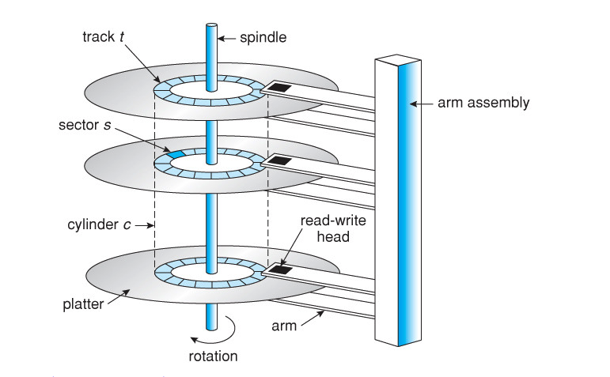

**플래터(platter)**
플래터는 CD처럼 생긴 원형 판으로, 양쪽 표면이 자기 물질로 덮여 있다. 
정보는 플래터 상에 자기적으로 기록되어 저장된다. 

**디스크 암(disk arm), 헤드(head)**
읽기와 쓰기 헤드는 모든 플래터의 각 표면 바로 위에서 움직인다.
헤드는 모든 헤드를 한꺼번에 이동시키는 디스크 암에 부착되어 있다. 

**트랙(track), 섹터(sector), 실린더(cylinder)**
플래터의 표면은 원 모양의 트랙으로 논리적으로 나뉘어져 있고, 트랙은 다시 섹터로 나뉜다. 동일한 암 위치에 있는 트랙의 집합은 하나의 실린더를 형성한다. 
하나의 디스크 드라이브(일반적으로 GB 단위)에는 수천 개의 동심원 실린더가 존재할 수 있고, 각 트랙은 수백 개의 섹터를 포함할 수 있다. 

디스크 접근 시간은 탐색시간, 회전 지연시간, 전송시간의 합으로 계산한다. 
**탐색 시간(seek time)**: 원하는 트랙(실린더)로 암이 이동하는 시간 
**회전 지연시간(rotational latency)**: 원하는 섹터가 디스크 헤더로 회전하는 데 걸리는 시간 
**전송 시간(transfer time)**: 데이터를 전송하는 시간

이 중 기계적으로 헤드를 이동시켜야 하는 탐색 시간이 가장 오래 걸린다. 

### 반도체 디스크(Solid-State Disk)
**SSD와 자기 디스크의 차이**
- SSD는 기계적 이동 부품이 없기 떄문에 더 신뢰할 수 있고, 탐색과 지연 시간이 없어 속도가 더 빠르다. 
- SSD는 자기 디스크에 비해 전력 소모가 적다. 
- SSD가 메가바이트당 가격이 더 높고 용량은 작으며, 수명이 더 짧다. 

SSD는 주로 고성능을 필요로 하는 파일 시스템의 메타데이터를 저장하는 데 사용된다. 또 SS는 현대적 컴퓨터의 저장장치로서 사용되어 더 작고 빠르며 에너지 효율적으로 동작한다. 

### 자기 테이프(Magnetic Tape)
초기의 보조 저장장치 매체로, 순차 접근만 가능하다. 주 메모리와 자기 디스크와 비교해 많은 양의 데이터를 보관할 수 있지만, 접근 시간이 느리다.(자기 테이프에 대한 무작위 접근은 자기 디스크에 대한 무작위 접근보다 약 1000배 느리다.) 때문에 자기 테이프는 보조 저장장치로는 부적합하며, 주로 backup용이나 한 시스템에서 다른 시스템으로 정보를 전송하기 위한 매체로 사용된다. 

---

## 디스크 부착(Disk Attachment)

---

## 디스크 스케줄링(Disk Scheduling)
자기 디스크의 경우, 디스크 접근 시간은 탐색 시간과 회전 지연 시간으로 이루어진다. 효율적인 디스크 스케줄링은 접근 시간과 대역폭을 향상시킬 수 있다.

프로세스가 입출력을 필요로 할 때, 운영체제에 보내는 시스템 콜에는 다음과 같은 인수가 주어진다.
- 입력/출력 여부
- 디스크 주소
- 메모리 주소
- 전송될 섹터의 수

만일 디스크 드라이브나 제어기(controller)가 쉬고 있는 상태라면 요청은 즉시 시작되지만, 드라이브나 제어기가 바쁘면 요청은 드라이브의 큐에 들어가 대기한다. 하나의 디스크 입출력이 완료되면, 큐에서 대기 중인 디스크 요청 중 하나를 선택해 처리해준다. 

### 선입 선처리(FCFS) 스케줄링
<u>큐에 도착한 순서대로 처리하는 방식</u>으로 가장 간단한 형태의 스케줄링이지만, 빠른 서비스를 제공하지는 못한다. 

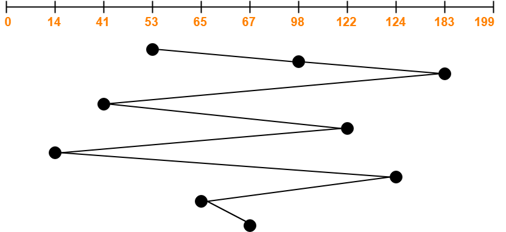

### 최소 탐색 시간 우선(SSTF) 스케줄링
최소 탐색 시간 우선 알고리즘은 헤드가 다른 곳으로 이동을 시작하기 전에 근처에 있는 요구들을 먼저 처리해 주고, 헤드를 이동하는 방식이다. SSTF 알고리즘은 현재 헤드 위치에서 출발해 탐색 시간이 가장 적은, 즉 현재의 헤드 위치와 가장 가까운 요청을 선택한다. 

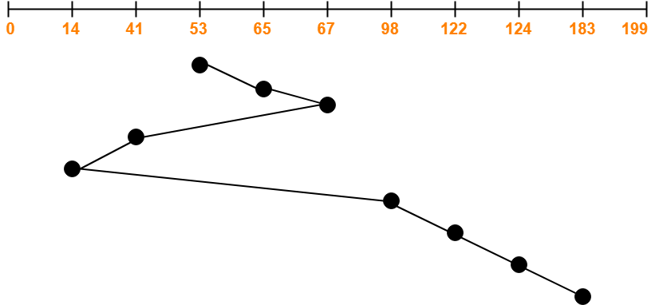

SSTF 알고리즘을 사용 시, 몇몇 디스크 요청들이 매우 오래 기다리게 되는 기아 상태가 발생할 수 있다. 

### SCAN 스케줄링
SCAN 알고리즘에서는 디스크 암이 디스크의 한 끝에서 다른 끝으로 왕복하며 경로에 있는 모든 요청을 처리한다. 다른 한쪽 끝에 도달하면 역방향으로 이동하며 오는 길에 있는 요청을 모두 처리한다. 

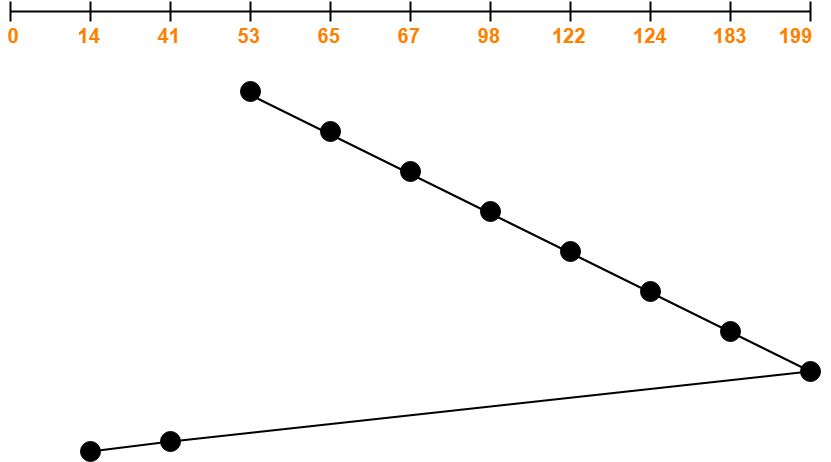

### C-SCAN 스케줄링
C-SCAN 알고리즘은 SCAN의 변형으로, 각 요청에 걸리는 시간을 더 균등하게 하기 위한 알고리즘이다. C-SCAN도 한쪽 방향으로 헤드를 이동해 가며 요청을 처리하지만, 한쪽 끝에 다다르면 처음 시작했던 자리로 다시 되돌아가서 요청을 처리한다. 

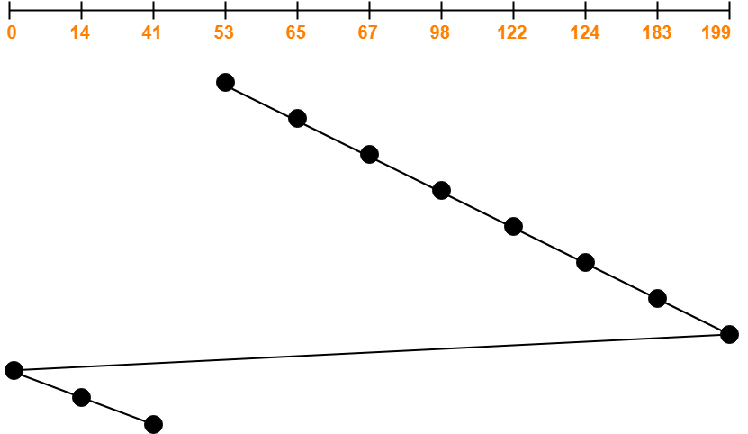

### LOOK 스케줄링
LOOK 알고리즘에서 헤드는 SCAN, C-SCAN에서처럼 각 방향으로 가다가 그 방향에서 대기하는 요청이 없다면 헤드의 이동 방향을 즉시 바꾼다. SCAN과 C-SCAN의 이러한 변형을 각각 LOOK, C-LOOK 스케줄링이라 한다. 헤드가 한 방향으로 계속 움직이기 전에 미리 요구가 있는지 확인하는 방식이다. 

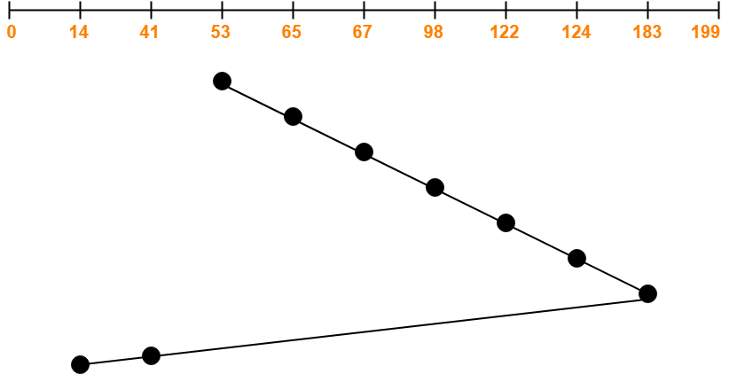

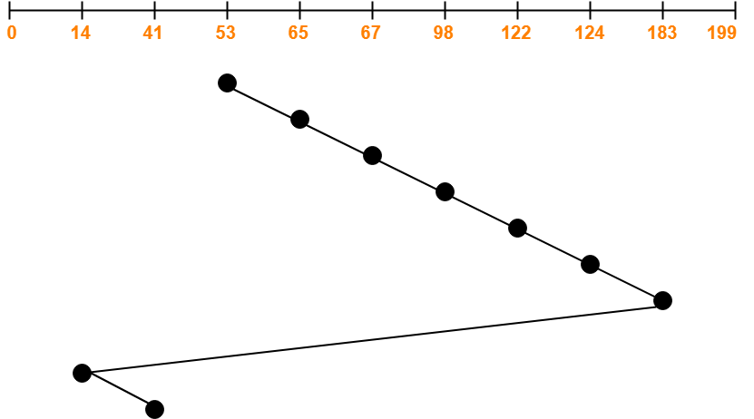

--- 

## 디스크 관리
### 디스크 포맷팅(Disk Formatting)
새로운 디스크는 아무런 정보도 없는 비어있는 판이다. 디스크는 자료를 저장하기 전에 섹터들로 나누어져 있어야 하며, 이 과정을 **저수준 포맷팅**(low-level formatting)이라 한다. 

저수준 포맷팅: 섹터를 구분하기 위해 디스크를 적절한 자료구조로 채우는 것
- 섹터의 자료구조는 보통 헤더(header), 자료 구역(data area), 트레일러(trailer)로 구성됨
    - 헤더와 트레일러는 섹터 번호와 오류 수정 코드(ECC, Error Correcting Code)를 가짐
    - ECC는 데이터 기록 시 계산되어 저장되고, 나중에 해당 섹터가 읽혀질 때 데이터로부터 다시 계산되어 이전의 값과 비교된다. 
- 저수준 포맷 시 모든 섹터의 헤더와 트레일러 사이에 몇 바이트 공간을 가지도록 할 것인지 결정된다. 

디스크에 파일을 저장하기 전에, 운영체제는 디스크에 운영체제의 자료구조를 기록한다. 이 과정은 다음과 같이 이루어진다. 
1. 디스크를 여러 실린더들로 이루어지는 파티션으로 나눈다. 
2. 파티션 후, **논리적 포맷팅**(logical formatting)을 통해 파일 시스템을 만든다. 
    - 운영체제가 파일 시스템 자료구조를 디스크에 저장하는 과정이다. 
    - FAT, inode, 가용 공간 정보, 초기의 빈 디렉터리 구조 등을 저장한다. 

### 부트 블록(Boot Block)
부트스트랩(bootstrap) 프로그램: 전원을 켜거나 재부팅할 때, 시스템을 시작시키는 최초의 프로그램 
부트스트랩 프로그램은 여러 하드웨어(CPU 레지스터, 장치 제어기, 메모리 등)을 초기화하며, 운영체제가 어디에 저장되어 있는지 알아내 메모리에 올려놓고 시작시킨다. 

대부분의 시스템들은 ROM(read-only memory) 안에 부트스트랩 프로그램 본체를 디스크로부터 적재하는 역할의 부트스트랩 로더(bootstrap loader) 프로그램을 적재한다. 부트스트랩 프로그램 본체는 쉬운 변경을 위해 디스크의 고정된 위치인 **부트 블록**에 저장된다. 부트 파티션을 가지고 있는 디스크는 부트 디스크(시스템 디스크)라고 한다. 

### 손상된 블록
디스크는 움직이는 부품들이 있고, 헤드와 디스크 표면간의 틈이 매우 좁기 때문에 고장 나기 쉽다. 손상된 블록들은 디스크와 제어기(controller)에 따라 다양한 방법으로 처리된다. 

**가장 간단한 경우: IDE 제어기**
IDE 제어기를 가진 디스크는 손상된 블록들을 수동으로 처리한다. 
디스크 포맷 중, 디스크를 스캔해 손상된 블록이 있는지 검사한다. 발견된 손상 블록은 사용불가라고 표시해 파일 시스템이 그 블록을 할당하지 않도록 한다. 손상된 블록에 저장되어 있던 데이터는 일반적으로 잃어버리게 된다. 

**섹터 재배치**
제어기는 손상 블록 리스트를 유지한다. 제어기는 저수준 포맷팅 시 남겨진 예비 섹터 중 하나를 손상된 섹터와 교체할 수 있다. 

일반적으로 손상된 섹터는 다음과 같이 처리된다. 
1. 운영체제가 논리 블록 87을 읽으려고 시도한다. 
2. 제어기가 ECC를 계산한 결과 해당 섹터가 손상된 것을 알게 되고, 이 사실을 운영체제에 보고한다. 
3. 다음 번에 시스템이 재부트될 때, 특정한 명령어를 통해 제어기가 섹터를 예비 섹터로 교체하도록 한다. 
4. 그 후 논리 블록 87이 요청될 때마다 변경된 새로운 섹터 주소로 가게 된다. 

이러한 재배치는 디스크 스케줄링 알고리즘에 의한 최적화가 무산되게 할 수 있기 때문에, 일부 디스크들은 각 실린더마다 예비 섹터를 배치하고 예비 실린더도 배치한다. 그리고 가능한 동일한 실린더에서 예비 섹터를 찾아 대체한다. 

**섹터 밀어내기(sector slipping)**
섹터 밀어내기는 섹터들을 순차적으로 다음 섹터에 재맵핑하는 과정이다. 
예를 들어 논리 블록 17에 결함이 생겼고 첫 번째 예비 섹터는 202 다음에 있다고 할 때, 섹터 202는 예비 섹터로 복사되고 201은 202로, 200은 201로 계속해서 섹터를 복사한다. 결과적으로 섹터 18이 빈 공간이 되어 손상된 섹터 17을 18로 옮길 수 있게 된다. 

---

## RAID 구조
RAID(redundant array of inexpensive/independent disk)는 여러 개의 하드 디스크에 일부 중복된 데이터를 나눠서 저장하는 기술이다. RAID는 일반적으로 성능과 신뢰성 이슈를 해결하는 데 중점을 두고 있으며, 현재는 높은 신뢰성과 높은 데이터 전송률 때문에 사용된다. RAID는 상대적으로 속도가 많이 느린 하드디스크를 보완하는 역할을 한다. 

RAID는 다음과 같은 장점을 가진다. 
- 데이터 안정성 증가
- 대용량의 단일 볼륨을 사용하는 효과 
- 디스크 I/O 병렬화로 인한 성능 향상 

**중복을 통한 신뢰성 향상**
RAID는 중복을 허용해 신뢰성 문제를 해결한다. 중복은 모든 디스크의 복사본을 만드는 **미러링** (mirroring)을 통해 도입된다. 미러링을 사용하는 경우 하나의 논리 디스크는 두 개의 물리 디스크로 구성되고 모든 쓰기 작업은 두 디스크에서 모두 실행된다. 이 미러드 볼륨 중 하나의 디스크에서 오류가 발생하면, 다른 디스크에서 데이터를 읽어들인다. 

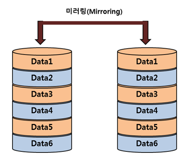

두 미러드 디스크의 같은 블록에 쓰기가 동시에 진행될 때, 두 블록이 모두 완전히 쓰이기 전에 전원 고장이 발생한다면 두 블록은 불완전한 상태가 된다. 이 문제는 다음 방법을 통해 해결할 수 있다. 
- 첫 번째 디스크에 쓰기 작업을 먼저 마친 후 다음 디스크에 쓰기를 수행한다. 
- 비휘발성 메모리 캐시를 RAID 배열에 둔다. //질문 

**벙렬성을 이용한 성능 향상**
여러 디스크를 사용할 경우, 여러 디스크에 걸쳐 데이터 스트라이핑(data striping)을 사용해 전송 비율을 향상시킬 수 있다. 스트라이핑은 데이터를 여러 개의 디스크 드라이브에 저장해 디스크를 병렬적으로 사용할 수 있게 하는 기술이다.

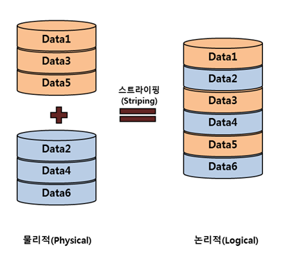

데이터 스트라이핑은 다음과 같은 두 가지 목적이 있다.
- 부하 균등화를 이용해 여러 작은 액세스의 처리량을 높인다. 
- 규모가 큰 액세스의 응답 시간을 줄인다. 

데이터 스트라이핑은 비트 레벨 스트라이핑과 블록 단위 스트라이핑으로 나눌 수 있다. 

**비트 스트라이핑(bit striping)**
비트 스트라이핑은 각 바이트를 여러 개의 비트로 쪼개어 나눠 저장하는 방법이다. 예를 들어 8개의 디스크를 가지고 있다면, i번째 디스크에는 각 바이트의 i번째 비트를 쓰게 된다. 모든 디스크가 읽기/쓰기에 참여하므로 같은 시간에 하나의 디스크보다 8배의 데이터를 읽어올 수 있다. 

**블록 스트라이핑(block striping)**
블록 단위 스트라이핑에서 파일의 블록은 여러 디스크에 각각 나뉘어져 저장된다. n개의 디스크에서 파일의 i번째 블록은 (i mod n)+1 디스크에 저장된다. 

### RAID 레벨
RAID를 구성하는 디스크의 수가 같아도 RAID의 구성 방식에 따라 성능과 용량에서 차이가 난다. 
각각의 RAID 구성 방식은 RAID 레벨로 분류한다. 

**RAID Level 0**
블록 레벨로 스트라이핑하는 디스크 구성을 말하며, 미러링이나 패리티 비트 등 어떠한 중복 정보도 가지고 있지 않다. 빠른 성능을 요구하면서 데이터의 손실이 큰 문제가 되지 않는 자료를 저장하는데 적합하다. 

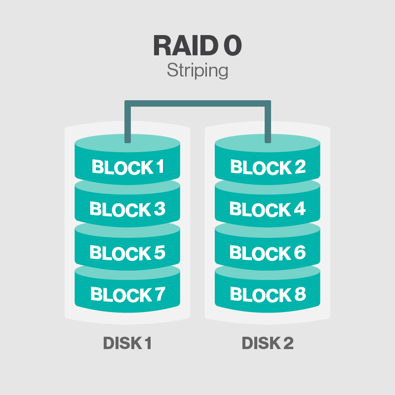

최소 디스크 개수: 2 
용량: 디스크 수 X 디스크 용량

**RAID Level 1**
RAID Level 1은 디스크 미러링을 사용한다. 스트라이핑 구성이 아니며, 여러 디스크를 동시에 읽을 수 있기 때문에 읽기 성능이 향상된다. 

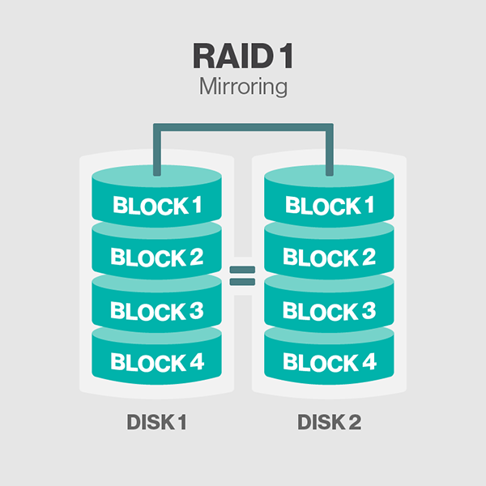

최소 디스크 개수: 2 
용량: (디스크 수/2) X 디스크 용량

**RAID Level 2**
비트 스트라이핑과 메모리 스타일 오류 정정 코드 구조(ECC organization)를 적용해, 일부 디스크에 오류 검사 및 수정을 위한 ECC(Error Correction Code) 정보가 저장된다. 디스크 중 하나가 고장난다면, 남아있는 비트와 다른 디스크로부터 오류 정정 비트를 읽어와 오류를 복구한다. 
현재는 더 이상 사용되지 않는 구성이다. 

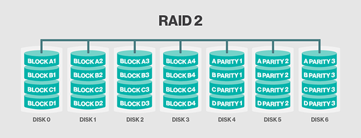

최소 디스크 개수: 3 
용량: (디스크 수-1) X 디스크 용량

**RAID Level 3**

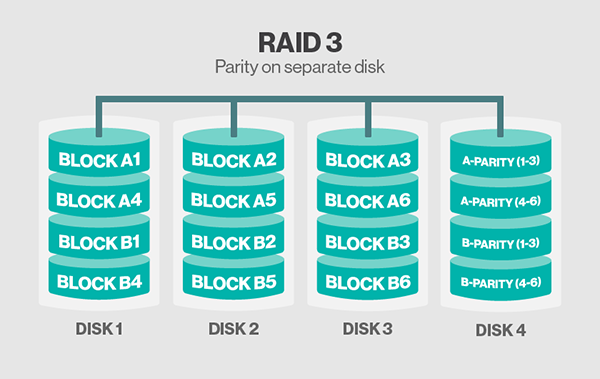

RAID 3은 RAID 1에 비해 다음과 같은 장점을 가지고 있다. 
- RAID 1의 미러드 디스크와는 다르게 오직 하나의 패리티 디스크가 여러 디스크를 커버할 수 있다. 
- N-way 데이터 스트라이핑을 사용해 RAID 1에 비해 N배의 데이터 전송률을 가진다. 

RAID 3은 다음과 같은 성능 문제를 가진다. 
- 모든 디스크가 모든 입출력 요구에 참여해야 하기 때문에 RAID 1에 비해 초당 입출력 횟수가 더 적다.
- 패리티를 계산하고 쓰는 데 비용이 들어간다. 

최소 디스크 개수: 3 
용량: (디스크 수-1) X 디스크 용량

**RAID Level 4**

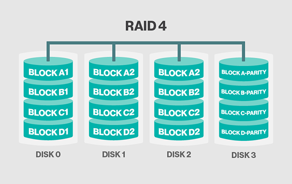

최소 디스크 개수: 3 
용량: (디스크 수-1) X 디스크 용량

**RAID Level 5**

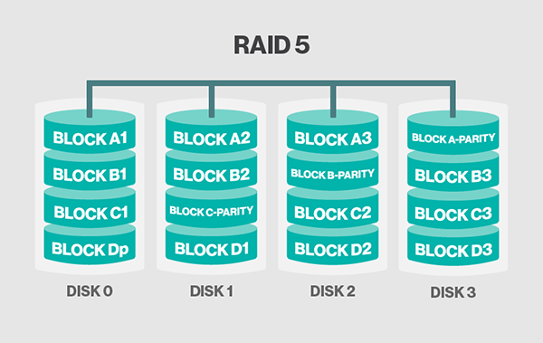

최소 디스크 개수: 3 
용량: (디스크 수-1) X 디스크 용량

**RAID Level 6**

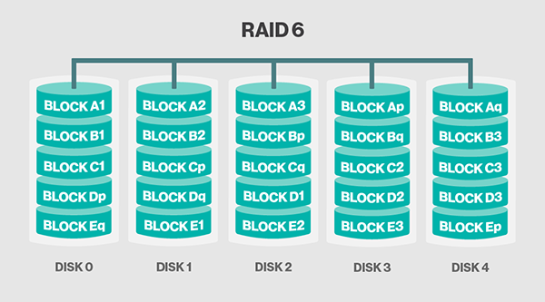

최소 디스크 개수: 4 
용량: (디스크 수-2) X 디스크 용량

**RAID Level 1+0**

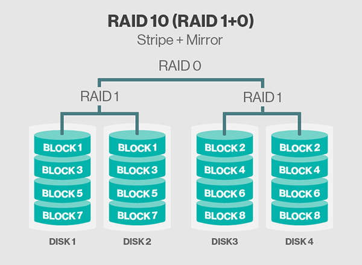

최소 디스크 개수: 4 
용량: (디스크 수-2) X 디스크 용량