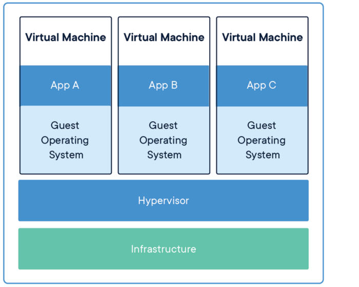

## 운영체제 서비스 
운영체제는 프로그램과 프로그램 사용자에게 다음과 같은 서비스를 공통적으로 제공한다. 
- 사용자 인터페이스(User Interface)
    입출력을 지시하고, 메뉴를 선택하는 지시장치와 문자열을 입력하는 키보드를 포함한 윈도 시스템
    - 명령어라인 인터페이스(Command-Line Interface, CLI)
    - 배치 인터페이스(batch interface)
    - 그래피컬 사용자 인터페이스(Graphical User Interface, GUI)
- 프로그램 실행(Program execution)
- 입출력 연산(I/O operation)
- 파일 시스템 조작
- 통신
- 오류 탐지 
- 자원 할당
- 회계
- 보호와 보안

## 가상기계(Virtual Machines)

VM의 기본적인 착상은 하드웨어(CPU, 메모리, 디스크 드라이브, 네트워크 인터페이스 카드 등)를 추상화 해 다수의 다른 실행 환경을 제공하는 것이다.

CPU 스케줄링과 가상 메모리 기법을 통해, 운영체제 호스트는 각 플로세스가 자신의 전용 메모리를 갖는 전용 처리기에서 실행되는 것처럼 보여지게 한다. 

보통 게스트 프로세스는 하나의 운영체제이고, 하나의 물리적인 기계가 여러 운영체제를 각자의 VM 안에서 실행시킬 수 있다. 

장점 
- VM들끼리 서로 보호되며 호스트 시스템도 VM으로부터 보호된다. 
    - 각 VM은 다른 VM으로부터 완전히 격리된다. 
    - 게스트 운영체제 안의 바이러스는 그 운영체제를 손상시킬 수 있으나 호스트 또는 다른 게스트를 손상시킬 수 없다. 

### VMware

### Java Virtual Machine 