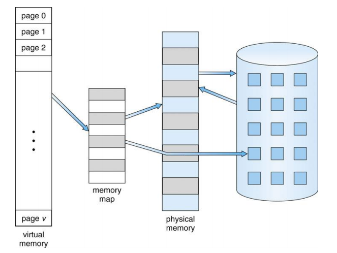
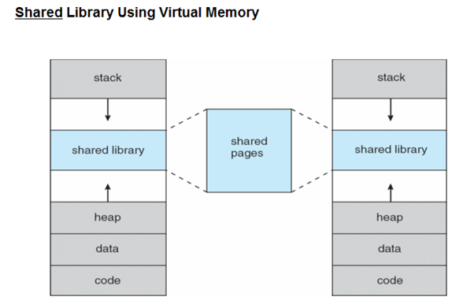
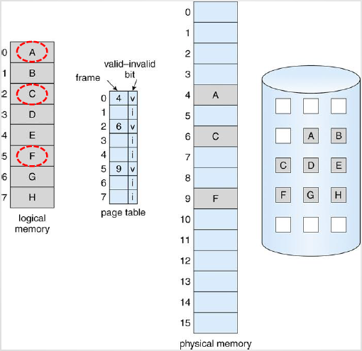
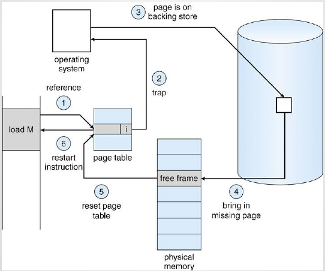
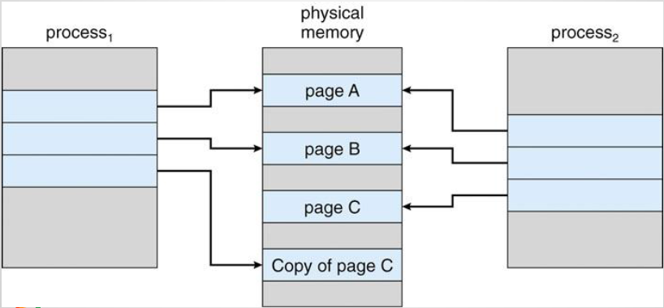

# 가상 메모리 
프로그램 전체가 한꺼번에 메모리에 올라와 있지 않아도 되는 이유 
- 거의 실행되지 않는 코드가 존재
- 배열, 리스트 테이블 등은 필요 이상으로 많은 공간을 점유
- 프로그램 내 거의 사용되지 않는 옵션/기능 존재 

프로그램의 일부분만 메모리에 올려놓고 실행하는 데 대한 이점
- 물리 메모리 크기에 제약받지 않음
    - 매우 큰 가상 주소 공간을 가정하고 프로그래밍 가능
- 더 많은 프로그램을 동시 실행 가능
    - 응답시간은 그대로, CPU 이용률과 처리율은 증가 
- 스왑하는데 필요한 입출력 횟수가 줄음

**가상 메모리**: 각 프로그램에 실제 메모리 주소가 아닌 가상의 메모리 주소를 주는 방식
- 메모리 용량 및 안정성 보장
    - 실제 메모리보다 큰 가상 주소 공간 제공
    - 프로세스들끼리 메모리 침범이 일어날 여지 줄임
- 메모리 관리의 단순화
    - 각 프로세스마다 가상메모리의 통일된 주소 공간 배정
- 주기억장치의 효율적 관리 
    - 주기억장치를 디스크에 대한 캐시로 설정
        - 프로세스 스왑

물리 메모리는 페이지 프레임(page frame)들로 구성되며, 필요한 페이지 프레임만을 스와핑을 통해 메모리에 올리고 나머지는 하드디스크에 둔다. 
- 논리 메모리와 물리 메모리의 분리 
- 하나의 프로세스에 할당된 페이지 프레임들은 서로 연속적이지 않을 수 있다.
- MMU가 페이지와 페이지 프레임을 바인딩한다. 

가상 메모리는 페이지 공유를 통해 파일이나 메모리가 여러 프로세스들에 의해 공유되는 것을 가능하게 한다. 
- 시스템 라이브러리 공유 가능
- 프로세스간 메모리 공유 가능
    - 공유 메모리를 통한 통신 가능

## 요구 페이징을 통한 가상 메모리 구현 
요구 페이징(demand paging) 방식은 초기에 필요한 것들만을 적재하는 방식이며, 페이지들은 실행과정에서 실제로 필요해질 때 적재된다. 한 번도 접근되지 않는 페이지는 물리 메모리에 적재되지 않는다. 

요구 페이징의 고려 사항 
- **프레임 할당 알고리즘**
    - 한 프로세스에 얼마나 많은 프레임을 할당해야 할지 
- **페이지 교체 알고리즘**
    - 페이지 교체가 필요할 경우, 어떤 페이지를 교체해야 할지

**스왑퍼(swapper)**
- 전체 프로세스를 관리 
- 프로세스는 디스크(보조 메모리)에 존재하며, 실행 시 메모리로 읽어들여짐(swap in)
- 게으른 스왑퍼(lazy swapper) 사용
    - 페이지가 필요하지 않는 한 적재하지 않음

**페이저(pager)**
- 프로세스 내의 개별 페이지를 관리 
- 프로세스 전체를 스왑 인 하는 대신, 실제 필요한 페이지들만 메모리로 로딩함

페이저가 실제 필요한 페이지를 예측하기 위해, **유효/무효 비트(valid-invalid) 기법**이 사용된다. 

비트가 유효: 해당 페이지가 메모리에 존재 
비트가 무표: 해당 페이지가 유효하지 않거나(가상 주소 공간에 존재하지 않거나), 유효하지만 디스크에 존재 
메모리에 올라오는 페이지에 대해서는 유효로 설정하며, 현재 메모리에 올라와 있지 않은 페이지의 페이지 테이블 항목은 무효로 설정하거나 그 페이지가 저장되어있는 디스크 주소를 기록한다. 

프로세스가 메모리에 올라와 있지 않는 페이지에 접근하려고 하면 **페이지 부재 트랩(page-fault trap)**이 발생된다.

페이지 부재 처리 과정
1. 프로세스 내부 테이블에서 메모리 참조가 유효/무효인지 검사한다.  
2. 무효한 페이지에 대한 참조일 경우, 프로세스는 중단된다. 유효한 참조인데 페이지가 메모리에 올라오지 않았다면, 디스크로부터 가져와야 한다. 
3. 메모리에서 빈 공간, 자유 프레임(free frame)을 찾는다. 
4. 디스크에 새로 할당된 프레임으로 해당 페이지를 읽어 들이도록 요청한다. 
5. 디스크 읽기가 끝나면 페이지 테이블을 갱신하고 프로세스가 유지하고 있는 내부 테이블을 수정한다. 
6. 중단되었던 명령어를 다시 실행한다. 

요구하기 전까지는 해당 페이지를 메모리에 적재하지 않는 방식을 **순수 요구 페이징(pure demand paging)**이라고도 한다. 순수 요구 페이징은 처음에 많은 페이지 부재를 발생시키는데, 이를 방지하기 위해 **프리 페이징(예상 페이징)**이라는 방식이 사용된다. 
프리 페이징은 많이 사용될 것으로 예상되는 페이지를 모두 메모리 내로 가져오는 방식이다. 프리 페이징은 입출력을 여러 번 수행하는 요구 페이징보다 성능이 좋지만, 예상이 틀리거나 이미 적재한 페이지를 사용하지 않을 경우 메모리를 낭비하게 되는 단점이 있다. 

## 쓰기-시-복사(Copy-on-write)
이전에는 fork() 명령어 사용 시 자식 프로세스에 부모 프로세스를 복사해 줌으로써 자식 프로세스의 주소 공간을 구성해 주었다. 하지만 대부분의 자식들은 만들어지자마자 exec()을 호출해 주소 공간을 새로 구성해, 부모 프로세스를 복사할 이유가 없었다. 

**쓰기-시-복사**는 자식 프로세스가 시작할 때 부모의 페이지를 당분간 함께 공유하는 방법이다. 

**쓰기-시-복사 페이지**: 부모와 자식 간 공유되는 페이지 

자식은 별도의 개인용 페이지에 쓰기-시-복사 페이지의 수정 내용을 기록하며, 수정되지 않는 페이지들은 부모와 공유한다. 

## 페이지 교체(Page Replacement)
다중 프로그래밍의 정도를 높이는 데서 오는 과할당 문제(모든 메모리가 사용 중인 경우) 해결 방법
- 사용자 프로세스 종료
- 프로세스 스왑 아웃 
- 페이지 교체

페이지 부재 서비스 루틴은 페이지 교체를 포함해 다음과 같이 이루어진다. 
1. 디스크에서 필요한 페이지의 위치를 알아낸다. 
2. 빈 페이지 프레임을 찾는다. 
- 빈 프레임이 있다면 그것을 사용
- 없다면 희생될(victim) 프레임을 선정하기 위해 페이지 교체 알고리즘을 실행
- 희생될 페이지를 디스크에 기록하고 테이블을 수정함
3. 비워진 프레임에 새 페이지를 읽어보고 프레임 테이블을 수정한다. 
4. 사용자 프로세스를 재시작한다. 

빈 프레임이 없는 경우 디스크를 두 번 접근해야 하는 데서 오는 오버헤드는 **변경 비트(modify bit/dirty bit)**를 사용해 감소시킬 수 있다. 
- 각 페이지/프레임은 자신과 관련된 변경 비트를 하드웨어에 가짐
- CPU가 페이지를 변경했음을 나타내기 위해 사용됨
- 희생될 페이지가 선정되면 변경 비트를 확인
    - 변경 비트가 설정되었다면 페이지 내용이 디스크 상의 원래 내용과 달라진 것
    - 설정되지 않았다면 메모리로 로딩된 후 변경되지 않은 것 -> 메모리 페이지를 디스크에 기록할 필요 없음 

### 페이지 교체 알고리즘 
**FIFO 페이지 교체**
- 각 페이지마다 적재한 시간을 기록하거나, 큐를 만들어 유지 
- 페이지 부재율이 더 높아질 수 있다. 

**최적 페이지 교체**
- 앞으로 가장 오랫동안 사용되지 않을 페이지를 찾아 교체
- 낮은 페이지 부재율
- 구현 어려움 
    - 프로세스가 메모리를 어떻게 참조할 것인지 미리 알아야 함 

**LRU 페이지 교체**
- 최적 알고리즘의 의 근사 알고리즘 
- 가장 오랜 기간 사용되지 않은 페이지 교체(Least-Recently-Used)
- 각 페이지마다 사용 시간을 기록 
- 두 가지의 구현 방법 존재
    - 계수기(counters): 각 페이지 항목마다 사용 시간 필드를 넣고 CPU에 논리적인 시계나 계수기를 추가
    - 스택(stack): 페이지 번호의 스택을 유지해, 페이지가 참조될 때마다 페이지 번호는 스택 중간에서 제거되어 top에 놓임

**LRU 근사 페이지 교체**
- 
