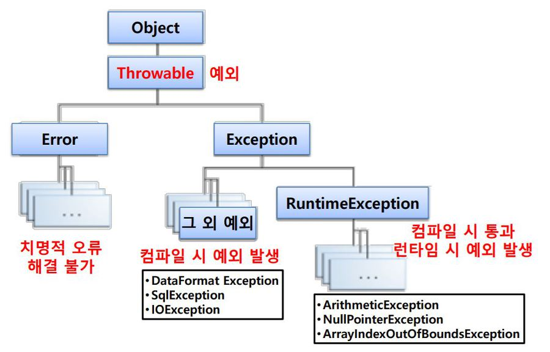

이 문서는 예외의 정의와 종류, <br>spring 환경에서의 @ExceptionHandler 사용 방법과 예외 처리 가이드에 대해 다룬다. 

## 프로그래밍에서의 예외
예외(Exception란 사용자의 잘못된 조작 또는 개발자의 잘못된 코딩으로 인해 발생하는 프로그램 오류를 뜻한다. <br>하드웨어의 오동작 또는 고장으로 인한 에러(Error)와 달리, 예외는 예외처리(Exception Handling)을 통해 프로그램을 종료되지 않고 정상적으로 작동되게 할 수 있다. 
<br>예외 처리 방법은 다음과 같은 것들이 있다. 
- try-catch문 이용
- 요구사항에 의한 예외 처리 
    - ex) validation > 특정 값이 0~255범위가 아니면 유효하지 않은 값으로 판단하고 예외 처리
- 스프링 시큐리티에서 인터셉터로 처리 
- @ExceptionHandler, @ControllerAdvice 사용

### 예외 종류

예외에는 `일반 예외`, `실행 예외` 두 가지 종류가 존재한다.<br>일반 예외는 컴파일 시 확인되는 예외로, Exception을 상속받지만 RuntimeException은 상속받지 않는다.
실행 예외는 컴파일 과정에서 예외 처리 코드를 검사하지 않는 예외를 뜻한다.<br>런타임 시 발생하는 예외로, 개발자의 경험에 의해 예외 처리 코드를 삽입해야 한다.

### 실행 예외 종류
- **NullPointerException**
    - NULL 객체를 참조하는 경우 발생
- **ArrayIndexOutOfBoundsException**
    - 배열에서 인덱스 범위를 초과하여 사용할 경우 발생
    ex) 길이가 2인 배열에서 -1 또는 3의 인덱스를 참조하려 하는 경우
- **NumberFormatException**
    - 문자열이 나타내는 숫자와 일치하지 않는 타입의 숫자로 변환시 발생 
- **ArithmeticException**
    - 어떤 수를 0으로 나눌 때 발생
- **ClassCastException**
    - 변환할 수 없는 타입으로 객체를 반환 시 발생
    - 상위 클래스-하위 클래스 또는 구현 클래스-인터페이스 관계가 아닌 클래스를 변환하는 경우 
- **NegativeArraySizeException**
    - 배열의 크기가 음수값인 경우 발생 
- **OutOfMemoryException**
    - 메모리가 부족한 경우 발생
- **NoClassDefFoundException**
    - 원하는 클래스를 찾지 못한 경우 발생 

## Spring에서의 예외처리  
### Exception Handler 사용법
`@ExceptionHandler`<br>
ExceptionHandler 어노테이션은 @Controller, @RestController가 적용된 Bean내에서 발생하는 예외를 잡아서 하나의 메서드에서 처리해주는 기능을 한다.<br>아래 예제는 NullPointerException을 캐치해 에러 내용을 출력하는 코드이다. 

```java
@RestController 
public class MyRestController {
     ... 
     ... 
     @ExceptionHandler(NullPointerException.class) 
     public Object nullex(Exception e) { 
        System.err.println(e.getClass());
        return "myService"; 
    } 
}
```
위와 같이 `@ExceptionHandler`라는 어노테이션을 쓰고,<br>인자로 캐치하고 싶은 예외클래스를 등록해주면 된다.
```
@ExceptionHandler({ Exception1.class, Exception2.class}) 
```
위와 같은 방식으로 두 개 이상 등록도 가능하다.

### 전역 예외 처리 가이드
각각의 컨트롤러에 `@ExceptionHandler`를 추가해 예외를 처리할 수도 있지만,<br>`@ControllerAdvice`를 이용해 일관성 있는 코드 스타일을 유지하며 전역 예외를 처리할 수 있다.

#### Error Response 객체 
동일한 예외처리 로직과 에러 코드를 위해 일관된 Error Response를 가져야 한다. 

```java
@Getter
@NoArgsConstructor(access = AccessLevel.PROTECTED)
public class ErrorResponse {

    private String message;
    private int status;
    private List<FieldError> errors;
    private String code;
    ...

    @Getter
    @NoArgsConstructor(access = AccessLevel.PROTECTED)
    public static class FieldError {
        private String field;
        private String value;
        private String reason;
        ...
    }
}

```
다음은 Error Response 객체의 JSON이다. 
```JSON 
{
  "message": " Invalid Input Value",
  "status": 400,
  // "errors":[], 비어있을 경우 null 이 아닌 빈 배열을 응답한다.
  "errors": [
    {
      "field": "name.last",
      "value": "",
      "reason": "must not be empty"
    },
    {
      "field": "name.first",
      "value": "",
      "reason": "must not be empty"
    }
  ],
  "code": "C001"
}
```

#### @ControllerAdVice를 통한 전역 예외 처리 
@ExceptionHandler가 하나의 클래스에 대한 것이라면, @ControllerAdvice는 모든 컨트롤러를 대상으로 예외를 캐치해 처리해준다. 

```java
@ControllerAdvice
@Slf4j
public class GlobalExceptionHandler {

    /**
     *  javax.validation.Valid or @Validated 으로 binding error 발생시 발생한다.
     *  HttpMessageConverter 에서 등록한 HttpMessageConverter binding 못할경우 발생
     *  주로 @RequestBody, @RequestPart 어노테이션에서 발생
     */
    @ExceptionHandler(MethodArgumentNotValidException.class)
    protected ResponseEntity<ErrorResponse> handleMethodArgumentNotValidException(MethodArgumentNotValidException e) {
        log.error("handleMethodArgumentNotValidException", e);
        final ErrorResponse response = ErrorResponse.of(ErrorCode.INVALID_INPUT_VALUE, e.getBindingResult());
        return new ResponseEntity<>(response, HttpStatus.BAD_REQUEST);
    }

    /**
     * @ModelAttribut 으로 binding error 발생시 BindException 발생한다.
     * ref https://docs.spring.io/spring/docs/current/spring-framework-reference/web.html#mvc-ann-modelattrib-method-args
     */
    @ExceptionHandler(BindException.class)
    protected ResponseEntity<ErrorResponse> handleBindException(BindException e) {
        log.error("handleBindException", e);
        final ErrorResponse response = ErrorResponse.of(ErrorCode.INVALID_INPUT_VALUE, e.getBindingResult());
        return new ResponseEntity<>(response, HttpStatus.BAD_REQUEST);
    }

    ...
}
```
`@ControllerAdvice`가 사용된 GlobalExceptionHandler 클래스 안에서 여러 `@ExceptionHandler`가 선언되고, <br>각각의 에러에 대해 일관된 형식으로(ResponseEntity<ErrorResponse> 사용을 통해) 처리하는 것을 볼 수 있다.
<br>
`ErrorCode`는 아래와 같이 enum 타입으로 한 곳에서 관리한다. 

```java
public enum ErrorCode {

    // Common
    INVALID_INPUT_VALUE(400, "C001", " Invalid Input Value"),
    METHOD_NOT_ALLOWED(405, "C002", " Invalid Input Value"),
    ....
    HANDLE_ACCESS_DENIED(403, "C006", "Access is Denied"),

    // Member
    EMAIL_DUPLICATION(400, "M001", "Email is Duplication"),
    LOGIN_INPUT_INVALID(400, "M002", "Login input is invalid"),

    ;
    private final String code;
    private final String message;
    private int status;

    ErrorCode(final int status, final String code, final String message) {
        this.status = status;
        this.message = message;
        this.code = code;
    }
}
```
### References
@ExceptionHandler, @ControllerAdvice에 대해: <https://jeong-pro.tistory.com/195>
try-catch문과 예외의 종류: <https://coding-factory.tistory.com/280>
예외의 종류: <https://deftkang.tistory.com/44>
예외처리 전략: <https://cheese10yun.github.io/spring-guide-exception/>